# From Antenna to Audio
### An FPGA / DSP / Embedded Systems Training Module Built on a Real SDR FM Receiver Project

**Course Design Document**  
**Audience:** Graduate engineers (0–3 years experience), DSP or embedded C background, little or no prior FPGA exposure

---

## Table of Contents

1. [Purpose and Philosophy](#1-purpose-and-philosophy)
2. [Audience and Prerequisites](#2-audience-and-prerequisites)
3. [Course Structure — Overview](#3-course-structure--overview)
4. [Detailed Module Breakdown](#4-detailed-module-breakdown)
5. [The Artisan's Path — Full Callout Index](#5-the-artisans-path--full-callout-index)
6. [Open Decisions Before Build](#6-open-decisions-before-build)
7. [References](#7-references)

---

## 1. Purpose and Philosophy

This course teaches FPGA-based DSP and embedded systems development end-to-end, using a single real project as its spine: a software-defined FM receiver built from a genuine COTS SDR capture, taken from MATLAB algorithm through Simulink system modeling, Fixed-Point Designer quantization, hand-written VHDL and Vitis HLS, full SoC integration, bare-metal bring-up, and a Linux port.

Two design principles distinguish this course from typical FPGA training material:

- **Real signal, not a synthetic test tone.** The I/Q capture (`rds.wav`) driving every lab in this course was recorded from an actual RTL-SDR-class receiver, not generated. It carries a real noise floor, DC offset, IQ imbalance, and unpredictable dynamic range — the same properties that make the saturation and rounding logic visible throughout the RTL necessary in the first place, rather than defensive code nobody can explain.
- **The debugging history is kept, not cleaned up.** Every module below is built around a real failure this project actually hit — a cosim rejection, a permanent-X signal traced to a reset-scope gap, a timing violation closed in two different ways, a cache-coherency bug solved twice with two different mechanisms. Idealized, bug-free walkthroughs teach syntax; real failures teach judgment.

### 1.1 The Model-Based Design Thread

The single methodology this course keeps returning to is MathWorks' Model-Based Design pipeline, structured as a running thread rather than a one-off lesson:

| Stage | Question it answers |
|---|---|
| MATLAB floating point | Does the algorithm work, in the simplest possible representation? |
| Simulink floating point | Does the algorithm work as a connected system, with real signal flow and timing? |
| Fixed-Point Designer | How many bits does each signal actually need, given real, measured signal statistics? |
| HDL / HLS implementation | How is this built in hardware? |

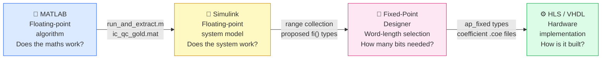

Each stage answers a question the previous stage cannot. Learners who default to writing RTL directly — which, for this audience, will be most of them — need to see this alternative modeled explicitly, not just told it exists.

### 1.2 Simulink Logging as the Source of Truth

A theme worth stating plainly early, because it resolves a question learners will otherwise ask repeatedly: where do the golden reference values in this project's testbenches and verification scripts actually come from? The answer is Simulink signal logging and probing during the floating-point and fixed-point modeling stages. Every comparison vector in `verify_fm_demod_rtl.m` and every stimulus file in `gen_coeffs_testvectors.m` traces back to a signal someone logged at the model stage — probing is not a debugging convenience bolted on afterward, it is the mechanism that produces the reference data everything downstream is checked against.

### 1.3 "The Artisan's Path" — A Recurring Callout

Nearly every hard problem in this project was solved by hand: pragmas chosen empirically and corrected after a failed cosim run, a timing violation closed by hand-splitting a multiply-accumulate, cache coherency worked around with manual flush/invalidate calls. This is real, valuable engineering skill — but a licensed, model-based toolchain exists specifically to automate large parts of it.

Every module below that hits one of these moments includes a clearly marked callout box (styled consistently throughout the course material) naming the AMD Vitis Model Composer capability that targets the same problem. These are not corrections — the manual path is what makes the automated tools legible rather than a black box — but learners deserve an honest account of what a fuller toolchain buys, including its licensing cost.

> **⚒ THE ARTISAN'S PATH**
>
> *Example of the recurring callout style used throughout this course. Every instance cites the specific AMD-documented capability it refers to; see Section 5 for the full consolidated list.*

---

## 2. Audience and Prerequisites

### 2.1 Target Learner

- Graduate of a 3-year engineering degree, 0–3 years of professional experience.
- Background in one of two tracks — DSP/signal processing, or embedded C/software — but typically not both.
- Little or no prior FPGA exposure. Cannot be assumed to know what synthesis is, how to read an entity/architecture pair, or what AXI handshaking means.

### 2.2 Consequence for Course Design

This audience cannot be assumed to already have the prerequisite vocabulary this course depends on — digital logic fundamentals, reading HDL, AXI4/AXI4-Stream handshaking, and (depending on background) either DSP or computer-architecture fundamentals. Rather than building a dedicated in-course foundations module, this design assigns that material as required pre-reading via the References section (Section 7), annotated specifically for this purpose.

The two backgrounds are also asymmetric: a DSP-trained learner is missing computer-architecture fundamentals (memory maps, caches, interrupts vs. polling) that an embedded-C learner already has, and vice versa for signal-processing fundamentals — the pre-reading assignment should be tailored per learner background rather than assigned uniformly.

---

## 3. Course Structure — Overview

The course is one linear track. Prerequisite foundations are handled via required pre-reading (Section 7) rather than a standalone module. Part 8 is optional.

| Part | Title | New Concept Burden | Built on Real Project History? |
|---|---|---|---|
| 1 | Model-Based Design Methodology | High | Anchors the whole course |
| 2 | Reading an Existing Design | Medium | `fm_demod` signal chain |
| 3 | HLS, Built Up in Layers | High | `audio_ppdma` / `iq_ppdma` saga |
| 4 | System Integration | Medium | Clock mismatch, address planning |
| 5 | System-Level Verification | High (4-state sim is rarely taught) | `AXI4_ERRS_RDATA_X` crash |
| 6 | Timing Closure | Medium | `de_emph` pipelining / MCP fix |
| 7 | Embedded Software Integration | Medium | Bare-metal cache coherency, real-time budget |
| 8 *(optional)* | Linux Migration — Capstone | Very high | PetaLinux port, second cache-coherency solution |

### 3.1 The Per-Module Template

Every module in Section 4 follows the same five-part template:

1. **Objectives** — what the learner should be able to do afterward, stated as actions.
2. **Concept Primer** — the theory needed before the walkthrough makes sense.
3. **Guided Code Walkthrough** — annotated reading of the real project source.
4. **Hands-On Lab** — using the actual project files, not a simplified stand-in.
5. **What Actually Went Wrong** — a sidebar pulled directly from this project's real debugging history, plus (where applicable) an Artisan's Path callout.

---

## 4. Detailed Module Breakdown

---

### Part 1 — Model-Based Design Methodology

**Objectives:** explain the four-stage MATLAB → Simulink → Fixed-Point Designer → HDL/HLS pipeline; explain why this ordering separates algorithmic bugs from bit-width bugs; trace a real coefficient from its Simulink origin to its VHDL constant; read and explain what a real verification entry-point script (`run_and_extract.m`) does, end to end.

#### Concept Primer

- The four stages and the distinct question each one answers (see Section 1.1).
- The COTS SDR capture (`rds.wav`) as the motivating example: a real signal carries noise floor, DC offset, IQ imbalance, and unpredictable dynamic range that a synthetic test tone never exposes — which is the direct, concrete reason the saturation logic visible in `de_emph.vhd` (`sat32`/`sat40`) exists at all.
- Simulink signal logging/probing as the mechanism that produced this project's actual golden-reference data (`verify_fm_demod_rtl.m`, `gen_coeffs_testvectors.m`) — not a debugging convenience, but the source of truth everything downstream is checked against.

#### Guided Walkthrough: `run_and_extract.m`

This script is the actual entry point for the fixed-point FM demodulator verification flow used throughout this project, and is worth reading line-by-concept rather than summarizing, since every detail in it is a direct consequence of a decision made earlier in the pipeline.

The MATLAB script `run_and_extract.m` serves as the entry point for the fixed-point FM demodulator verification flow. It loads `rds.wav`, a two-channel 16-bit PCM file recorded at 250 kHz, whose left and right channels carry the in-phase (I) and quadrature (Q) baseband samples of a real FM broadcast signal captured from an RTL-SDR receiver. The script quantises the raw 16-bit integer samples to the `fixdt(1,16,15)` fixed-point format — signed 16-bit with 15 fraction bits, matching the hardware ADC interface — and feeds them into a Simulink fixed-point model of the complete demodulator chain.

The model performs carrier frequency correction via a −10 kHz NCO mixing stage, anti-aliasing lowpass filtering on both I and Q channels, FM discrimination, FIR decimation by a factor of five from 250 kHz to 50 kHz, audio lowpass filtering, and 75 µs de-emphasis.

For mono reception the demodulated output is the baseband audio signal recovered directly from the FM discriminator and subsequent filtering stages, representing the L+R sum channel that carries the primary audio programme. For stereo reception — which this signal contains, as indicated by the RDS subcarrier also present in the recording — the full MPX baseband would additionally require a 19 kHz pilot tone detector, a 38 kHz subcarrier regenerator, and an L−R decoder to reconstruct the separate left and right channels; the current implementation demodulates the mono L+R sum only, leaving stereo decoding as a future extension.

The script extracts intermediate node signals from the Simulink model, saves the FreqCorr output vectors `ic_gold` and `qc_gold` to `ic_qc_gold.mat` for use by the sub-block unit test vector generators, and writes the I/Q stimulus files used to drive the full-chain RTL behavioural simulation in Vivado xsim.

> **Worth flagging explicitly to learners:** the recording carries a full stereo/RDS-capable MPX signal, but this implementation deliberately targets mono decoding only. This is a genuinely good scoped-extension exercise for a more advanced cohort — implementing the 19 kHz pilot/38 kHz subcarrier/L−R decode chain on top of an already-working mono pipeline, rather than as a from-scratch project.

#### Lab

- Trace one path forward end-to-end: MATLAB algorithm → Simulink block → Fixed-Point Designer word-length/fraction-length spec → the literal quantized constant in `de_emph.vhd` (`B0`/`A1`).
- Run `run_and_extract.m`; identify where `ic_gold`/`qc_gold` are produced and where `ic_qc_gold.mat` is consumed downstream by the sub-block unit test generators.

> **⚒ THE ARTISAN'S PATH**
>
> *This entire pipeline — quantization, RTL generation, and testbench generation — can be automated by AMD Vitis Model Composer, a licensed Simulink-integrated add-on to Vivado/Vitis (~$995 node-locked / ~$1,995 floating). It generates synthesizable VHDL/Verilog or optimized HLS code with pragmas already inserted directly from a Simulink model, generates the testbench automatically, and includes a built-in feature to compare results against golden references in the MATLAB/Simulink environment — the automated version of exactly what `verify_fm_demod_rtl.m` does by hand. This course teaches the manual pipeline deliberately: seeing every translation step by hand is what makes an automated generator legible later, rather than a black box.*
>
> *Source: AMD product page, Vitis Model Composer (adaptive SoCs and FPGAs).*

---

### Part 2 — Reading an Existing Design

**Objectives:** read the `fm_demod` signal chain (NCO → FreqCorr → AA LPF → FM Disc → FIR Dec → Audio LPF → De-emph) at block-diagram level and in RTL; run an existing testbench and correlate its output against the MATLAB/Simulink reference.

#### Lab

- Run the standalone `fm_demod` testbench; compare output against `verify_fm_demod_rtl.m`.
- For one block, trace its constants back to their Model-Based Design origin (callback to Part 1).

> **⚒ THE ARTISAN'S PATH**
>
> *The manual archaeology of matching a VHDL constant back to its Simulink/Fixed-Point Designer source is exactly what HDL Coder-class traceability reporting generates automatically in a model-based flow.*

---

### Part 3 — HLS, Built Up in Layers

**Objectives:** understand what Vitis HLS is and why it exists; apply basic interface pragmas; implement ping-pong buffering as a general pattern; understand the real `audio_ppdma`/`iq_ppdma` cores and their control-protocol history.

#### Concept Primer

1. What HLS is and why it exists.
2. A trivial pragma example — not yet the project cores.
3. Ping-pong buffering taught as a general pattern with a diagram, no hardware yet.
4. Fixed-point primer: given a Fixed-Point Designer word-length/fraction-length spec, select the matching `ap_fixed<>` type.

#### What Actually Went Wrong

`audio_ppdma` and `iq_ppdma` were both built, broken, and fixed in front of real cosim output during this project's development: an initial `ap_ctrl_none` design failed cosim outright because its latency varied per invocation; a corrected version passed cosim but left a GPIO output permanently undefined (X) due to a reset-scope gap between control logic and data-path registers; the fix required a shadow-register idiom to decouple output timing from internal scheduling. This sequence is taught as a case study in the gap between what an HLS pragma promises and what the tool actually schedules.

> **⚒ THE ARTISAN'S PATH**
>
> *A model-based HLS flow selects validated interface configurations largely by construction, through the model itself, rather than by empirical trial and error against cosim output. Vitis Model Composer's HLS blocks generate optimized HLS code with pragmas already inserted — collapsing what took three rounds of manual correction in this project into a single generation step.*
>
> *Source: AMD product page, Vitis Model Composer.*

---

### Part 4 — System Integration

**Objectives:** build a block design with PS7/AXI interconnect; understand clock domains well enough to diagnose a mismatch; plan a DDR address map with an eye toward an eventual Linux migration.

#### What Actually Went Wrong

A real attempt to move part of the design to a 50 MHz clock domain produced a block-design validation failure (`FREQ_HZ` mismatches across interface pins) — a genuine, common integration mistake, used here to teach clock-domain association in Vivado's IP Integrator rather than as an abstract warning.

#### Lab

- Reproduce and resolve a deliberately-seeded clock-domain mismatch.
- Plan a DDR address map for a set of fixed buffers, including the `reserved-memory`/`no-map` consideration that will matter again in Part 8.

---

### Part 5 — System-Level Verification

**Objectives:** distinguish a liveness/watchdog test from a golden-reference correctness test; understand 4-state (0/1/X/Z) simulation well enough to diagnose an X-propagation failure.

#### Concept Primer

- **4-state simulation** — taught as a standalone mini-lesson. This is rarely covered even in a full digital-design curriculum, and the case study below is unreadable without it.
- **Liveness testing vs. golden-reference testing** as two different claims about a design, both legitimate, answering different questions.

#### What Actually Went Wrong

A full-system PS7 VIP testbench hit a hard AXI4 protocol-checker crash (`AXI4_ERRS_RDATA_X`) partway through a run — a real X-propagation bug traced back to a register with no explicit reset. Diagnosed via waveform inspection of internal HLS-generated signals, not just top-level ports. Used as the primary teaching example for why "the waveform looks alive" and "the design is correct" are different claims.

> **⚒ THE ARTISAN'S PATH**
>
> *HDL Verifier's Simulink/HDL-simulator co-simulation and FPGA-in-the-loop testing automate exactly the "does hardware match what Simulink logged" workflow this module teaches by hand. It would very likely have surfaced the same X-propagation failure sooner and with substantially less waveform archaeology — not a different result, a faster path to the same one.*

---

### Part 6 — Timing Closure

**Objectives:** read a Vivado timing report; distinguish setup from hold violations; understand two valid, different fixes for the same combinational-depth violation and their real tradeoffs.

#### What Actually Went Wrong

A real `de_emph` IIR filter failed setup timing at 100 MHz due to an unpipelined multiply-accumulate-saturate chain. Two independently valid fixes were developed: splitting the computation across two pipeline stages (a genuine RTL change requiring correctness re-verification against the golden reference), and a multicycle path exception (which required two iterations — the first constraint missed a legitimate second source register in the same combinational cloud, caught by re-reading the next timing report rather than assuming the fix was complete).

#### Lab

Given the same violation, implement both fixes and compare their tradeoffs directly: verification burden vs. constraint-scope risk.

---

### Part 7 — Embedded Software Integration

**Objectives:** read/write memory-mapped I/O correctly; explain why a non-coherent DMA path requires explicit cache maintenance; reason about a real-time budget in a backpressure-free, free-running producer/consumer architecture.

#### Concept Primer

Memory-mapped I/O and cache coherency built up from first principles — most learners in this audience, DSP or embedded background, have not previously had to reason about a non-coherent DMA path.

#### What Actually Went Wrong

The bare-metal bring-up application required explicit `Xil_DCacheFlushRange`/`InvalidateRange` calls around every buffer handoff with the PL, because the Zynq-7000's HP ports are not cache-coherent with the ARM cores by default. Separately, moving from a one-shot, CPU-paced DMA model to a free-running ping-pong architecture removed all natural flow control — the refill loop now has a real, unverified real-time budget (~10 ms) it must meet or silently start reading stale data, with no error and no stall to catch it.

> **⚒ THE ARTISAN'S PATH**
>
> *Vitis Model Composer includes hardware-validation workflow support — generating data movers and build files to help move a model-based design onto hardware. This does not eliminate the cache-coherency or real-time-budget reasoning this module teaches, but it automates a meaningful share of the manual plumbing this project's bare-metal bring-up required by hand.*

---

### Part 8 *(Optional Capstone)* — Linux Migration

Marked optional/capstone rather than core: it assumes everything above, plus genuinely new material (device trees, kernel vs. userspace, real-time scheduling) that is advanced for a 0–3-year audience. Mandatory inclusion risks burying learners immediately before the finish line.

#### What Actually Went Wrong

The same cache-coherency problem from Part 7 reappears under Linux, solved by a different mechanism: opening `/dev/mem` with `O_SYNC` before `mmap()` to obtain an uncached mapping, since plain userspace has no direct equivalent to the bare-metal cache-maintenance intrinsics. GPIO access moves from raw register peeking to the `libgpiod` character-device API, with chip/line numbering that must be verified on real hardware (`gpiodetect`/`gpioinfo`) rather than derived from the block design alone. The real-time budget problem from Part 7 gets strictly worse moving from a deterministic bare-metal superloop to a general-purpose, non-real-time Linux scheduler.

#### Capstone Exercise

Trace one sample's entire journey — RTL-SDR antenna capture → `rds.wav` → MATLAB → Simulink → Fixed-Point Designer → HLS/VHDL → measured hardware output — as the final synthesis exercise tying the whole course's methodology together.

---

## 5. "The Artisan's Path" — Full Callout Index

Consolidated for reference. Every claim below is tied to a specific AMD-documented Vitis Model Composer capability. None should be published without a final check against AMD's current product page, since tool capabilities and branding shift.

| Module | Project Pain Point | Vitis Model Composer Capability |
|---|---|---|
| 1 | Manual constant traceability, hand-built testbenches | Generates RTL/HLS + testbench directly from model; golden-reference comparison built in |
| 3 | 3 rounds of empirical pragma correction against cosim failures | HLS blocks generate optimized HLS code with pragmas already inserted |
| 5 | Manual waveform archaeology to find an X-propagation bug | HDL Verifier: Simulink/HDL co-simulation and FPGA-in-the-loop testing |
| 7 | Manual data-mover/build-file plumbing for hardware validation | Automated hardware validation workflow (data movers, build files) |

---

## 6. Open Decisions Before Build

### 6.1 Pre-Reading Depth vs. Integrated Concept Primers

The pre-reading approach (Section 7) assigns prerequisite foundations before the course begins rather than teaching them in a standalone module. If the actual audience arrives without adequate foundations despite this, an instructor has two options:

1. Run a short live orientation session covering digital logic, HDL reading, and AXI handshaking before Part 1.
2. Convert the pre-reading to a structured self-paced module inserted before Part 1, extending the total course duration accordingly.

Option (2) is the higher-confidence but costlier route.

### 6.2 Duration and Format

This is closer to a multi-week course than a compact workshop. Needs a target — a few intensive days, a semester-style program, or a slower self-paced series — since the compression/splitting of later modules depends on this answer.

### 6.3 Availability of Simulink Source Material

Whether learners get hands-on time inside Simulink doing their own probing, or a guided walkthrough of existing logs and outputs, depends on whether the actual Simulink models and Fixed-Point Designer session files are available to build labs from, or only their downstream artifacts (`.m` scripts, VHDL constants, coefficient headers) already present in the repository. This materially changes the lab design for Parts 1 and 2.

### 6.4 Artisan's Path Framing

Two defensible framings, not mutually exclusive: "here is what we would do differently with a full toolchain license" (honest account of a real constraint), versus "here is what to reach for once you have access" (forward-looking career advice). Could be both, varied by callout.

---

## 7. References

Every link below was verified live during the writing of this document and reflects each source's current official location as of that check. Two things worth doing before publishing this course:

1. Re-verify each link once more close to actual publication — AMD/MathWorks documentation URLs are versioned and occasionally reorganized.
2. Where a link points to a general documentation portal rather than a fixed version, pin it to the specific tool version the course is built against (this project used Vivado / Vitis HLS / PetaLinux 2022.2 throughout).

### 7.1 AMD / Xilinx Tools

- **Vivado Design Suite** — documentation portal (UG910, Getting Started): <https://docs.amd.com/r/en-US/ug910-vivado-getting-started>
- **Vivado Design Suite** — product page and Developer Hub (tutorials, design-flow overviews): <https://www.amd.com/en/developer/resources/vivado.html>
- **Vitis HLS** — user guide UG1399: <https://docs.amd.com/r/en-US/ug1399-vitis-hls>
- **PetaLinux Tools** — reference guide UG1144: <https://docs.amd.com/r/en-US/ug1144-petalinux-tools-reference-guide>  
  2022.2-specific: <https://docs.amd.com/r/2022.2-English/ug1144-petalinux-tools-reference-guide/Overview>
- **Vitis Model Composer** — product page: <https://www.amd.com/en/products/software/adaptive-socs-and-fpgas/vitis/vitis-model-composer.html>

### 7.2 MathWorks

- **Simulink** — documentation: <https://www.mathworks.com/help/simulink/index.html>
- **Fixed-Point Designer** — documentation: <https://www.mathworks.com/help/fixedpoint/index.html>
- **HDL Verifier** — documentation: <https://www.mathworks.com/help/hdlverifier/>
- **HDL Verifier** — "Get Started with HDL Verifier" (tutorials: Verify HDL Module with MATLAB Testbench; Verify HDL Module with Simulink Testbench; Verify HDL Implementation of PID Controller Using FPGA-in-the-Loop): <https://www.mathworks.com/help/hdlverifier/getting-started-with-hdl-verifier.html>

### 7.3 Protocol and Architecture References

- **ARM AMBA AXI Protocol Specification** (IHI 0022): <https://developer.arm.com/documentation/ihi0022/l/>
- **ARM "Learn the Architecture: An Introduction to AMBA AXI"** — recommended as pre-reading for AXI4-Stream/AXI4 handshaking (see 7.5d), genuinely pitched at this course's audience level: <https://developer.arm.com/documentation/102202/0300/AXI-protocol-overview>

### 7.4 Open-Source Components (Parts 7–8)

- **libgpiod** — documentation: <https://libgpiod.readthedocs.io/> ; source: <https://git.kernel.org/pub/scm/libs/libgpiod/libgpiod.git/>  
  ⚠️ Confirm which major API version — v1.x vs. v2.x — ships in your PetaLinux rootfs before teaching the character-device API directly; the two have meaningfully different C APIs.
- **FatFs (ChaN)** — official site and application note: <https://elm-chan.org/fsw/ff/>

### 7.5 Required Pre-Reading (Foundations)

Foundations are no longer an in-course module. The following references are assigned as required pre-reading, tailored by learner background:

- Embedded-C learners: read **7.5a**, **7.5b**, **7.5d**
- DSP learners: read **7.5b**, **7.5d**, **7.5e**
- Both tracks: read **7.5d**

Instructors should verify on intake which sections each learner actually needs rather than assigning all uniformly.

#### 7.5a — Digital Logic and FPGA Fundamentals

*(For embedded-C learners)*

- **Vivado Design Suite: Getting Started (UG910)** — Chapter 1 gives a concise "what is an FPGA" orientation grounded in Vivado's own design flow: <https://docs.amd.com/r/en-US/ug910-vivado-getting-started>
- **Vivado Design Methodology Guide (UG949)** — covers the simulation / synthesis / implementation distinction: <https://docs.amd.com/r/en-US/ug949-vivado-design-methodology>

#### 7.5b — Reading HDL (VHDL and Verilog)

*(For all learners — goal at entry is reading comprehension, not writing)*

- **Vivado Design Suite: Synthesis (UG901)** — Part II covers VHDL constructs as synthesized by Vivado, a practical reading-oriented reference: <https://docs.amd.com/r/en-US/ug901-vivado-synthesis>  
  Note: a structured VHDL primer such as Peter Ashenden's *The Designer's Guide to VHDL* may suit a classroom setting better.
- **Vitis HLS User Guide (UG1399)** — covers the generated Verilog conventions (needed because HLS-generated RTL is Verilog even when hand-written glue is VHDL): <https://docs.amd.com/r/en-US/ug1399-vitis-hls>

#### 7.5c — DSP Fundamentals

*(For embedded-C learners)*

This course's own MATLAB/Simulink walkthrough in Part 1 is self-contained for the DSP concepts needed. No additional external prerequisite reference is required here beyond what is present in the project files.

#### 7.5d — AXI4-Stream / AXI4 Handshaking

*(For all learners — the single most important prerequisite)*

- **ARM "Learn the Architecture: An Introduction to AMBA AXI"** — the clearest available entry-level introduction: <https://developer.arm.com/documentation/102202/0300/AXI-protocol-overview>
- **Vivado AXI Interconnect (PG082)** — covers the Zynq/Vivado-specific AXI implementation this course actually uses: <https://docs.amd.com/r/en-US/pg082-axi-interconnect>

#### 7.5e — Computer Architecture Fundamentals

*(For DSP learners)*

- **Zynq-7000 Technical Reference Manual (UG585)** — covers the Cortex-A9 memory system in the context of this course's exact SoC; more directly useful than a generic computer-architecture textbook, and learners will need it in Parts 7–8 anyway: <https://docs.amd.com/r/en-US/ug585-zynq-7000-TRM>

---

## Appendix A — FM Receiver Architecture

### A.1 What FM Broadcasting Actually Is

FM (Frequency Modulation) radio encodes audio by varying the instantaneous frequency of a carrier wave rather than its amplitude. A station assigned to, say, 98.0 MHz transmits a carrier whose instantaneous frequency swings up and down around that centre by up to ±75 kHz in proportion to the audio signal — a deviation that conveniently fits within the 200 kHz channel spacing mandated by broadcasting standards. Recovering the audio therefore means measuring the instantaneous frequency of the received signal at every sample, which is the job of the FM discriminator.

The full baseband signal carried within that ±75 kHz deviation is the **MPX (Multiplex) baseband**: a mono L+R sum on a 0–15 kHz subcarrier, a 19 kHz stereo pilot tone, a 38 kHz suppressed-carrier DSB signal carrying L−R difference, and an RDS/RBDS data subcarrier at 57 kHz. This project targets mono-only reception — demodulating the L+R sum — which is the simplest useful case and a self-contained starting point before tackling stereo.

### A.2 I/Q Baseband Representation

An RTL-SDR receiver does not capture a raw RF signal. Its tuner and ADC directly produce a **complex baseband (I/Q) representation**: two channels, In-phase (I) and Quadrature (Q), sampled at a rate much lower than the RF carrier frequency. This is possible because the tuner multiplies the incoming RF by a local oscillator at the tuned frequency (and a 90°-shifted copy), recovering the signal at or near DC. The result is a two-dimensional signal where amplitude and phase carry all the information — the carrier itself has been removed.

In this project `rds.wav` is a stereo WAV file recorded at 250 kHz: the left channel holds I and the right holds Q. The I/Q pair is effectively a sequence of complex numbers, each representing one sample of the baseband signal centred near DC.

### A.3 The Signal Chain

The FPGA implementation processes a continuous stream of `sfix16_En15` I/Q pairs at 250 kHz through the following pipeline:

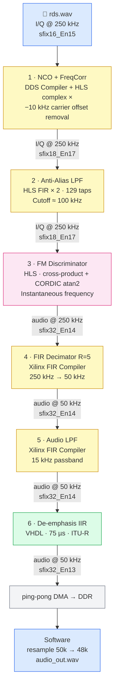

**Stage 1 — NCO and Frequency Corrector:** The SDR recording is centred −10 kHz from the station's true carrier. The NCO generates a complex exponential at exactly +10 kHz; multiplying the incoming I/Q by it corrects the offset, centering the desired signal exactly at DC. This is implemented with Vivado's DDS Compiler IP for the NCO and a custom HLS `freq_corr` block for the complex multiply.

**Stage 2 — Anti-Alias LPF:** A 129-tap symmetric FIR applied separately to I and Q limits the bandwidth to roughly ±100 kHz before the discriminator. Without this, out-of-band noise aliases into the audio band when the discriminator operates on the full 250 kHz spectrum.

**Stage 3 — FM Discriminator:** The core demodulation step. See Appendix D for a detailed treatment of the CORDIC atan2 approach used.

**Stage 4 — FIR Decimator (R=5):** Reduces the sample rate from 250 kHz to 50 kHz. A decimation ratio of 5 is the only clean integer factor that keeps 50 kHz above the Nyquist requirement for 15 kHz audio bandwidth. The Xilinx FIR Compiler IP provides the anti-image filtering and decimation in one step.

**Stage 5 — Audio LPF:** A further 127-tap FIR with 15 kHz passband removes any residual MPX subcarrier energy (pilot tone, stereo difference signal, RDS) that leaked through the discriminator, leaving only the mono audio band.

**Stage 6 — De-emphasis:** Commercial FM broadcasting applies 50 µs (Europe) or 75 µs (Americas) pre-emphasis to boost treble before transmission; receivers must apply the complementary de-emphasis to restore a flat frequency response. This is a single-pole IIR with a time constant of 75 µs, implemented as a hand-written VHDL block (`de_emph.vhd`).

**Post-FPGA:** The FPGA outputs audio at 50 kHz. Bare-metal software reads these samples from DDR via the ping-pong DMA architecture, converts them to 16-bit PCM, and applies a polyphase resampler (L=24, M=25, 2208 taps) to produce standard 48 kHz output.

---

## Appendix B — Floating-Point vs. Fixed-Point: What the FPGA Actually Computes

### B.1 Why FPGAs Use Fixed-Point

A floating-point number (IEEE 754 `double` or `float`) uses a variable exponent to represent a wide dynamic range, with a fixed-width significand for precision. A CPU can do this cheaply because floating-point units are a dedicated, hardened part of the silicon. An FPGA has no such units; it builds arithmetic from configurable logic and DSP slices (hardened 18×18 multipliers). Implementing a single IEEE 754 double-precision adder on an FPGA consumes roughly 2–4 DSP slices and dozens of LUTs, and introduces latency of 10–15 clock cycles. A full FM receiver chain implemented in floating-point would consume the entire FPGA's DSP budget for a handful of multipliers — and still run slowly.

**Fixed-point arithmetic** represents a number as a plain integer, with a contract that the designer tracks about where the binary point sits. A value stored as `sfix18_En17` is an 18-bit signed integer that should be interpreted as divided by 2^17 — i.e. it represents a real value in approximately [−1, +1) with 17 bits of fraction. Addition of two fixed-point numbers at the same format is just integer addition: zero overhead, one DSP clock cycle. Multiplication of two 18-bit numbers produces a 36-bit result, which the designer then rounds and truncates back to the desired width — one DSP slice, one or two cycles. The entire FM receiver chain in this project runs at 100 MHz on a Zynq-7010 using only a handful of DSP48 slices.

The tradeoff is that fixed-point requires the designer to reason explicitly about:
- **Word length** — how many bits to allocate for each signal.
- **Fraction length** — where the binary point sits (equivalently: what the maximum representable value is).
- **Overflow** — what happens when a result exceeds the representable range (saturate or wrap).
- **Rounding** — how to discard the low-order bits of a multiplication product (truncate, round-to-nearest, etc.).

Getting any of these wrong produces results that are subtly or catastrophically wrong, typically without any error signal — the hardware will happily compute whatever binary arithmetic it is told to. This is why the model-based design flow exists: MATLAB and Simulink let you explore these choices at simulation speed before committing them to RTL.

### B.2 The Fixed-Point Notation Used in This Project

Vivado's Simulink-interop tooling and HLS both use a common notation:

`sfix<W>_En<F>` — **signed**, **W** bits wide, with **F** fraction bits.

Examples from the actual signal chain:
- `sfix16_En15` — ADC output. Range [−1, +1), resolution 2^−15 ≈ 30 µV/LSB.
- `sfix18_En17` — after frequency correction. Range [−1, +1), 17 fraction bits.
- `sfix32_En14` — discriminator output. Range [−131072, +131072) representing ±128 kHz of instantaneous frequency deviation, with 14 fraction bits (resolution ~0.06 Hz).
- `sfix32_En13` — de-emphasis output (audio). The de-emphasis IIR shifts the binary point by one bit due to its coefficient scaling.

The format at each stage is determined by the mathematical operation that produced it: a multiply of an `sfix18_En17` by an `sfix18_En17` yields a raw `sfix36_En34`, which is then rounded and saturated to whatever the designer decides is appropriate. In HLS this is expressed as `ap_fixed<32, 18, AP_RND, AP_SAT>` (32 bits total, 18 integer bits, round-to-nearest, saturate on overflow).

### B.3 The Four Decisions Made for Every Operation

Every arithmetic operation in the RTL requires four explicit decisions, which in the Model-Based Design flow are made at the Simulink/Fixed-Point Designer stage and then carried forward mechanically into HLS:

| Decision | Options | Consequence if wrong |
|---|---|---|
| Word length | Too short: noise floor raised; too long: DSP resources wasted | Audio quality degraded or area budget exceeded |
| Fraction length (binary point position) | Too few integer bits: overflow/saturation; too many: precision wasted | Distortion, or underused LSBs |
| Overflow mode | Wrap (modular) vs. Saturate | Wrap causes catastrophic sign flips; Saturate clips gracefully |
| Rounding mode | Truncate vs. Round-to-nearest | Truncate is biased (systematic DC offset); RTN is unbiased |

The Fixed-Point Designer's role is to make the first two decisions based on actual measured signal statistics (the range collection step), and to confirm the last two produce acceptable results by comparing the fixed-point simulation output against the floating-point golden reference.

---

## Appendix C — The Improved FM Receiver Design

### C.1 Why the Initial Architecture Needed Revisiting

The first version of the receiver that emerged from the initial MATLAB exploration took a pragmatic shortcut: it computed the frequency correction, anti-alias filtering, and FM discrimination entirely in MATLAB floating-point before feeding the result into Simulink, leaving only the audio LPF and de-emphasis inside the model. This was convenient for rapid prototyping but wrong for the purpose — a Simulink golden model that doesn't contain the full signal chain cannot serve as the reference for the RTL that will.

The architecture was rebuilt so that every FPGA processing stage has a corresponding block inside Simulink, fed by the real I/Q samples from `rds.wav`, producing output vectors that are then used as the reference against which RTL simulation results are checked.

### C.2 The Specific Improvements Made

**1. Frequency correction moved into Simulink.** The initial version computed the −10 kHz offset correction as a pre-processing step in MATLAB. The rebuilt model generates the NCO cosine/sine tables in MATLAB (as timeseries fed from workspace), but the complex multiply itself is inside Simulink — matching the `freq_corr` HLS block exactly.

**2. Anti-alias LPF moved into Simulink.** A 129-tap symmetric FIR filter block replaces the pre-processing step, making the filter's fixed-point word-length choices visible inside the model.

**3. FM discriminator moved into Simulink.** This was the most significant change. The differential phase discriminator (see Appendix D) is now a Simulink subsystem using fixed-point multipliers and an `hls::atan2`-compatible CORDIC block, producing the exact same `sfix32_En14` output format as the HLS implementation.

**4. CIC decimator added to Simulink.** The HDL Optimized CIC Decimation block (R=5, N=3) provides both the rate reduction and the bit-growth model (18-bit input, 26-bit output matching `ceil(N × log₂(R))` bit growth) — essential because the CIC's inherent gain and bit growth must be modeled correctly or the downstream audio LPF operates on values with the wrong binary point.

**5. Full fixed-point simulation.** Once all blocks were inside Simulink, Fixed-Point Designer could be applied to the complete chain — running with real I/Q input, collecting actual signal ranges at every node, and proposing word lengths that are grounded in the real signal statistics of a real FM broadcast. This is qualitatively different from the initial approach where fixed-point choices were made ad hoc at each HLS implementation stage.

### C.3 Consequences for RTL Verification

With the full chain in Simulink, the `run_and_extract.m` script can now extract intermediate node vectors at any point — `ic_gold`/`qc_gold` after the frequency corrector, discriminator output, decimated output — and these become the reference inputs and expected outputs for each sub-block's standalone testbench. A bug in the RTL of any individual stage is immediately localised to that stage rather than showing up as a mystery error at the audio output.

---

## Appendix D — The CORDIC atan2 FM Discriminator

### D.1 The Mathematics of FM Discrimination

Given a complex baseband signal z[n] = I[n] + jQ[n], the instantaneous frequency at sample n is:

```
f[n] = (fs / 2π) × angle(z[n] × conj(z[n−1]))
```

Expanding the complex product z[n] × conj(z[n−1]) = (I[n] + jQ[n]) × (I[n−1] − jQ[n−1]):

```
X = I[n]×I[n−1] + Q[n]×Q[n−1]    (real part)
Y = Q[n]×I[n−1] − I[n]×Q[n−1]    (imaginary part)

f[n] = (fs / 2π) × atan2(Y, X)
```

X and Y together form the cross-product of the current sample with the conjugate of the previous sample. The atan2 extracts the angle of this product, which is the instantaneous phase difference — and phase difference per sample is instantaneous frequency.

This approach is sometimes called the **differential phase discriminator** or **complex multiply discriminator**. Its advantages over simpler alternatives (e.g. the unnormalized cross-product `I[n]×Q[n−1] − Q[n]×I[n−1]`) are that it is amplitude-independent (the magnitude of the complex product cancels), and the atan2 output is directly linear in frequency across the full ±π range rather than only approximating linearity near DC.

### D.2 Why atan2 Needs CORDIC

Computing `atan2(Y, X)` in fixed-point hardware efficiently is non-trivial. Direct evaluation of the arctangent via a polynomial approximation requires division (to compute Y/X) and several multiplications; a lookup table would need to be two-dimensional and large. The CORDIC (COordinate Rotation DIgital Computer) algorithm computes `atan2` iteratively using only additions and bit-shifts — operations that map to near-zero cost in FPGA logic.

CORDIC rotates the vector (X, Y) toward the real axis through a sequence of micro-rotations, each of pre-computed fixed angle. After N iterations the accumulated rotation angle equals `atan2(Y, X)` to within the error of the N-th micro-rotation. With N=16 iterations on 18-bit inputs, the output precision matches `sfix18_En15` (approximately the same precision as the inputs), and the algorithm runs as a fully-pipelined 16-stage chain at 100 MHz with one output per clock cycle.

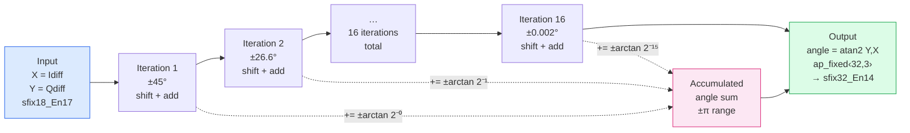

In this project, `hls::atan2` from Vitis HLS's CORDIC library is used, with the output type set to `ap_fixed<32, 3>` (range [−4, +4) covering [−π, +π] with 29 fraction bits). This gives higher internal precision than Simulink's native CORDIC block (which uses `sfix18_En15`), converging to the same result after scaling and truncation to `sfix32_En14`.

### D.3 The Scaling Factor

The atan2 output is an angle in radians in the range [−π, +π]. To convert to Hz:

```
f[n] = atan2(Y, X) × fs / (2π) = atan2(Y, X) × 250000 / (2π) ≈ atan2(Y, X) × 39788.7
```

This scaling factor (39788.7 for fs=250 kHz) is applied as a fixed-point multiply after the CORDIC, producing the `sfix32_En14` output whose range [−131072, +131072) covers approximately ±131 kHz — comfortably wider than the ±75 kHz maximum FM deviation, with headroom for a modestly off-tuned carrier.

### D.4 The Four Multiply Operations

The complete discriminator requires four 18×18 multiplications per input sample (to compute X and Y), plus the CORDIC, plus one final scale multiply. In the HLS implementation, the four cross-products are computed combinatorially, with one-sample delay registers on `I[n−1]` and `Q[n−1]`, and the whole path is pipelined at II=1 — one output sample per clock cycle. At 100 MHz this is comfortably within the ~400-cycle inter-sample budget for 250 kHz input data.

The word lengths of the intermediate products were confirmed by simulating the Simulink fixed-point model with the real `rds.wav` input and checking that saturation never occurs and that the signal-to-noise ratio at the discriminator output matches the floating-point reference to within 1 dB — the standard acceptance criterion applied by `verify_fm_demod_rtl.m`.

---

## Appendix E — Why Simulink as the Golden Model

### E.1 The Alternative and Why It Falls Short

The most common alternative to Simulink for DSP algorithm development is "just write the algorithm in MATLAB and call it a golden model." This project started there and moved away from it, for a concrete reason: a MATLAB script that processes data sequentially is structurally different from an FPGA pipeline that processes data in parallel with registered inter-stage delays, and those structural differences produce numerically different results that can be hard to separate from actual bugs.

Specifically:
- A MATLAB loop can use the exact same variable for the intermediate result and the next iteration's input, with no ambiguity. An FPGA pipeline has real registered delays: the value of `I[n−1]` in the discriminator genuinely is the value that was registered one cycle ago, not something recomputed.
- A MATLAB `double` operation never overflows. An FPGA fixed-point operation overflows unless explicitly guarded — and the saturation/wrap behavior is part of the specification, not an error.
- A MATLAB script has no concept of pipeline latency. An FPGA discriminator followed by a CIC decimator has a deterministic, non-zero number of clock cycles of latency between input and output that must be accounted for when comparing against a reference.

Simulink's block diagram models all three of these directly: blocks have explicit sample-time semantics, registered delays are explicit signal-flow elements, and fixed-point types are attached to every wire.

### E.2 What Simulink Provides That a Script Cannot

**A structural model of the hardware.** The Simulink block diagram is not just code — it is a drawing of the hardware, where each block corresponds directly to an FPGA IP or HLS function. When the discriminator HLS block and the Simulink FM Discriminator subsystem produce different output, the discrepancy is between two things that are supposed to be structurally identical, and the search space for the bug is correspondingly narrow.

**Signal logging at any intermediate node.** Probing the discriminator output in Simulink gives you the exact numeric vector that the RTL equivalent should produce. This is not possible in a sequential MATLAB script without significant restructuring.

**Continuous validation as the design evolves.** When a block's word lengths change, or a coefficient is refined, the Simulink model re-simulates automatically and `verify_fm_demod_rtl.m` re-compares. The feedback loop is minutes, not hours.

**Parametric simulation across edge cases.** The same Simulink model can be driven with `rds.wav` for a realistic test, a synthetic tone for a frequency-response check, and an all-zero input for a stability check — without changing any RTL.

---

## Appendix F — Why Fixed-Point Designer Rather Than Manual Fixed-Point in Simulink

### F.1 The Naive Approach and Its Problem

Simulink supports fixed-point data types on every block — you can manually set every signal's word length and fraction length in the block mask. This is a perfectly valid approach, and it is what the initial version of this project did. The problem is that choosing word lengths manually requires knowing, in advance, the range of every intermediate signal under all relevant input conditions.

For simple, well-understood DSP blocks (FIR filters, integrators) there are analytical formulas. For the FM discriminator with its cross-products and CORDIC, the range propagation involves magnitude tracking across the complex multiplication, CORDIC gain (approximately 1.6468 for infinite iterations, approaching 1.0 with scaling), and the interaction of saturation modes at each stage. Getting this right by hand without error is possible but tedious, and one wrong word-length or fraction-length assignment can produce a model that passes simple tests but fails on real signals with high-frequency content or unusual modulation depth.

### F.2 What Fixed-Point Designer Actually Does

Fixed-Point Designer's **range collection** step runs the Simulink model with real input data and records the actual minimum and maximum value observed at every node in the model. It then **proposes** word lengths and fraction lengths sized to accommodate those ranges, plus a programmable safety margin, and **applies** them back into the model automatically.

The key insight is that the word lengths it proposes are grounded in the real signal statistics of your real input — `rds.wav`, a genuine FM broadcast with real modulation depth, real noise floor, and real spectral content at the MPX subcarriers. A synthetic sine wave would leave the `sfix32_En14` discriminator output appearing to have a much smaller range than it actually has under real-world conditions, potentially leading to fraction-length choices that overflow on real input.

### F.3 Why Not Just Use More Bits Everywhere

The obvious alternative to careful word-length selection is to use wide fixed-point types everywhere — `ap_fixed<64, 32>` throughout — and not worry about it. On an FPGA this is not free: DSP48 slices are hardened 18×18 multipliers. A 64-bit multiply requires cascading four DSP48s and additional routing, consuming four times the resource and adding latency. The Z7-010 used in this project has 80 DSP48 slices total; the difference between a 16-bit and a 32-bit signal path through the discriminator alone can be 8 DSP48 slices vs. 32. Fixed-Point Designer's role is to find the minimum word length that maintains acceptable SNR — exactly enough bits, not one more.

### F.4 The Workflow in Practice

1. Run `build_fm_demod_slx.m` to create and configure the Simulink model.
2. Open **Fixed-Point Tool** (Apps menu or right-click a block).
3. **Collect Ranges** — runs the simulation with `rds.wav` input, logs min/max at every node.
4. **Propose Data Types** — generates a proposed fixed-point type for every signal.
5. **Apply** — rewrites every block's data type with the proposed types.
6. Re-run the simulation and compare against the floating-point reference. If SNR is acceptable (in this project: > 40 dB PSNR at the audio output), the word lengths are correct.
7. Export the resulting `fi` types: these directly inform the `ap_fixed<W, I>` template arguments in HLS and the `sfix<W>_En<F>` formats in VHDL.

This process is what separates an educated guess from a verified design — and it is what `verify_fm_demod_rtl.m` closes the loop on at the RTL level.

---

## Appendix G — Tools Used: A Practical Summary

This appendix describes every tool and language used in the project, what role each played, and — where the project hit real tool-specific constraints or quirks — what learners need to know before using them. The descriptions are grounded in what actually happened, not in the tools' marketing material.

---

### G.1 Vivado Design Suite (2022.2)

**Role:** The central integration environment for the entire FPGA design. Vivado is used for block design (IP Integrator), synthesis, implementation, bitstream generation, hardware platform export, and simulation.

**What it actually does in this project:**

- **IP Integrator (block design):** The system's block diagram is defined in `bd.tcl`, a Tcl script that Vivado's IP Integrator can source to recreate the design from scratch. Every IP instance, parameter setting, port connection, and address assignment in the block design is expressed as a Tcl command — `create_bd_cell`, `set_property`, `connect_bd_intf_net`, `assign_bd_address`. This makes the design fully version-controllable and reproducible without any GUI clicking.
- **Synthesis and implementation:** Driven headlessly via `prj.tcl`, which calls `launch_runs synth_1 -jobs 4`, `wait_on_run`, `launch_runs impl_1 -to_step write_bitstream`, and `write_hw_platform` to produce an XSA (hardware specification archive) consumed by the Vitis software build.
- **XSim:** Vivado's integrated simulator, used for behavioural simulation of individual blocks and the full end-system testbench. Invoked as `launch_simulation` from the Tcl console or `vivado -mode batch` from the command line.

**Practical notes that matter for learners:**
- Vivado is run in batch mode (`stdbuf -oL -eL vivado -mode batch -source script.tcl`) for headless builds; the `-source` flag processes the Tcl script and exits. Log output from a batch run appears in `.log` files in the project directory and can be followed live with `tail -f`.
- The block design's name matters at the source-code level: when renamed from `design_1` to `sdr_fm_receiver`, any pre-compiled simulation netlists that still referred to `design_1_wrapper` broke silently — the IP's simulation model instantiated a black-boxed module rather than the real design.
- `prj.tcl` uses a wrapper shell script (`build_prj.sh`) that pre-sets two Tcl variables (`origin_dir_loc`, `user_project_name`) before sourcing `prj.tcl`, rather than passing them as `-tclargs`, because `prj.tcl`'s own argument-parsing preamble intercepts the `-tclargs` mechanism.

---

### G.2 Tcl (Tool Command Language)

**Role:** The scripting language of the entire Xilinx toolchain. Vivado, Vitis HLS, and Vitis (the IDE and command-line tools) all accept Tcl as their automation interface. In this project, Tcl scripts replace the GUI for every repeatable build step.

**Files in this project that are Tcl:**

| File | Purpose |
|---|---|
| `bd.tcl` | Recreates the full Vivado block design — every IP, parameter, connection, address mapping |
| `prj.tcl` | Creates the Vivado project, adds sources, runs synthesis through bitstream, exports XSA |
| `build_prj.sh` | Bash wrapper that pre-sets Tcl variables and then sources `prj.tcl` |
| `run_hls.tcl` | Per-block Vitis HLS build: `open_project`, `set_top`, `add_files`, `csim_design`, `csynth_design`, `cosim_design`, `export_design` |
| `run_hls.tcl` (per block) | One copy per HLS block in the signal chain (`aa_lpf`, `fm_disc`, `audio_ppdma`, `iq_ppdma`, etc.) |
| `de_emph_mcp.xdc` | Xilinx Design Constraints file — technically XDC, but the constraint commands (`set_multicycle_path`) are Tcl |

**What learners need to know:**
- Tcl is weakly typed and whitespace-sensitive in ways that differ from Python/C. Brace `{}` vs. bracket `[]` vs. quote `""` have different substitution semantics; this catches every first-time Tcl writer.
- The `bd.tcl` produced by "Export Block Design as Tcl" from Vivado's GUI is reproducible but often brittle between Vivado versions — IP interface names, parameter keys, and even function signatures change between releases. `2022.2` scripts are not guaranteed compatible with `2023.x`.
- The `XDC` constraint file for the multicycle path (`de_emph_mcp.xdc`) uses `get_pins` with hierarchical paths that are only valid in the full `end_system` project context, not in isolated per-block builds.

---

### G.3 VHDL

**Role:** The hardware description language used for two hand-written RTL blocks in this project.

**Files:**

| File | What it implements |
|---|---|
| `de_emph.vhd` | First-order IIR de-emphasis filter: two clocked processes, fixed-point multiply-accumulate-saturate, 75 µs time constant. The block that caused the timing violation addressed in Part 6. |
| `iq_splitter.vhd` | Splits the 32-bit packed I/Q word arriving from the AXI DMA into two separate 16-bit AXI-Stream channels feeding `freq_corr`. |
| `tlast_gen.vhd` | Inserts a periodic `tlast` pulse every `FRAME_SIZE` valid samples on the de-emphasis output, providing the DMA transfer boundary. |

**Why VHDL rather than HLS for these blocks:**
- `de_emph.vhd` was the only block where the IIR feedback path (reading from `y_prev` and writing it in the same process) needed careful control over the exact register update timing that HLS's scheduling tends to obscure. Writing it in VHDL made the feedback loop explicit and verifiable by inspection.
- `iq_splitter.vhd` and `tlast_gen.vhd` are purely structural/glue logic — combinational splitting, counter-based `tlast` insertion — where VHDL is as concise as any alternative and does not justify an HLS project's overhead.

**Practical notes:**
- VHDL is strongly typed. Casting between `std_logic_vector`, `signed`, `unsigned`, and `integer` requires explicit conversion functions (`to_signed`, `resize`, `std_logic_vector`, etc.). The sign-extension bug fixed earlier in the project (`xlconstant_0` zero-padding 18-bit signed values to 24-bit AXI-S instead of sign-extending) is a direct consequence of an implicit conversion that dropped the sign bit.
- Vivado 2022.2 supports VHDL-2008 (`set_property enable_vhdl_2008 1 [current_project]`), which adds `to_integer(signed(...))` and process sensitivity list `(all)` — worth enabling explicitly in `prj.tcl` rather than discovering the omission during synthesis.

---

### G.4 SystemVerilog (Testbenches Only)

**Role:** The testbench language for two levels of the verification hierarchy: the individual IP-level testbenches and the full end-system testbench.

**Files:**

| File | What it verifies |
|---|---|
| `tb_fm_demod_chain.sv` | Full behavioural simulation of the fm_demod signal chain: feeds I/Q stimulus from file, checks audio output against MATLAB golden reference |
| `tb_sdr_fm_receiver.sv` / `tb_sdr_fm_receiver_liveness.sv` | End-system testbench: exercises the PS7 VIP to preload DDR, release PL reset, and monitor the ping-pong DMA active_buf GPIO bits |

**The PS7 VIP:** The `processing_system7_vip` (v1_0_15) is the simulation model of the Zynq-7000's ARM Processing System, provided by Xilinx. It exposes task-based APIs for:
- `fpga_soft_reset(4'hF)` / `fpga_soft_reset(4'h0)` — assert/release PL fabric reset
- `write_data(addr, size, data[1023:0], resp)` — AXI GP0 master write (CPU register writes)
- `read_data(addr, size, data[1023:0], resp)` — AXI GP0 master read (CPU register reads)
- `write_mem(data[1023:0], addr, bytes)` — HP0 backdoor DDR write (preloading I/Q buffers)
- `read_mem(addr, bytes, data[1023:0])` — HP0 backdoor DDR read
- `set_slave_profile("S_AXI_HP0", 2'b00)` — configures HP0 bus timing

**Critical XSim constraints learners will hit:**
- XSim 2022.2 does not reliably support SystemVerilog class constructs (`semaphore`, class-based objects). The testbench must use plain Verilog-2001-compatible constructs: no `bit` type, no vectors wider than 1024 bits in tasks, no named begin/end blocks with local variables, and tasks must declare scratch variables as `reg` at the top (not with `automatic`). Violation produces SIGSEGV crashes during `xelab`, not meaningful error messages.
- The PS VIP simulation package file (`processing_system7_vip_v1_0_2_pkg.sv`) must be explicitly added to the `sim_1` fileset before `xelab` runs — it does not automatically appear in the compile order even though the IP is instantiated in the block design.
- `FIXED_IO_ps_porb` and `FIXED_IO_ps_srstb` must be actively driven high in the testbench. Leaving them unconnected (Z) keeps the PS7 VIP's internal memory interfaces in power-on reset, causing HP0 DMA reads to stall indefinitely — the symptom looks like a DMA hang in the PL but the root cause is an undriven power signal in the testbench.

---

### G.5 Vitis HLS (2022.2)

**Role:** High-Level Synthesis tool that compiles C++ (with Xilinx-specific `ap_fixed`, `hls::stream`, and interface pragmas) into RTL (Verilog + VHDL), timing constraints, and a packaged Vivado IP. Used for every programmable DSP block in the signal chain that would be tedious to write in VHDL.

**HLS blocks in this project:**

| Block | Function | Key pragma |
|---|---|---|
| `freq_corr` | Complex multiply: NCO × I/Q input | `ap_ctrl_none`, scalar axis ports |
| `aa_lpf` | 129-tap anti-alias FIR (×2: I and Q) | `ap_ctrl_none`, `PIPELINE II=1` |
| `fm_disc` | FM discriminator: cross-product + `hls::atan2` CORDIC | `ap_ctrl_none`, `PIPELINE II=1` |
| `fir_decimation` | 127-tap polyphase decimator R=5 | `ap_ctrl_none` |
| `audio_lpf` | 127-tap audio lowpass FIR | `ap_ctrl_none` |
| `audio_ppdma` | Ping-pong audio capture + DDR mirror | `ap_ctrl_hs`, `ap_start` tied high |
| `iq_ppdma` | Ping-pong I/Q DDR source feed | `ap_ctrl_hs`, `ap_start` tied high |

**The build flow for each block:**
1. `run_hls.tcl`: `open_project` → `set_top` → `add_files` (source + testbench) → `open_solution` → `set_part {xc7z010clg400-1}` → `create_clock -period 10` → `csim_design` → `csynth_design` → `cosim_design` → `export_design -format ip_catalog`
2. `build.sh`: checks prerequisites, calls `vitis_hls -f run_hls.tcl`
3. The exported IP catalogue entry is then added to Vivado's IP repository and instantiated in `bd.tcl`

**Practical constraints learners will encounter:**

- **`ap_ctrl_none` cosim restrictions:** Vitis HLS's cosim only supports `ap_ctrl_none` designs that are (1) combinational, (2) pipelined at II=1, or (3) built entirely from streaming ports. A function with data-dependent latency (e.g. a burst-copy loop that runs only on every 50th invocation) will synthesize fine but fail cosim with a specific error about these three conditions. The fix for `audio_ppdma` was switching to `ap_ctrl_hs` with `ap_start` tied high in the block design.
- **`depth` pragma on `m_axi` ports:** The `depth=N` parameter in `#pragma HLS INTERFACE mode=m_axi depth=N` tells cosim's transactor how large the simulated memory backing that port is. If `depth` exceeds the actual buffer size in the testbench, cosim crashes in the `DUMP_INPUTS` phase with a SIGSEGV (too-large depth, reads past the buffer) or a DMA address violation (too-small depth, addresses exceeding the modeled region). The value must exactly match the testbench's allocation.
- **Reset scope:** By default, Vitis HLS only puts control-logic registers (the `ap_ctrl_hs` FSM) on the reset network. Static `ap_uint` variables used as state counters are NOT reset unless explicitly declared with `#pragma HLS RESET variable=var_name`. Without this, those variables initialize to X in simulation and — because `!X = X` in 4-state logic — never resolve to a clean 0/1 regardless of how many times they toggle. On real silicon this is not a problem (registers power up to a real value), but it produces permanent X in simulation, most visibly on GPIO output ports.
- **XSim 2022.2 parameter limitations:** XSim does not propagate `parameter int` overrides into `always_ff` conditions, `localparams`, or `generate-if` blocks in the generated RTL. Workaround: use `localparam` inside the HLS-generated module, or use `define`.

---

### G.6 Vitis (Embedded Software, 2022.2)

**Role:** The Xilinx embedded software IDE and build system, used to create the bare-metal application that runs on the Zynq-7010's ARM Cortex-A9. Vitis consumes the XSA exported by Vivado and generates BSP libraries (including `xilffs` for FAT filesystem access on the SD card, `xilcache` for cache maintenance, and the AXI DMA driver `xaxidma`).

**What Vitis produces in this project:**
- **Hardware platform** from the XSA: BSP with all Xilinx driver libraries configured for the actual hardware in the block design.
- **Application project**: `main.c`, `resample_50k_to_48k.c`, `resample_coeffs.h`, compiled for the Cortex-A9 (`-mcpu=cortex-a9 -mfpu=vfpv3 -mfloat-abi=hard`).

**Key BSP configurations:**
- `xilffs` configured with `fs_interface = 1` (SD/eMMC via `XSdPs` driver, not RAM disk).
- SD0 must be enabled in the PS7 block design (MIO 40–45, `PCW_SD0_PERIPHERAL_ENABLE {1}` in `bd.tcl`) — if it isn't, the BSP compiles but `f_mount` returns an error that cannot be fixed on the software side.
- `Xil_DCacheFlushRange` / `Xil_DCacheInvalidateRange` are the BSP cache-coherency calls used before/after AXI DMA transfers; the HP ports bypass the CPU cache, so explicit cache maintenance is required for correct DMA behavior.

**Headless Vitis build:** The Vitis software build is scripted via `vitis_create.tcl`, which calls `setws`, `platform create`, `bsp config`, `app create`, `app build` in sequence, driven from a shell wrapper `build.sh`. This avoids the GUI entirely and makes the software build reproducible from a clean checkout alongside the hardware build.

---

### G.7 Xilinx IP Used in the Block Design

Beyond the custom HLS blocks and VHDL modules, the block design uses several Xilinx-supplied IPs:

| IP | Instance name | Role in this project |
|---|---|---|
| Processing System 7 (PS7) | `processing_system7_0` | Zynq-7010 ARM subsystem: clock generation (FCLK_CLK0 at 100 MHz), reset, AXI GP/HP ports, SD card, DDR controller |
| AXI DMA | *(used in earlier architecture)* | Memory-to-stream (MM2S) and stream-to-memory (S2MM) DMA for CPU-managed buffer transfers; replaced by custom `audio_ppdma`/`iq_ppdma` cores in the final architecture |
| AXI GPIO | `axi_gpio_0` | Two-channel GPIO: `active_buf` status bits from `iq_ppdma_0` and `audio_ppdma_0` read by CPU polling |
| AXI Interconnect | (generated) | Routes GP0 master to GPIO and HLS IP control registers; routes HP0 to DDR for DMA |
| DDS Compiler | `dds_compiler_0` | NCO: generates the cosine/sine pair at −10 kHz for carrier frequency correction |
| FIR Compiler | (×2) | Audio LPF (15 kHz) and FIR decimator (R=5); configured via coefficient `.coe` files generated by `gen_coeffs_testvectors.m` |
| Proc System Reset | `proc_sys_reset_0` | Synchronizes the PS7-supplied reset to the PL clock domain, generating `peripheral_aresetn` |
| Constant (xlconstant) | (×several) | Hard-wires `ap_start` high for the free-running HLS DMA cores; supplies DDR base addresses for ping/pong buffers to `audio_ppdma`/`iq_ppdma` |
| Slice/Concat (xlslice, xlconcat) | `xlslice_0`, `xlconcat_0` | Sign-bit replication to correctly sign-extend 18-bit `sfix18_En17` values to 24-bit AXI-S `tdata`; replacing zero-padding (the root cause of the sign-extension bug identified and fixed during development) |

**Vivado IP versioning note:** Every IP in the block design has an explicit version string embedded in `bd.tcl` (e.g. `xilinx.com:ip:axi_dma:7.1`). When opening the project in a different Vivado version, mismatched IP versions trigger "IP out-of-date" warnings. The correct response is to upgrade the IPs and re-validate the block design before re-running implementation — silently ignoring these warnings and continuing to use stale IP can produce incorrect simulation or implementation results.

---

## Appendix H — Incremental Development, Test Plan, and the Simulink–RTL Parallel Workstream

### H.1 The Core Problem This Methodology Solves

A complete FM receiver is not a single, simple block — it is a pipeline of six distinct signal-processing stages, each of which can fail independently due to an arithmetic error, a wrong fixed-point format, a sign-extension mistake, or a timing closure failure. Developing all six stages simultaneously and testing them only as an integrated system would mean that any failure at the audio output is the product of six possible failure sources, with no immediate way to localise it. The time to diagnose a single bug under this approach scales with the number of possible causes, not with the severity of the bug itself.

The development strategy used in this project inverts that problem: by the time the full block design is assembled, every individual stage has already been verified in isolation against a known-good reference. Integration bugs — things that only appear when stages are connected — are then the only remaining category, and they can be found precisely because the individual stages are already trusted.

This requires a disciplined handoff mechanism. The mechanism used is Simulink's signal logging: intermediate node vectors extracted from the running Simulink fixed-point model serve simultaneously as the output reference for the upstream stage and the input stimulus for the downstream stage. This is the thread that connects the MATLAB/Simulink workstream to the RTL workstream, and it is what makes parallel development possible.

---

### H.2 The Two Parallel Workstreams

The development is structured as two concurrent workstreams that are loosely coupled through a set of shared artifact files:

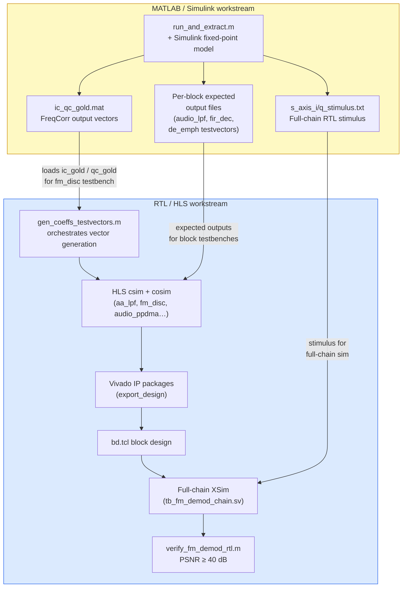

The critical property of this arrangement: the RTL workstream can begin as soon as the first intermediate node vectors are available from the Simulink model — it does not need to wait for the full model to be complete, validated, and fixed-pointed. As long as a stage's input/output interface is stable, its RTL can be developed and tested against whatever the Simulink model produces at that node, even if earlier stages are still being refined.

---

### H.3 The Test Plan: Four Verification Levels

The complete test plan is organized into four levels, each with a specific scope, stimulus source, pass/fail criterion, and the point in the development timeline at which it runs.

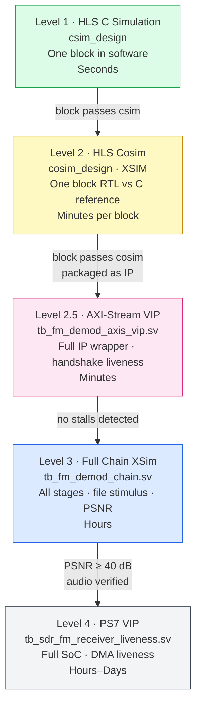

---

#### Level 1 — HLS C Simulation (csim)

**Scope:** One HLS block in isolation, tested entirely in software (no RTL generated yet).

**When it runs:** Before synthesis, as the first step of `run_hls.tcl` (`csim_design`). Runs in seconds.

**Stimulus source:** A dedicated C++ testbench (`*_tb.cpp`) that either:
- Synthesizes stimulus analytically (e.g. a known-phase I/Q pair for `fm_disc`, where the expected discriminator output can be computed exactly from the phase difference), or
- Reads pre-generated test vectors from files produced by MATLAB (`gen_fm_disc_vectors.m`, `gen_audio_lpf_impulse_test.m`, etc.)

**Pass/fail criterion:** Bit-exact match between the C++ HLS function under test and the expected output loaded from the MATLAB-generated vector file. Any mismatch is a C-level bug in the HLS implementation — a wrong formula, a sign error, a rounding mode mismatch — that can be debugged in a standard C++ debugger before any RTL is involved.

**What it catches:** Algorithmic errors, wrong fixed-point types (the C++ `ap_fixed<>` argument doesn't match the Simulink `sfix` format), wrong rounding or saturation mode choices, off-by-one errors in delay registers.

**Example — `fm_disc` csim:** The testbench feeds 1000 samples of `ic_gold`/`qc_gold` (loaded from `ic_qc_gold.mat` via a text file), computes the expected discriminator output independently using the same cross-product formula, and checks that the HLS `fm_disc()` function output matches to within the tolerance of one LSB of `sfix32_En14`. If the `hls::atan2` template arguments are wrong (e.g. wrong output word length), this level catches it before cosim is even attempted.

---

#### Level 2 — HLS C/RTL Co-Simulation (cosim)

**Scope:** One HLS block's generated RTL, verified against the same C++ testbench via XSim.

**When it runs:** After synthesis, as the third step of `run_hls.tcl` (`cosim_design`). Runs in minutes per block.

**Stimulus source:** Identical to Level 1 — the same C++ testbench drives the RTL simulation through Vitis HLS's automatically-generated transactor model. The testbench sees the same function call interface; the tool wraps it in AXI-Stream/AXI4 protocol transactions transparently.

**Pass/fail criterion:** The RTL simulation output matches the C simulation output exactly (bit-for-bit, not just approximately). Any mismatch between Level 1 and Level 2 is a synthesis-introduced discrepancy — a pragma that scheduled differently than expected, an uninitialised reset register (the class of bug that caused the permanent-X GPIO symptom), or a depth mismatch on an `m_axi` port that caused cosim's transactor to read out of bounds.

**What it catches:** Pragma-induced scheduling hazards, missing RESET pragmas on static variables, `m_axi depth` mismatches, `ap_ctrl_none` variable-latency violations.

**Notable bugs caught at this level in this project:**
- The `ap_ctrl_none` rejection on `audio_ppdma` (variable latency from the burst-copy loop).
- The `m_axi depth=1048576` SIGSEGV in `audio_ppdma` (cosim reading past the end of the testbench's actual buffer).
- The `iq_ppdma` pipelined address-generation hazard (out-of-range read address 33 when max valid was 23, produced by a pipeline scheduling interaction between cross-iteration state and runtime `ap_none` config ports at II=1).
- The permanent-X `active_buf` output on `iq_ppdma`, traced to a mux gated to a single FSM state (`ap_CS_fsm_state10`) with explicit `'bx` on all other states — resolved by inspecting the generated Verilog and adding a shadow register.

---

#### Level 3 — Full Behavioural Chain Simulation (Vivado XSim)

**Scope:** The complete `fm_demod` signal chain (all six stages connected as a block design), simulated behaviourally in Vivado XSim using the full I/Q stimulus.

**When it runs:** After all individual HLS blocks have passed Levels 1 and 2, and the block design has been assembled.

**Stimulus source:**
- `s_axis_i_stimulus.txt` and `s_axis_q_stimulus.txt` — generated by `gen_coeffs_testvectors.m` (specifically its `gen_fm_demod_stimulus` step) from `rds.wav`, quantised to `fixdt(1,16,15)` and written as integer text files. 2,500,000 samples (10 seconds of audio) are used as the standard stimulus.
- The testbench (`tb_fm_demod_chain.sv`) reads these files with `$readmemh` and streams them as AXI-Stream transactions into the chain.

**Pass/fail criterion:** `verify_fm_demod_rtl.m` reads the XSim output, aligns it to the Simulink fixed-point model's output using cross-correlation to account for pipeline latency, and computes PSNR. The acceptance criterion is >40 dB PSNR at the audio output. Subjective audio playback (via `sound()`) provides a secondary human-perceptible check — distortion, incorrect pitch, or missing audio are immediately obvious.

**What it catches:** Integration bugs between stages (sign-extension errors at stage boundaries, incorrect AXI-Stream handshaking, wrong sample-rate conversion ratios), timing issues visible only when all stages are connected, and numerical quality degradation that is below the threshold of a per-block unit test but audible in aggregate.

**The sign-extension bug that was caught here:** `iq_splitter.vhd` was initially using `xlconstant_0` to zero-pad the 18-bit `sfix18_En17` values to 24 bits for the AXI-Stream `tdata` field, instead of sign-extending. Zero-padding treats the value as unsigned, flipping the sign of all negative values — a catastrophic error that produced grossly wrong discriminator output. This was caught at Level 3 during waveform analysis of the behavioural simulation: the discriminator output showed incorrect sign at every negative I or Q value. The fix (replicating the MSB using `xlslice`/`xlconcat` in `bd.tcl`) was verified by re-running Level 3 and confirming PSNR recovery.

---

#### Level 4 — End-System Integration Test (PS7 VIP)

**Scope:** The complete SoC — PS7 ARM subsystem, AXI interconnect, DMA, and the full `fm_demod` IP — simulated using the PS7 VIP.

**When it runs:** After the full block design has been assembled and passes Level 3.

**Stimulus source:** The PS7 VIP's `write_mem`/HP0 backdoor preloads I/Q data into the DDR simulation model before PL reset is released. The ping-pong DMA cores then read this data continuously without any further CPU intervention.

**Pass/fail criterion:** Two tiers:
1. **Liveness check** (`tb_sdr_fm_receiver_liveness.sv`): the `active_buf` GPIO bits for both `iq_ppdma_0` and `audio_ppdma_0` must toggle repeatedly throughout a simulated run of up to 500 ms simulated time. A watchdog timer (50 ms / 5 ms per DMA, respectively) fires if either bit stops toggling — indicating a DMA hang. This is the check that caught the PS7 VIP `FIXED_IO_ps_porb`/`ps_srstb` undriven-signal bug.
2. **Audio data check** (informational at this level): a readback of the first 16 words at `AUDIO_DEST_ADDR` checks that at least some non-zero audio data has been written — distinguishing a working audio path from a DMA that is toggling correctly but writing zeros.

**What it catches:** DMA hang conditions (both hardware bugs and testbench bugs, which are indistinguishable until the root cause is traced), incorrect AXI addressing, cache-coherency issues visible at the SoC level, and the PS7 VIP configuration pitfalls described in Appendix G.4.

---

### H.4 The `gen_coeffs_testvectors.m` Orchestrator

The six-step master script that drives the entire vector generation sequence deserves explicit explanation, because its structure directly reflects the dependency graph between workstreams:

```
gen_coeffs_testvectors.m
  │
  ├── [1/6] aa_lpf/      audio_lpf_coeffs.m + gen_audio_lpf_impulse_test.m
  ├── [2/6] audio_lpf/   (same pattern)
  ├── [3/6] de_emphasis/ gen_de_emph_test.m
  ├── [4/6] fir_dec/     fir_dec_coeffs.m + gen_fir_dec_impulse_test.m
  ├── [5/6] fm_disc/     gen_fm_disc_vectors.m
  │           └── loads ic_qc_gold.mat (saved by run_and_extract.m)
  └── [6/6] fm_demod/    gen_fm_demod_stimulus.m
                └── reads rds.wav directly → s_axis_i/q_stimulus.txt
```

Steps 1–4 are fully self-contained — they generate impulse responses and coefficient files from filter design specifications, with no dependency on the Simulink simulation having been run. They can run immediately after `gen_coeffs_testvectors.m` is called, in any session.

Step 5 (`fm_disc`) is the dependency point. It requires `ic_gold` and `qc_gold` — the frequency-corrected I/Q vectors that are the output of the first stage (NCO/FreqCorr) and the input to the AA LPF and discriminator. These can only come from a run of `run_and_extract.m`, which executes the full Simulink model. To decouple the two workstreams, `run_and_extract.m` saves these vectors to `ic_qc_gold.mat` at the end of its execution; `gen_fm_disc_vectors.m` loads from that file if the variables are not already in the workspace. The two scripts can therefore be run in different MATLAB sessions, or by different engineers, without manual variable passing.

Step 6 (`fm_demod`) reads `rds.wav` directly — it is self-contained and can run independently of all other steps.

**The sequencing discipline enforced by this script is pedagogically important:** steps 1–4 can be done while the Simulink model is still being refined (they don't depend on it); step 5 requires the model to have run at least once; step 6 can run at any time. A learner who tries to run step 5 before `run_and_extract.m` receives a clear, actionable error message rather than a cryptic variable-not-found crash.

---

### H.5 The Parallelism in Practice

The development sequence that this test plan enables — and which is the key insight to transfer to learners — is as follows:

**Phase 1: Simulink model development (MATLAB/Simulink workstream)**
While the full Simulink model is being built and fixed-pointed, the RTL workstream can begin immediately on blocks that do not depend on Simulink intermediate vectors. Steps 1, 2, 3, 4, and 6 of `gen_coeffs_testvectors.m` are available from the start: the AA LPF coefficients, audio LPF coefficients, de-emphasis test vectors, and FIR decimator coefficients all come from filter design specifications that are independent of any signal simulation. The corresponding HLS blocks (`aa_lpf`, `audio_lpf`, `fir_decimation`) can be built and taken through Levels 1 and 2 while `run_and_extract.m` is still being refined.

**Phase 2: Discriminator development unlocked by first Simulink run**
As soon as `run_and_extract.m` produces `ic_qc_gold.mat`, the `fm_disc` HLS block can be developed and verified. This is typically the first block that depends on the Simulink model output, and it is also the most algorithmically complex block (the CORDIC atan2 discriminator). Having all simpler blocks already verified at this point means that when `fm_disc` Level 1/2 passes, the signal chain from input to discriminator output is trusted.

**Phase 3: Integration**
With all individual blocks verified, the block design is assembled from `bd.tcl`. Level 3 simulation is the first time all stages are connected; at this point, the only remaining bugs can be at stage boundaries (sign-extension, format mismatches, `tlast` framing, clock domain issues). The sign-extension bug described in H.3 is a good example — it was a boundary bug that could not have been caught at Level 1 or 2, but was caught immediately at Level 3 because the individual stages were already trusted.

**Phase 4: End-system**
With Level 3 audio quality confirmed, Level 4 adds the PS7, DMA, and software. The scope of possible bugs at this level is narrow enough that the PS7 VIP liveness check is sufficient as the primary verification criterion — if DMA is running and audio data is non-zero, the integration is correct, and remaining questions (real-time budget, cache coherency on hardware) can only be confirmed on real silicon.

---

### H.6 What This Test Plan Does Not Cover (and Why That Is Deliberate)

**Exhaustive stimulus coverage:** Each HLS block is tested against a few hundred to a few thousand samples, not against all possible input combinations. For a 16-bit input, exhaustive testing is computationally infeasible; the choice of `rds.wav` as a real FM broadcast provides diverse, realistic stimulus that exercises a wide range of signal conditions (varying modulation depth, brief silence intervals, RDS subcarrier content) without requiring synthetic coverage models.

**Timing simulation at block level:** Levels 1 and 2 are behavioural — they test functional correctness, not timing. The first timing feedback comes at Level 3 (Vivado implementation) and is only meaningful at the block-design level. Individual HLS blocks get Fmax estimates from `csynth_design`, but these are pre-placement estimates and the real timing constraint is only known after full implementation of the `end_system` project.

**Hardware-in-the-loop:** The test plan as described is entirely simulation-based. Real hardware introduces failure modes that simulation cannot reproduce: actual DDR latency and arbitration, SD card jitter, real FM signal conditions, and the cache-coherency behavior of the physical Zynq-7010 HP ports. These are addressed during hardware bring-up (Part 7 of the course) rather than in the RTL verification phase, because the simulation already provides sufficient confidence in the functional correctness of the RTL before hardware is involved.

**Automated regression:** `gen_coeffs_testvectors.m` orchestrates vector generation but does not itself run simulations or check pass/fail. The simulation steps (HLS `build.sh` scripts, `run_batch_sim.sh`) are currently triggered manually in sequence. A complete regression suite would chain these automatically and aggregate pass/fail across all levels — this is an open extension noted in Section 6 of the main course design.

---

## Appendix I — Five Missing Pieces

---

### I.1 The Sign-Extension Bug: A Complete Case Study

This is the single most instructive real bug in the entire project, and it deserves a full account in one place rather than scattered mentions. It is a genuinely transferable lesson that will recur in any project that connects fixed-point signals across block boundaries with different word widths.

#### The symptom

During Level 3 full-chain simulation (`tb_fm_demod_chain.sv`), the FM discriminator output showed severe corruption: instead of a smooth audio-frequency waveform, the output exhibited sawtooth-like wraparound artifacts at regular intervals. The waveform looked superficially alive — it was toggling at the right rate, it had the right general shape — but it clipped abruptly to a large positive value whenever the input signal went negative, then snapped back. The PSNR measurement in `verify_fm_demod_rtl.m` was effectively zero — no meaningful match with the Simulink golden reference.

#### The diagnosis

Suspicion immediately fell on the I/Q adapter path, because the corruption had the signature of a sign bit being dropped: positive input values were handled correctly, negative values were not. Adding intermediate waveform probes confirmed that the AA LPF input signals were corrupted for negative I/Q values. Specifically, at the `s_axis_i_0_tdata[23:0]` bus feeding `aa_lpf_I`, a value of `-1` in `sfix18_En17` (which is `0x3FFFF` in two's-complement — all 18 bits set) was appearing on the 24-bit bus as `0x03FFFF` — a large positive value — rather than the correct sign-extended `0xFFFFFF`.

Tracing backward through the block design, the adapter from the 18-bit HLS output to the 24-bit AXI-Stream `tdata` field consisted of:
- `xlconcat_0`: combining `In0[17:0]` (the 18-bit signal) with `In1[5:0]` (a 6-bit constant) to produce 24 bits
- `xlconstant_0`: providing the 6-bit constant, with `CONST_VAL = 0` and `CONST_WIDTH = 6`

The bug is on the last line: a constant zero in the upper 6 bits means zero-padding, not sign extension. For a positive 18-bit value, the upper 6 bits are legitimately zero, so zero-padding happens to be correct. For a negative 18-bit value in two's-complement, the upper 6 bits should all be `1` (the sign bit replicated), but zero-padding writes `000000` instead — reinterpreting the negative value as a large positive 24-bit number.

This is a concrete consequence of the distinction between **zero-extension** (treating the value as unsigned, padding with zeros) and **sign-extension** (treating the value as signed, replicating the MSB). Xilinx's `xlconstant` IP can only provide a fixed constant — it cannot track the changing sign bit of an input signal. Using it for sign extension is therefore structurally incorrect regardless of what value is programmed.

#### The fix

`xlconstant_0` was removed and replaced with a two-step dynamic sign-bit replication:

1. `xlslice_sign`: extracts bit 17 (the MSB/sign bit) of the 18-bit input signal as a 1-bit output.
2. `xlconcat_sign`: replicates that single bit across 6 outputs by wiring the same 1-bit signal to all 6 inputs of a 6-wide concatenator.

The output of `xlconcat_sign` (6 copies of the current sign bit) replaces `xlconstant_0/dout` as `In1` of the existing `xlconcat_0`. The result is a correct two's-complement sign extension: for positive values, `In1` is `000000`; for negative values, `In1` is `111111`.

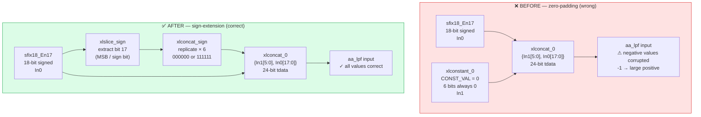

This was implemented entirely in `bd.tcl` via the Tcl script `fix_sign_extend_adapters.tcl`, which patches the block design programmatically without touching any HDL.

After the fix, the Level 3 simulation immediately produced PSNR > 40 dB and audible, intelligible audio from `verify_fm_demod_rtl.m`.

#### The transferable lesson

Every point in a design where a signal crosses from a narrower to a wider AXI-Stream `tdata` field is a sign-extension opportunity for a bug. The standard approach in RTL (`{{N{sign_bit}}, signal}` concatenation in Verilog; `resize(signed_signal, new_width)` in VHDL) does this correctly. Block-design wiring that uses `xlconstant` for the padding bits is a common mistake precisely because it works correctly for positive values and fails silently for negative ones — a correctness problem that only appears when the input exercises both signs.

The fact that this bug was caught at Level 3 (not Level 1 or 2) is itself instructive. Levels 1 and 2 test individual HLS blocks in C-simulation and RTL cosim; neither level involves the block design at all. The boundary wiring only exists in `bd.tcl`, and `bd.tcl` is only exercised at Level 3. This is exactly why Level 3 exists as a distinct verification tier.

---

### I.2 Frequency Correction — The NCO and Complex Mixer Stage in Depth

#### Why frequency correction is necessary

An RTL-SDR receiver tunes its local oscillator to a nominal centre frequency, but it cannot tune to exactly that frequency. The crystal reference has finite accuracy (typically ±1–5 ppm), the tuner's PLL has finite resolution, and the station itself may be slightly off its assigned frequency. The net result is that the recorded `rds.wav` baseband is centred not at DC but at some small offset — in this project, measured at approximately −10 kHz. Without correction, the FM discriminator would measure the phase derivative of a signal rotating at 10 kHz rather than a signal at DC, interpreting that rotation as 10 kHz of audio-frequency content — severe, constant distortion.

#### The NCO

The numerically controlled oscillator (NCO) generates a continuous complex exponential at exactly +10 kHz (to cancel the −10 kHz offset). It is implemented using the **Xilinx DDS Compiler v6.0** IP in phase-increment mode, configured as follows:

- **Output frequency:** +10 kHz at 250 kHz sample rate
- **Phase width:** 24 bits (giving frequency resolution of 250000/2²⁴ ≈ 0.015 Hz)
- **Output format:** `fixdt(1,16,15)` — 16-bit signed, one sign bit, 15 fraction bits; range [−1, +1)
- **Output port:** `m_axis_data_tdata[31:0]` packed as `{sin[31:16], cos[15:0]}` per PG141

The `tdata` packing matters: the DDS Compiler places cosine in the low 16 bits and sine in the high 16 bits, which is the reverse of an intuitive layout. Any testbench or downstream block that reads these fields in the wrong order will see the cosine when it expects the sine, producing a 90° phase error in the mixer — a real bug that was caught during NCO testbench development when the output shape at t=0 was wrong until the slice assignments were corrected.

#### The complex mixer

The frequency corrector (`freq_corr` HLS block) performs the standard complex baseband mixing operation. Given an input complex sample (I, Q) and the NCO output (cos θ, sin θ), the corrected output is:

```
Ic = I × cos θ  −  Q × sin θ
Qc = I × sin θ  +  Q × cos θ
```

This is a rotation of the complex phasor (I + jQ) by angle θ — exactly cancelling the −10 kHz offset rotation accumulated in the recorded data. It requires four 16×16 multiplications and two additions per sample.

**AXI-Stream synchronisation requirement:** The block has four input streams (I, Q, cos, sin), each with independent `tvalid`. The implementation only asserts `s_axis_i_tready` (and analogously for the others) when all four streams are simultaneously valid — a strict four-way handshake. This prevents I and Q from advancing one sample relative to their corresponding NCO values, which would introduce a phase slip equivalent to one sample of frequency error. In simulation this was verified by deliberately stalling one input stream and confirming the others did not advance.

**Word-length growth:** The 16×16 product is a 32-bit result. After the subtraction/addition, the 17th bit (the carry/overflow bit from the accumulation) could, in principle, carry. The output is therefore widened to `sfix18_En17` — 18 bits, 17 fraction bits, range [−1, +1) with one extra guard bit for the accumulation. This is the format that the downstream AA LPF and the sign-extension adapters must handle correctly (see I.1).

#### Dynamic retuning

The DDS Compiler supports a programmable phase increment via its `S_AXIS_CONFIG` port. When configured with `Phase_Increment = Programmable`, a new PINC value written by the PS ARM core at runtime immediately changes the NCO frequency — no bitstream reload required. The PINC for a target offset frequency f is:

```
PINC = round(f / fs × 2^phase_width) = round(f / 250000 × 2^24)
```

For −10 kHz: PINC = round(10000/250000 × 16777216) = 671089. This enables software-controlled retuning to any station within ±125 kHz of the recording's centre frequency without FPGA re-synthesis — a practical consideration for real deployment against a live SDR front end.

---

### I.3 The 50 kHz → 48 kHz Polyphase Resampler

#### Why 50 kHz, and why it needs resampling

The FM demodulator's CIC decimator (R=5) outputs audio at exactly 50 kHz. This is the only clean integer decimation ratio from 250 kHz that keeps the output rate above the Nyquist limit for 15 kHz audio. However, 50 kHz is not a standard audio sample rate — consumer audio equipment, codecs, and WAV file players expect 44.1 kHz or 48 kHz. The 50 kHz output therefore needs to be resampled before writing to a standard WAV file.

#### Why a rational polyphase FIR rather than linear interpolation

The rate conversion from 50 kHz to 48 kHz is a ratio of 48/50 = 24/25 — a 4% change. A naive linear interpolation between adjacent samples would introduce a passband droop and imperfect stopband rejection at this ratio. For an FM radio application the artifacts may be marginal, but the polyphase FIR approach is both correct and a faithful reproduction of what `MATLAB's resample(audio, 24, 25)` function actually does internally — making the bare-metal software output numerically consistent with the MATLAB post-processing used during simulation. Consistency with the validated reference is the decisive reason to use the FIR approach rather than an approximation.

#### The filter design

The resampler is conceptually built in three steps:
1. **Upsample by L=24**: insert 23 zeros between each input sample, producing a 1.2 MHz virtual sequence.
2. **Apply anti-alias FIR**: a lowpass filter with cutoff at min(fs_in, fs_out)/2 = 24 kHz suppresses the images created by upsampling.
3. **Downsample by M=25**: discard 24 out of every 25 samples.

The polyphase decomposition avoids computing the 23 zero-valued multiplications per input sample by rearranging the filter into L=24 phases, each of length `ceil(N_taps / L)`. Only one phase is computed per output sample, reducing the computational cost by a factor of L.

**Filter parameters:**
- Total taps: 2208 (designed with `kaiserord` for >66 dB stopband attenuation, rounded up to a multiple of L=24)
- Taps per phase: 92
- Cutoff: 24 kHz (min of 25 kHz input Nyquist and 24 kHz output Nyquist)
- Window: Kaiser, β chosen by `kaiserord` to meet the 66 dB attenuation spec

The coefficient table is generated once in MATLAB/Python, quantised to `float`, and embedded in `resample_coeffs.h` as a C array of 2208 values indexed as `h_poly[phase][tap]`.

#### The C implementation

`resample_50k_to_48k.c` implements the polyphase filter in a straightforward accumulator loop:

```c
// For each output sample m:
//   input index i   = floor(m × M / L)
//   phase           = (m × M) mod L
//   output[m]       = sum over k of h_poly[phase][k] × input[i - k]
```

The index arithmetic uses 64-bit integers to avoid overflow for large frame counts. The computation runs on the Cortex-A9 with hardware floating-point (`-mfloat-abi=hard -mfpu=vfpv3`); at 48 kHz output rate the CPU load is negligible compared to the SD card I/O.

**Why not implement this in FPGA fabric:** The FPGA outputs at 50 kHz; the resampler is a software post-processing step applied after the audio is moved to DDR. Implementing it in PL would consume FIR Compiler resources for a block that runs at 48 kHz — a trivially low rate that the Cortex-A9 handles in microseconds per frame. The separation of concerns (FPGA for real-time DSP, CPU for rate adaptation and file I/O) is the correct architectural choice here.

---

### I.4 AXI-Stream Glue Logic: `iq_splitter.vhd` and `tlast_gen.vhd`

These two hand-written VHDL blocks are invisible in the signal-processing description but essential for the SoC integration. They solve a class of problem that appears in almost every AXI-Stream-based SoC: the mismatch between the protocol requirements of a bus master (the DMA IP) and the data format requirements of the signal-processing pipeline.

#### `iq_splitter.vhd` — packing format adaptation

**The problem:** The AXI DMA IP delivers data from DDR as a 32-bit AXI-Stream: each `tdata` beat carries one packed I/Q word in the format `{Q[15:0], I[15:0]}` — two 16-bit values in a single 32-bit bus. The `freq_corr` HLS block, however, expects two *separate* AXI-Stream interfaces: one 16-bit stream for I and one 16-bit stream for Q, each with its own `tvalid`/`tready` handshake.

**What `iq_splitter.vhd` does:** Accepts the 32-bit packed DMA stream and produces two simultaneous 16-bit output streams. On each valid beat it presents `tdata[15:0]` on the I output and `tdata[31:16]` on the Q output. Both outputs carry the same `tvalid` (derived from the packed stream's `tvalid`). The packed stream's `tready` is only asserted when both downstream consumers assert their `tready` simultaneously — preventing one path from advancing relative to the other and introducing an I/Q skew.

**Why this cannot be done with `xlslice` alone:** `xlslice` extracts a bit range from a bus combinatorially, but it cannot replicate the AXI-Stream handshake semantics — specifically, the per-interface `tready` backpressure. `iq_splitter.vhd` is the simplest block that correctly handles the four-way handshake between one upstream producer and two downstream consumers.

#### `tlast_gen.vhd` — DMA framing

**The problem:** The AXI DMA IP requires `tlast` on its S2MM (stream-to-memory) input to know when a transfer is complete — it uses `tlast` as the transfer termination signal, not a byte count countdown (or both, depending on configuration). The de-emphasis output has no natural `tlast` — the filter simply produces one output sample per valid input sample, with no concept of frames or packets.

**What `tlast_gen.vhd` does:** Inserts a `tlast` pulse every `FRAME_SIZE` valid beats. It contains a saturating counter that increments on every accepted beat (when both `tvalid` and `tready` are high) and asserts `tlast` on the beat when the counter reaches `FRAME_SIZE - 1`, then resets. The counter gates on handshake qualification so that stall cycles (when `tready` is low) do not advance the count — ensuring exactly `FRAME_SIZE` data beats per `tlast`-delimited frame regardless of downstream backpressure.

`FRAME_SIZE` is a generic parameter. Setting it to match the S2MM transfer size in `main.c` ensures the DMA completes exactly one transfer per audio frame, which is the fundamental synchronisation point between the PL audio stream and the PS-side buffer management.

**Why this matters for the test plan:** `tlast_gen` is one of the trickiest blocks to unit-test in isolation because its correctness depends on handshake timing that only manifests under backpressure. The Level 3 simulation (`tb_fm_demod_chain.sv`) with a downstream consumer that occasionally asserts `tready = 0` is the correct verification environment for this block. A testbench that holds `tready` permanently high will pass `tlast_gen` even if the handshake gating is wrong — the bug only manifests when backpressure occurs.

---

### I.5 The AXI-Stream VIP Stall Testbench — An Intermediate Verification Level

Between the HLS IP-level cosim (Appendix H, Level 2) and the full PS7 VIP end-system testbench (Level 4), there is an intermediate verification tier that the test plan in Appendix H does not name explicitly: a testbench that exercises the complete `fm_demod` IP (packaged and instantiated in a wrapper) via the **Xilinx AXI4-Stream VIP** (`axi4stream_vip`) rather than the PS7 VIP. This testbench, `tb_fm_demod_axis_vip.sv`, was developed specifically to answer a question that neither Level 2 nor Level 3 addresses efficiently: *do the AXI-Stream interfaces stall?*

#### Why this level exists

Level 2 (HLS cosim) tests individual blocks in isolation. Level 3 (full-chain XSim simulation) tests the complete signal-chain with stimulus from a file, but uses a simplified testbench harness that drives the input at a fixed rate and does not model backpressure. Neither level exercises the AXI-Stream handshake protocol under realistic conditions where the downstream consumer occasionally stalls.

A stall — `tvalid = 1` and `tready = 0` for many consecutive cycles — is a real failure mode in AXI-Stream systems. If a downstream block asserts `tready` incorrectly (for example, de-asserting it permanently because of an upstream reset that was applied at the wrong time), the entire pipeline upstream of that block freezes. This kind of failure is invisible in both Level 2 and Level 3 because neither generates real backpressure.

#### What the AXI4-Stream VIP provides

The `axi4stream_vip` IP is a Xilinx simulation model that can act as either a master (generating AXI-Stream transactions) or a slave (consuming them). In `tb_fm_demod_axis_vip.sv`:

- A **master VIP** instance drives the `s` input port of `design_1_wrapper` with packed I/Q beats at the nominal 250 kHz rate (one beat every 400 PL clock cycles at 100 MHz).
- A **slave VIP** instance consumes the `m` output port with `tready` held high (accepting all output immediately).

The testbench adds a **stall watchdog** on both the input and output interfaces: if `tvalid` is asserted and `tready` is not asserted for more than `STALL_TIMEOUT` consecutive clock cycles, an error is flagged and `$finish` is called. The watchdog fires on both interfaces independently.

After `SAMPLE_COUNT` input beats the testbench checks that no stall events occurred and reports pass/fail.

#### Where this fits in the test plan

This level sits between Levels 2 and 3 in the hierarchy:

| Level | Testbench | Exercises | What it confirms |
|---|---|---|---|
| 2 | HLS cosim | One HLS block's RTL | Functional correctness of one block |
| **2.5** | **AXI-Stream VIP** | **Complete fm_demod IP wrapper** | **AXI-Stream handshake liveness under pacing** |
| 3 | Full-chain XSim | All stages, file stimulus | End-to-end signal quality (PSNR) |
| 4 | PS7 VIP | Full SoC | DMA liveness, end-system correctness |

The value of Level 2.5 is that it catches interface-level bugs (wrong `tready` logic in `iq_splitter.vhd`, `tlast_gen` advancing on stall cycles, mismatched pipeline depths between stages) before the full-system complexity of Level 3 makes them harder to isolate. The AXI4-Stream VIP master also provides an easy knob to inject realistic backpressure by randomising the `tready` assertion timing on the slave side — a capability that is difficult to replicate in Level 3's file-driven testbench without additional infrastructure.

#### Limitations

This level does not verify functional correctness of the output data — only that data moves through without stalling. It complements Levels 2 and 3 rather than replacing either. A pipeline that moves corrupt data efficiently passes Level 2.5 while failing Level 3; a pipeline that computes correctly but deadlocks under backpressure passes Level 3 but fails Level 2.5.

---

## Appendix J — Why the Auto-Proposed Fixed-Point Word Lengths Were Overridden

Appendix F describes the Fixed-Point Designer workflow as if it produces a trustworthy, complete answer that flows directly into the HLS implementation. In practice, the relationship is more nuanced: the auto-proposer's output was used as a starting point, checked analytically, and overridden in several places. This appendix explains each override, why the auto-proposed value was wrong, and what the correct value is. It is also a case study in why "the tool proposed it" is not sufficient justification for a fixed-point format choice.

### J.1 The Original Conversion Script and Its Failures

The first attempt at fixed-point conversion used `DataTypeWorkflow.Converter` in Simulink's Fixed-Point Tool in a pattern that is common but subtly wrong: the auto-proposer was run on the floating-point model to collect ranges, and then the `From Workspace` source blocks were manually overridden in the same script with hardcoded `fi()` type declarations. The result was that the auto-proposal and the manual override were fighting each other — the auto-proposer calculated correct propagated formats downstream, but the manually-set source format (`sfix16_En4`) immediately invalidated those downstream proposals because they were propagated from the wrong starting point.

The audio quality from this first attempt was catastrophically bad. Diagnosing why required understanding each thing the auto-proposer gets wrong, separately from what the manual override got wrong.

---

### J.2 The Input Format Override: `sfix16_En4` → `sfix16_En15`

**What the auto-proposer proposed:** The original script set `sfix16_En4` for the I/Q input samples.

**Why this was wrong:** `sfix16_En4` has 4 fraction bits and 12 integer bits, giving a representable range of [−2048, +2048) with a resolution of 2^−4 = 0.0625. The actual I/Q input values after normalising the 16-bit ADC output by dividing by 32768 are in the range (−1, +1) — they are fractional values close to zero. Representing a signal in (−1, +1) with a format whose resolution is 0.0625 means the entire signal is quantised to at most 32 distinct levels. This is not a subtle precision loss — it is equivalent to reducing the ADC resolution from 16 bits to 5 bits and discarding the rest. The "awful audio" symptom was directly caused by this single error: every I/Q sample was quantised to one of 32 values before entering the signal chain.

**The correct format:** `sfix16_En15` — signed 16-bit with 15 fraction bits. Range: [−1, +1), resolution: 2^−15 ≈ 30 µV equivalent. This is the natural format for a normalised 16-bit ADC output and exactly matches the SDRplay ADC's inherent precision. The NCO cosine and sine outputs, also in (−1, +1), use the same format for the same reason.

**Why the auto-proposer got this wrong:** The auto-proposer ran on the floating-point model, where the `From Workspace` block has no fixed-point type at all — it inherits `double`. When asked to propose a type for that source block, the tool observed the range of the floating-point simulation data, saw values in (−1, +1), added a small margin, and proposed something like `sfix16_En14` or `sfix16_En15`. But then the manual `fi()` override in step 5 of the script unconditionally replaced that proposal with `sfix16_En4`. The two actions were not coordinated.

**The lesson:** When using `DataTypeWorkflow.Converter`, do not manually override the source block types after running the auto-proposer unless you have a specific analytical reason to do so. The auto-proposer's source type proposals are typically correct; overriding them with analytically wrong values invalidates the entire downstream propagation.

---

### J.3 The Discriminator Output Override: `sfix18_En15` → `sfix32_En14`

**What the auto-proposer proposed:** For the CORDIC atan2 output (the phase angle, before the Hz-scaling multiply), the auto-proposer typically proposes something like `sfix18_En15` — 18 bits, 15 fraction bits, matching the precision it estimated from the Simulink CORDIC block's output.

**Why this was insufficient:** The CORDIC atan2 output is in (−π, +π). The *next* block multiplies this by `fs / (2π) = 250000 / (2π) ≈ 39788.7` to convert radians to Hz. After this multiplication the output range is approximately ±125 kHz. With `sfix18_En15` as the CORDIC output type, the multiplication product has a raw integer range of ±39788 × 2^15 ≈ ±1.3 × 10^9, which requires at least 31 bits to represent without overflow. The auto-proposer, looking only at the CORDIC output signal in isolation, saw values in (−π, +π) and proposed 18 bits. It did not look ahead to see that the gain block's output needed 31+ bits — that propagation step was missed, and the gain block's output silently overflowed for any signal with more than about ±3 kHz of instantaneous frequency deviation.

**The correct format:** The gain block output was explicitly set to `sfix32_En14` — 32 bits, 14 fraction bits, covering [−131072, +131072) Hz with resolution of ~0.06 Hz. The analysis:
- Maximum FM deviation: ±75 kHz (per ITU-R broadcast standard)
- Safety margin for off-tuned carriers or pre-emphasis transients: ~±130 kHz
- Required integer bits: ceil(log₂(130000)) + 1 sign bit = 18 bits
- Total word: 18 integer bits + 14 fraction bits = 32 bits → `sfix32_En14`

**Why the auto-proposer failed here specifically:** The auto-proposer is empirical — it only sees the range that the simulation actually exercised. A typical 5–10 seconds of FM broadcast audio rarely reaches ±75 kHz of instantaneous frequency deviation at every sample. The silence-to-music transients that cause peak deviation are rare in any fixed test vector. So the auto-proposer underestimates the required integer bit count for the discriminator output, producing a format that passes the test vector but overflows on real-world extreme inputs.

**The general principle this illustrates:** For signals whose worst-case range is analytically known (FM deviation is bounded by broadcast standards; atan2 output is bounded by (−π, +π)), the correct approach is to set the format analytically from that bound, not empirically from a simulation run. The auto-proposer's empirical approach is appropriate for signals whose worst-case range is genuinely unknown — internal accumulator values in a complex filter, for example, where analytical range propagation is tedious. It is the wrong tool for signals with hard analytical bounds.

---

### J.4 The De-emphasis Accumulator Override: narrow → `sfix40_En15`

**What the auto-proposer proposed:** For the de-emphasis IIR's internal accumulator and feedback path, the auto-proposer proposed a relatively narrow format — consistent with the observed signal range during simulation.

**Why this was insufficient:** The de-emphasis filter is a single-pole IIR:

```
y[n] = b0 × x[n] + a1 × y[n−1]
```

with coefficient a1 ≈ 0.766 (for 75 µs at 50 kHz). This coefficient is close to 1 — the filter has a long memory, and its step response ring-down is slow. The steady-state output range during a simulation of typical FM audio is significantly smaller than the worst-case accumulator value that occurs during a sudden step change (silence-to-loud transition). The auto-proposer observes the steady-state range; it does not compute the worst-case transient.

Additionally, a narrow accumulator in an IIR with a coefficient close to 1 can cause **limit cycles** — a phenomenon where rounding errors at the accumulator's LSB circulate in the feedback loop and produce a small, periodic oscillation in the output even when the input is zero or constant. This is inaudible for most signals but measurable, and it indicates incorrect fixed-point arithmetic.

**The correct format:** Coefficients at `sfix24_En23` (high-precision, matching the ADC-grade precision of the signal at this stage); accumulator at `sfix40_En15` — 40-bit wide, providing 25 integer bits of headroom above the 15-bit fraction, far more than needed to represent any audio signal but necessary to prevent the accumulator from overflowing on a worst-case step response.

**Why 40 bits:** The explicit accumulator size was chosen to be wide enough that the overflow risk is negligible for any physically meaningful FM audio signal, and narrow enough that it synthesises to a 32+8-bit split across two DSP48 slices rather than requiring three. This was a resource-aware choice, not a minimum-required choice.

---

### J.5 The Product Block Output Override: inherited → explicit `sfix32`

**What the auto-proposer proposed (via Simulink default):** Simulink's Product block in fixed-point mode defaults to `Inherit: Inherit via internal rule`, which typically resolves to the shorter of the two input types. For two `sfix18_En17` inputs, this produces a `sfix18`-something output — silently discarding the low-order 18 bits of the full-precision 36-bit product.

**Why this was wrong:** A multiply of two 18-bit numbers produces a 36-bit result. Truncating this to 18 bits before further accumulation discards exactly half the precision of the multiplication — in the frequency corrector and FM discriminator, where two cross-products are then summed, the accumulated truncation error is large enough to affect the discriminator's accuracy by several hundred Hz on real signals.

**The correct setting:** Every product block in the frequency corrector and discriminator subsystems was given an explicit output type of `sfix32_En14` (or appropriate precision for that stage), computed analytically from the input formats rather than inherited. This ensures the product maintains full intermediate precision before the subsequent rounding step.

**The Simulink UI trap:** The default "Inherit via internal rule" setting looks reasonable, and for many signal types it is adequate. It is wrong specifically when the inputs are already using most of the available word width (18-bit inputs into a 36-bit full product), because the "internal rule" does not know that you need the extra bits. This is a case where the default optimises for hardware efficiency (smaller intermediate word) at the cost of numerical correctness that the designer must actively override.

---

### J.6 The Broader Lesson: When to Trust the Auto-Proposer and When Not To

Synthesising the four overrides above:

| Signal type | Trust auto-proposer? | Reason |
|---|---|---|
| Source/input format (ADC output) | No | Format is analytically determined by the ADC specification, not by simulation range |
| Signals with hard analytical range bounds (atan2, FM deviation) | No | Simulation may not exercise the worst case; bound is known from the spec |
| IIR accumulator/feedback paths | No | Worst-case transient differs from steady-state; limit cycles require analytical margin |
| Default product block output | No | Default truncates to shorter input; must be set explicitly for intermediate nodes |
| Filter output signals (FIR output, decimated audio) | Yes | Simulation exercises the full range well; no known analytical bound is tighter |
| Post-FIR audio path signals | Yes | Signal range is bounded by filter gain, simulation-verified adequately |

The correct use of Fixed-Point Designer for this chain is therefore a **hybrid**: run the auto-proposer to get proposals for the signals where it is reliable (the audio-path FIR outputs, the post-decimation path), and override analytically for the signals where it is not (source formats, gain outputs, IIR accumulators, product block outputs). The `verify_fm_demod_rtl.m` PSNR measurement is the final judge — if the fixed-point model matches the floating-point reference to > 40 dB PSNR, every override was either correct or conservative. If it doesn't, the search for the bad override starts with the signals in the "No" rows of the table above.

---

## Appendix K — AXI Buses, DMA, Ping-Pong, and Data Movement

### K.1 AXI Bus Topology in the Zynq-7010

The Zynq-7010 integrates an ARM Cortex-A9 Processing System (PS) and programmable logic (PL) in a single device. They communicate via hardened AXI interconnects. This project uses three distinct AXI bus types, each for a different role:

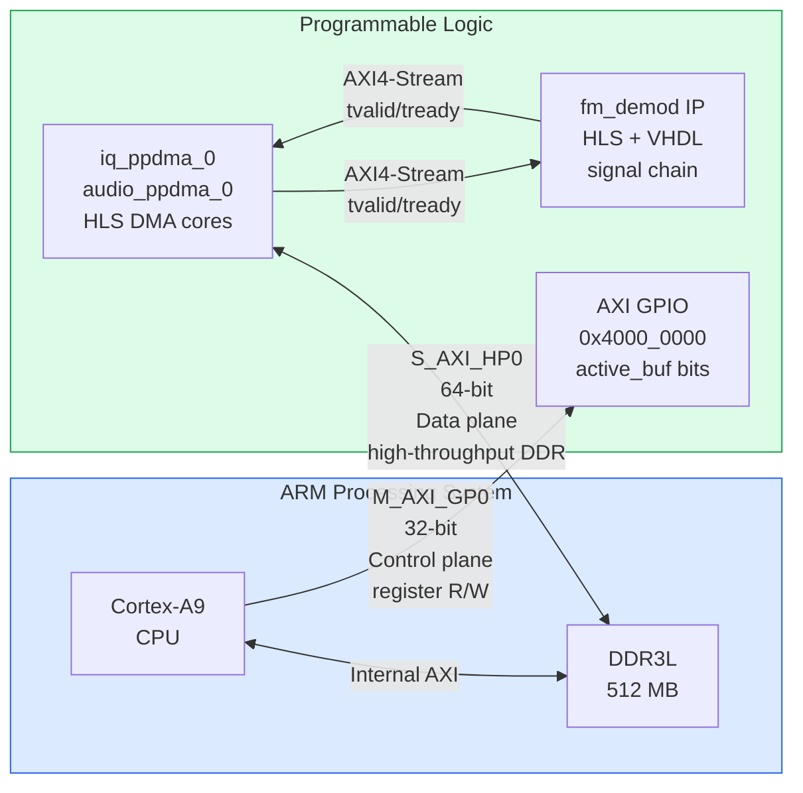

**M_AXI_GP0 (General Purpose port, 32-bit):** The CPU's outbound AXI master port. Used for control-plane transactions: writing to peripheral registers, reading status bits, configuring IP. In this project it reaches only the AXI GPIO (`axi_gpio_0` at `0x4000_0000`). It is a narrow, low-latency path that carries very few bytes — polling `active_buf` is a single 32-bit read every few milliseconds.

**S_AXI_HP0 (High Performance port, 64-bit):** The PL's inbound AXI master port into the DDR controller, bypassing the CPU cache. Used for data-plane transactions: the ping-pong DMA cores (`iq_ppdma_0`, `audio_ppdma_0`) use this port to read I/Q data from DDR and write audio data to DDR respectively. It is wide (64-bit), pipelined, and capable of burst transactions — the correct port for high-throughput DMA between PL and DDR. **Critical:** because HP0 bypasses the CPU cache, the CPU cannot simply read or write DDR locations shared with HP0-connected PL masters without explicit cache maintenance (see K.4).

**AXI4-Stream (between PL blocks):** The inter-IP streaming protocol within the PL fabric. No address — pure data flow with `tvalid`/`tready` handshake. Every connection between HLS IP cores in the `fm_demod` signal chain uses AXI4-Stream. No CPU involvement at all during steady-state operation.

---

### K.2 The Old DMA Architecture vs. the New Ping-Pong Architecture

The project started with Xilinx's standard AXI DMA IP for moving data between DDR and the FM demodulator. This was replaced with custom HLS ping-pong cores. Understanding why requires seeing both architectures.

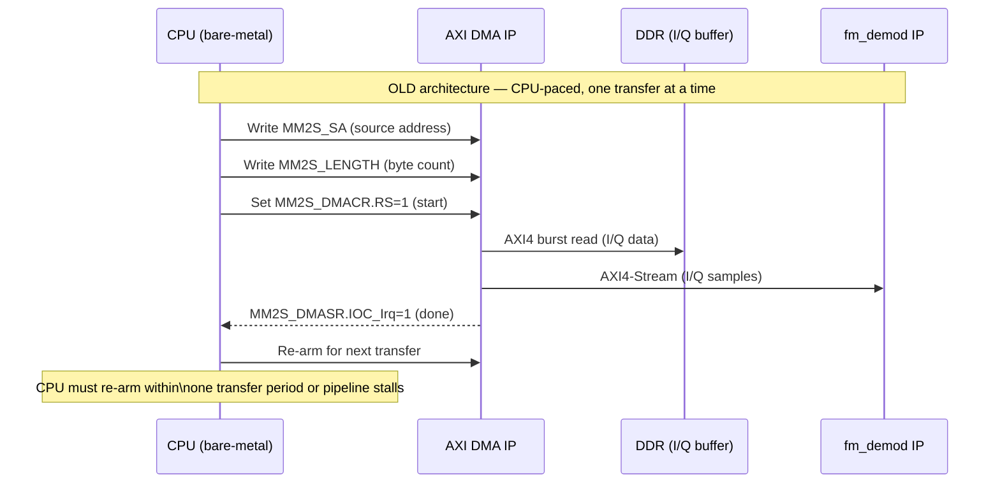

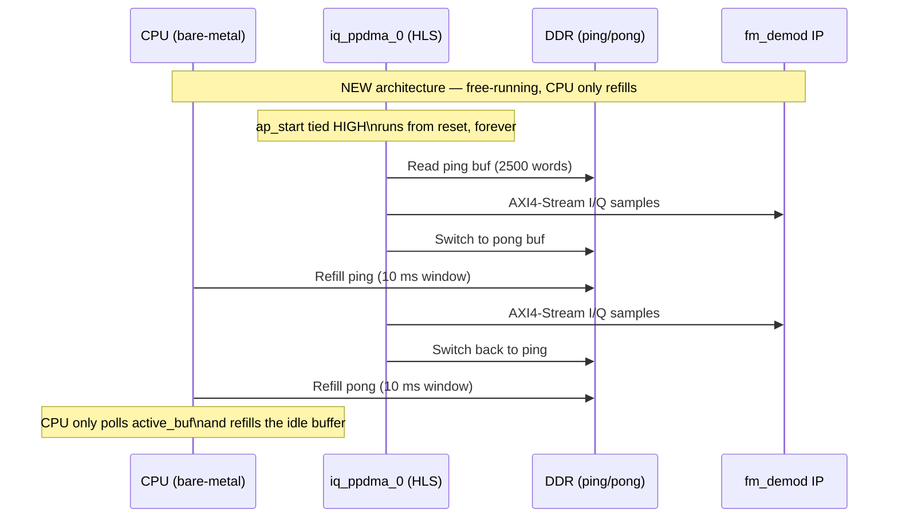

**Why the switch was made:** The AXI DMA IP requires the CPU to re-arm each transfer — write the source address, byte count, and control register before the next frame can start. At 250 kHz with a 2500-sample buffer, the re-arm must complete within 10 ms. Under a real-time-constrained bare-metal environment this is manageable, but under Linux, where the scheduler can preempt the CPU for tens of milliseconds, it is unreliable. The custom ping-pong cores run continuously from reset with `ap_start` hardwired high — the CPU is never in the critical path for sustaining the stream, only for refilling the idle buffer.

---

### K.3 The Ping-Pong Pattern and Its Timing Budget

```mermaid
gantt
    title Ping-Pong Buffer Timing (iq_ppdma_0, 10 ms per buffer)
    dateFormat x
    axisFormat %L ms

    section HW reads ping
    Hardware streaming ping→FM :active, hw1, 0, 10

    section CPU refills pong
    CPU refills pong (must finish in 10 ms) :crit, cpu1, 0, 10

    section HW reads pong
    Hardware streaming pong→FM :active, hw2, 10, 20

    section CPU refills ping
    CPU refills ping (must finish in 10 ms) :crit, cpu2, 10, 20

    section HW reads ping again
    Hardware streaming ping→FM :active, hw3, 20, 30
```

**The timing contract:** At any moment, hardware is draining one buffer while the CPU must finish refilling the other. With `IQ_BUF_SIZE_WORDS = 2500` at 250 kHz, the buffer is drained in exactly 10 ms. The CPU's refill — an `f_read()` from SD card into DDR — must also complete within that 10 ms window. If it doesn't, hardware wraps back onto a stale buffer and re-reads old data silently.

**Why 2500 words (10 ms):** This was chosen as a balance between latency (larger buffers add playout delay) and refill margin (larger buffers give the CPU more time). At 10 ms, the margin over a typical SD card `f_read()` latency on a fast card is generous under bare-metal, but tight under Linux. The value is a runtime GPIO-programmed parameter on `iq_ppdma_0` — it can be changed without resynthesis, which matters for tuning against real hardware.

**The audio side (`audio_ppdma_0`):** Uses a 1 ms buffer (`AUDIO_SAMPLES_PER_BUFFER = 50` at 50 kHz), a compile-time constant. The CPU's job here is reversed — it drains the buffer (reads completed audio) rather than filling it. The timing budget for the drain is also 1 ms per block. At 50 kHz, this is comfortable — writing 50 words to a WAV file via `f_write()` is far below a millisecond on any reasonable filesystem.

---

### K.4 Bare-Metal C Code Structure

The bare-metal application (`main.c`) follows a polling superloop. There is no RTOS, no interrupts, no scheduler — just the CPU spinning as fast as it can, checking two GPIO bits and doing work when they flip.

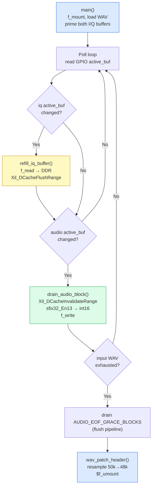

**Cache maintenance — the non-negotiable calls:**

Every DDR buffer exchange between the CPU and the PL requires explicit cache maintenance because the HP0 port bypasses the CPU's L1/L2 data cache:

- **Before `refill_iq_buffer` writes DDR:** `Xil_DCacheFlushRange(dest_addr, size)` — writes the CPU's cached copy of those addresses to actual DDR, so that `iq_ppdma_0` (reading via HP0) sees the fresh data rather than stale cached content.
- **Before `drain_audio_block` reads DDR:** `Xil_DCacheInvalidateRange(AUDIO_DEST_ADDR, size)` — discards the CPU's cached copy of those addresses, forcing the CPU to re-fetch from actual DDR on the next read, so it sees what `audio_ppdma_0` (writing via HP0) actually wrote, rather than old cached content.

Omitting either call is a cache-coherency bug. The symptom is silent data corruption — the pipeline runs without errors, but the audio content is wrong (typically stale frames repeated). This is one of the most common bugs in non-coherent DMA designs and is impossible to detect without the golden-reference verification approach this project uses.

**The `sfix32_En13` → `int16` conversion in `drain_audio_block`:**

```c
int32_t raw = (int32_t)Xil_In32(AUDIO_DEST_ADDR + i * 4);
float val    = (float)raw / 8192.0f;   // sfix32_En13: divide by 2^13
float scaled = val * 32767.0f;         // scale to int16 range
audio_pcm_block[i] = (int16_t)lroundf(scaled);
```

The scale factor 8192 = 2^13 comes from the de-emphasis output being `sfix32_En13` — 13 fraction bits. Dividing by 2^13 recovers a real value in approximately [−1, +1), which is then scaled to the 16-bit PCM range [−32768, +32767].

---

### K.5 Linux Port — What Changes in the C Code

Moving from bare-metal to Linux changes every I/O primitive while keeping the core ping-pong logic identical. The table below maps each bare-metal call to its Linux equivalent:

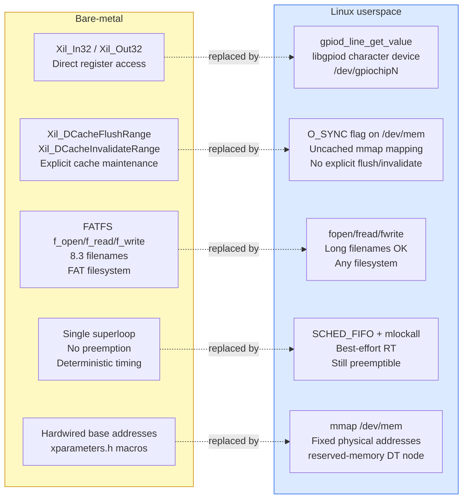

**The cache coherency mechanism change is the most important one.** Bare-metal uses `Xil_DCacheFlushRange`/`InvalidateRange` — explicit, per-buffer cache maintenance calls that are straightforward to reason about. Linux userspace has no equivalent portable API. The solution is to open `/dev/mem` with the `O_SYNC` flag before calling `mmap()`:

```c
int devmem_fd = open("/dev/mem", O_RDWR | O_SYNC);   // O_SYNC is load-bearing
volatile uint32_t *iq_ping = mmap(NULL, MMAP_SIZE,
    PROT_READ | PROT_WRITE, MAP_SHARED, devmem_fd, IQ_PING_ADDR);
```

`O_SYNC` on `/dev/mem` produces an **uncached mapping** on ARM Linux — the MMU marks those pages as device memory (no caching, no write-buffering). Every read goes directly to DDR; every write goes directly to DDR. The CPU never caches the contents of these pages, so there is nothing to flush or invalidate. This is the documented, established technique for sharing memory between userspace and non-coherent PL DMA masters on Zynq, used by tools like `devmem2` and widely in Xilinx/AMD embedded Linux documentation.

**The GPIO mechanism change.** Bare-metal reads the AXI GPIO's `GPIO_DATA` register directly via `Xil_In32(AXI_GPIO_0_BASEADDR + 0x00)`. Linux uses the `libgpiod` character-device API:

```c
struct gpiod_chip *chip = gpiod_chip_open_by_name("gpiochip0");
struct gpiod_line *line = gpiod_chip_get_line(chip, 0);  // line 0 = iq active_buf
gpiod_line_request_input(line, "fmdemod-linux");
int val = gpiod_line_get_value(line);
```

The chip name (`gpiochip0`) and line offset (0 for `iq active_buf`, 1 for `audio active_buf`) must be verified on real hardware with `gpiodetect` and `gpioinfo` — they depend on the kernel's probe order for the `gpio-xilinx` driver, which is not guaranteed to match the block design's numbering.

**The reserved-memory device-tree node.** The fixed physical addresses for the ping-pong/dest buffers (`0x3E000000`–`0x3E4FFFFF`) must be declared in the device tree as `reserved-memory` with `no-map` to prevent the Linux kernel's buddy allocator from handing those pages to unrelated processes:

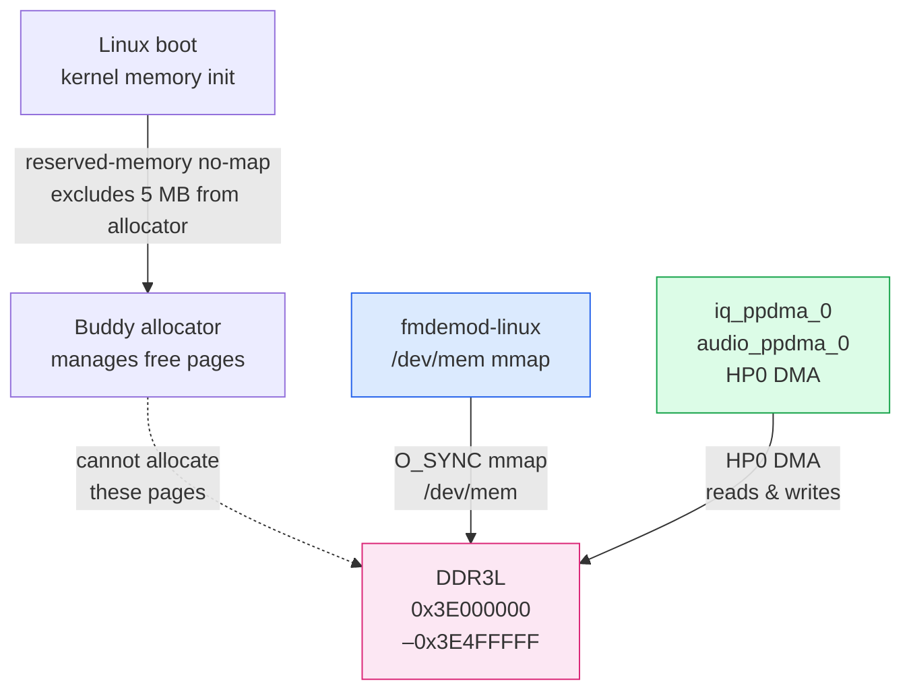

Without this node, Linux may eventually allocate a page inside the DMA region to an unrelated process's heap, overwriting audio data or I/Q buffers with arbitrary userspace content — a data corruption bug with no error signal, that only appears under memory pressure and is nearly impossible to debug after the fact.

---

## Appendix L — Filter Design: Specifications, Method, and Implementation Choices

Every filter in the FM receiver signal chain was designed to meet a specific requirement, and in each case the implementation method was chosen deliberately over the alternatives. This appendix documents both, block by block. The MATLAB code (`fir1`, `kaiser`, `exp`) appears in `run_and_extract.m` and the various `gen_*` scripts; the design decisions it embodies are explained here.

---

### L.1 Design Methodology Common to All FIR Filters

All three FIR filters in the chain (AA LPF, Audio LPF, FIR Decimator) share the same design procedure:

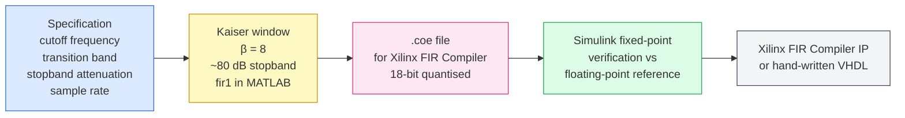

**Why Kaiser window, not Parks-McClellan (equiripple)?** The Kaiser window gives a monotonically decreasing stopband. Equiripple (Parks-McClellan/Remez) gives flat stopband ripple. For this application both are adequate; Kaiser was chosen because `fir1` with a Kaiser window requires fewer parameters to specify (just β and the cutoff), produces good results immediately, and is the standard approach in MATLAB's FM receiver literature. β=8 gives approximately 80 dB of stopband attenuation — significantly more than the 40 dB required for the PSNR target but chosen conservatively given the design was being verified against a real FM signal with an unknown noise floor.

**Why linear-phase FIR, not IIR, for these three filters?** A linear-phase FIR has constant group delay — every frequency component is delayed by the same amount ((N−1)/2 samples), producing no phase distortion across the passband. An IIR filter achieves the same magnitude specification with fewer operations, but at the cost of frequency-dependent group delay. For audio this matters: group-delay variation produces pre-ringing and smearing of attack transients that is perceptible to listeners. The de-emphasis filter uses IIR because it directly models the broadcast standard's RC network — no FIR alternative has a comparable specification at comparable cost.

---

### L.2 Anti-Alias LPF

**What it does:** Limits the I/Q bandwidth before the FM discriminator. Without it, the discriminator operates on the full 250 kHz spectrum, aliasing out-of-band noise and adjacent channels into the demodulated audio.

**Specification:** 250 kHz sample rate; cutoff 100 kHz (= fs/2.5); transition band 100–125 kHz; ~80 dB stopband attenuation.

**Design:**
```matlab
h_aa = fir1(128, 100e3/(250e3/2), 'low', kaiser(129, 8));
```

The cutoff at 100 kHz rather than 125 kHz (Nyquist) is deliberate: it provides a 25 kHz transition band, preventing roll-off from attenuating FM sidebands (which extend to ±75 kHz plus MPX content up to ~100 kHz). 129 taps gives a transition band narrow enough to suppress adjacent channels while leaving the station's full bandwidth intact.

**Implementation:** Xilinx FIR Compiler IP, instantiated twice (once each for I and Q). Coefficient `.coe` file generated by `gen_aa_lpf_coe.m`. Both channels share the same coefficient set.

---

### L.3 FIR Decimator (R=5)

**What it does:** Reduces the sample rate from 250 kHz to 50 kHz after the FM discriminator.

**Why R=5 specifically:** This is the only clean integer ratio available:
- 250 kHz / 5 = 50 kHz — exactly integer, above the 48 kHz Nyquist for audio ✓
- R=4: 62.5 kHz — non-standard and slightly wasteful
- R=6: 41.7 kHz — below 48 kHz, violates Nyquist for standard audio output

A CIC decimator (R=5, N=3) was used in the early Simulink model but replaced with the FIR Compiler because: (a) the CIC's sinc³ passband droop attenuates high-frequency audio without a separate compensation FIR; (b) the Xilinx FIR Compiler handles the combined anti-image filtering and decimation in a single optimised polyphase structure; and (c) the CIC's bit-growth model (input 18 bits → output 18 + ceil(3×log₂(5)) = 25 bits) introduced a fixed-point format boundary that was an additional source of divergence between the Simulink golden model and the RTL.

**Specification:** 250→50 kHz; passband 0–15 kHz; stopband 35 kHz+; >60 dB attenuation.

**Design:**
```matlab
h_dec = fir1(126, 15e3/(50e3/2), 'low', kaiser(127, 8));
% 127 taps at output rate; FIR Compiler decomposes into 25-26 taps per phase
```

**Implementation:** Xilinx FIR Compiler IP with decimation factor 5. Coefficient `.coe` file generated by `fir_dec_coeffs.m`.

---

### L.4 Audio LPF

**What it does:** Removes residual MPX subcarrier content (19 kHz pilot, 38 kHz stereo difference, 57 kHz RDS) after decimation.

**Specification:** 50 kHz sample rate; passband 0–15 kHz; stopband at 19 kHz (pilot tone); transition band 15–19 kHz (4 kHz width); >40 dB pilot attenuation.

**Why 15 kHz cutoff:** The ITU-R BS.450 standard specifies FM audio bandwidth as 50 Hz to 15 kHz. The 19 kHz pilot is the closest MPX component; the filter must be flat up to 15 kHz and suppressed by 19 kHz.

**Design:**
```matlab
h_audio = fir1(128, 15e3/(50e3/2), 'low', kaiser(129, 8));
```

**Implementation:** Xilinx FIR Compiler IP. Same pattern as the AA LPF but at 50 kHz rate.

---

### L.5 De-emphasis IIR

**What it does:** Compensates for the 75 µs pre-emphasis applied at the transmitter (Americas standard).

**Why IIR, not FIR:** The de-emphasis characteristic is a first-order IIR RC network response — a single pole at f = 1/(2π×75µs) ≈ 2.12 kHz. A FIR approximation would require hundreds of taps to reproduce this recursive filter's long impulse response. A single-pole IIR is trivially simple and exactly models the broadcast standard.

**Coefficient derivation:**
```matlab
tau = 75e-6;      % 75 µs (Americas); use 50e-6 for Europe
fs  = 50000;
a1  = exp(-1/(tau*fs));  % = exp(-0.2667) ≈ 0.7659
b0  = 1 - a1;            % ≈ 0.2341  (DC gain = 1 ✓)
```

Verification from the Simulink block: b0 = 0.234072, a1 = 0.765928. These two values are the entirety of the filter specification — the simplest non-trivial IIR design in the chain.

**Implementation: hand-written VHDL**, not FIR Compiler (which only handles FIR) and not a generated IIR IP (unnecessary complexity for a single-pole filter). `de_emph.vhd` is ~100 lines. The accumulator is fixed at `sfix40_En13` (see Appendix J.4 for the reasoning: wide enough to prevent limit cycles given a1 is close to 1, fits in two DSP48 slices without requiring three).

---

### L.6 Summary

| Filter | Rate | Taps/order | Design tool | Implementation | Key design decision |
|---|---|---|---|---|---|
| AA LPF | 250 kHz | 129 | `fir1` + Kaiser β=8 | FIR Compiler ×2 | Cutoff at 100 kHz not 125 kHz — preserves MPX bandwidth |
| FIR Decimator | 250→50 kHz | 127 | `fir1` + Kaiser β=8 | FIR Compiler polyphase R=5 | R=5 is the only clean integer ratio to ≥48 kHz |
| Audio LPF | 50 kHz | 129 | `fir1` + Kaiser β=8 | FIR Compiler | 15 kHz cutoff per ITU-R BS.450 |
| De-emphasis | 50 kHz | 1st-order IIR | `exp(-T/τ)` formula | Hand-written VHDL | FIR Compiler is FIR-only; one pole too simple to justify generated IP |

The common thread: every FIR filter uses the Xilinx FIR Compiler because it handles polyphase decomposition, coefficient quantisation, and pipelined synthesis automatically from a `.coe` file. The only exception is the de-emphasis IIR — the one filter where the Xilinx toolchain has no automated path, requiring a hand-written implementation, which is consequently the one filter whose correctness cannot be confirmed by a coefficient comparison and must be verified entirely through the Simulink/RTL PSNR comparison.
---

## Appendix M — Delivered Files and Bare-Metal Bring-Up Diagnostics

### M.1 Delivered PetaLinux Files

The following files were produced during the Linux migration work described in Part 8 and Appendix K:

**Build script and device tree:**
- `build_petalinux.sh` — scaffolds and builds the PetaLinux project from a Vivado XSA, adds the `fmdemod-linux` app recipe, enables `libgpiod`/`openssh`/`udhcpc` in the rootfs, and packages `BOOT.BIN`. Run as `XSA_PATH=/path/to/sdr_fm_receiver_wrapper.xsa ./build_petalinux.sh`.
- `reserved-memory.dtsi` — device-tree overlay declaring the five 1 MB ping-pong/dest DDR buffers (`0x3E000000`–`0x3E4FFFFF`) as `no-map` reserved memory so the Linux kernel allocator never touches them. Goes into `project-spec/meta-user/recipes-bsp/device-tree/files/system-user.dtsi`.

**Linux userspace application (`app/`):**
- `fmdemod-linux.c` — Linux port of the bare-metal app. Uses `O_SYNC` mmap over `/dev/mem` for uncached DDR access, `libgpiod` for GPIO polling, POSIX file I/O, and `SCHED_FIFO`+`mlockall` for best-effort real-time scheduling. See Appendix K.5 for the full bare-metal→Linux translation table.
- `resample_50k_to_48k.c` — polyphase FIR resampler ported from FATFS to plain POSIX `fopen`/`fread`/`fwrite`. Identical resampling math to the bare-metal version.
- `resample_coeffs.h` — unchanged from bare-metal; 2208 Kaiser-windowed FIR coefficients for L=24/M=25.

---

### M.2 Bare-Metal Bring-Up: A48.WAV Is 240 KB With No Intelligible Audio

The output file was produced and has a plausible size. Diagnosing this precisely requires knowing what that size implies.

**Duration arithmetic:** A48.WAV at 48 kHz, mono, 16-bit PCM:
```
240,000 bytes / 2 bytes per sample / 48,000 samples/sec = 2.5 seconds
```

The resampler ran and completed. The file is structurally valid. The problem is the *content* — 2.5 seconds of something that is not intelligible FM audio.

**The most likely causes, in order:**

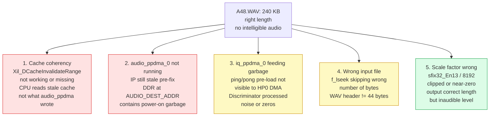

**How to distinguish them — a concrete checklist:**

**Check 1: Is A50.WAV (the intermediate 50 kHz file) also inaudible?**
If A50.WAV also has no intelligible content, the problem is upstream of the resampler — either cache coherency or `audio_ppdma_0` not running correctly. If A50.WAV sounds like noise at a plausible pitch, the scale factor (cause 5) is the issue.

**Check 2: How big is A50.WAV?**
A50.WAV should be `2.5 × 48000/50000 × 2 bytes = ~4800 bytes per second × 2.5s ≈ 250 KB`. If it is far smaller than expected, the input WAV header skip was wrong (cause 4) — `f_lseek(&fin, sizeof(wav_header_t), SEEK_SET)` where `sizeof(wav_header_t)` is 44 bytes. Confirm with: what does `f_size(&fin)` report for `rds.wav`? If it reports 0 or garbage, the file open succeeded but the seek failed silently.

**Check 3: Read back a few words of `AUDIO_DEST_ADDR` directly.**
In `main.c`, immediately after the poll loop exits, add before `wav_patch_header`:
```c
xil_printf("AUDIO_DEST first 4 words: %08X %08X %08X %08X\r\n",
    Xil_In32(AUDIO_DEST_ADDR),
    Xil_In32(AUDIO_DEST_ADDR + 4),
    Xil_In32(AUDIO_DEST_ADDR + 8),
    Xil_In32(AUDIO_DEST_ADDR + 12));
```
If these are all `0x00000000` or `0xDEADBEEF`-like patterns (power-on residue), `audio_ppdma_0` is not writing — either it is not running (stale IP) or it is running but `audio_buf_active` is toggling for a different reason (cause 2). If they are non-zero values that look like signed integers in a plausible audio range (roughly ±8192 for `sfix32_En13`), the DMA is running correctly and the scale factor or WAV header is the issue.

**Check 4: Try `Xil_DCacheDisable()` at the top of main.**
This is the fastest way to rule out cache coherency as a cause. Add one line before the first `f_read`:
```c
Xil_DCacheDisable();
```
This makes every DDR access uncached and eliminates all cache-coherency bugs in a single call. Performance degrades (every memory access goes to DDR, not cache) but correctness is guaranteed. If the audio becomes intelligible after this change, the root cause was a missing or incorrectly-placed `Xil_DCacheInvalidateRange` call.

**Check 5: What does the UART log actually say?**
The `[progress]` printouts in the polling loop (every 10 IQ refills = ~100 ms, every 100 audio blocks = ~100 ms) should appear at regular intervals. If they don't appear at all, the loop is not running. If they appear but the audio block count is very low (e.g. only 1–2 blocks), the `active_buf` bit for `audio_ppdma_0` is not toggling — pointing at cause 2 (IP not running). If both counts reach plausible values (hundreds of IQ refills, thousands of audio blocks for a 2.5 second recording), the pipeline ran to completion and the problem is in the data content, not the control flow.


---

## Appendix N — MATLAB to Simulink Data Handoff, and the Dataflow Modelling Approach

### N.1 The Problem: MATLAB and Simulink Have Different Execution Models

MATLAB scripts and Simulink models are not the same kind of thing, and connecting them incorrectly is one of the most common mistakes in model-based DSP development.

A MATLAB script executes sequentially — line by line, array by array. It has no concept of time steps, sample rates, or pipeline stages. A Simulink model executes as a discrete-time dataflow simulation — every block updates its outputs at defined sample times, signals flow between blocks with defined rates, and the simulation engine manages the timing relationships between all blocks simultaneously.

The consequence: you cannot simply call a MATLAB function from inside Simulink and expect it to behave like an RTL block. And you cannot run a Simulink model without giving it properly timed input signals — raw MATLAB arrays need to be wrapped in a form that Simulink's solver understands.

---

### N.2 Passing Data from MATLAB into Simulink: `timeseries` and `From Workspace`

The standard mechanism for feeding pre-computed MATLAB data into a Simulink model is the **`From Workspace`** block paired with a **`timeseries`** object.

**Step 1 — Create a `timeseries` in MATLAB:**

```matlab
fs  = 250000;               % sample rate of the signal
N   = length(I_corrected);  % number of samples
T   = 1/fs;                 % sample period
t   = (0:N-1).' * T;        % time vector, column vector

ts_I = timeseries(I_corrected, t, 'Name', 'I_input');
ts_Q = timeseries(Q_corrected, t, 'Name', 'Q_input');
```

The `timeseries` object wraps the data array with its associated time vector and a name. Simulink uses the time vector to know when each sample should be presented to the model — this is what turns a raw array into a properly-timed discrete-time signal.

**Step 2 — Configure the `From Workspace` block:**

In the Simulink block dialog:
- **Data:** `ts_I` (the workspace variable name)
- **Sample time:** `1/250000` (must match the `timeseries` time vector spacing)
- **Output after final data value:** `Holding final value` (prevents the model from erroring at the end of the data)
- **Interpolate data:** Off (for discrete signals — otherwise Simulink interpolates between samples)

**Step 3 — Set the simulation stop time:**

```matlab
SIM_DUR = (N - 1) * T;   % duration matching the data length
set_param(mdl, 'StopTime', num2str(SIM_DUR));
```

**Why `timeseries` and not a plain array?** Plain arrays passed to `From Workspace` require additional configuration and behave differently depending on Simulink version. `timeseries` is unambiguous: the time vector carries the sample rate information explicitly, and Simulink's solver uses it directly without inference.

**The NCO special case:** The frequency correction stage needs cosine and sine at +10 kHz. Rather than implementing the NCO inside Simulink (which would require a Trigonometric Function block and a running phase accumulator), the cosine and sine are pre-computed in MATLAB and passed as two additional `timeseries` inputs:

```matlab
t_iq  = (0:N-1).' / fs;
ph    = 2*pi * CARRIER_OFFSET * t_iq;   % +10 kHz phase ramp
ts_cos = timeseries(cos(ph), t_iq, 'Name', 'nco_cos');
ts_sin = timeseries(sin(ph), t_iq, 'Name', 'nco_sin');
```

This is an example of the MATLAB/Simulink boundary being used pragmatically: the NCO phase accumulation is a simple MATLAB one-liner, while the complex multiply that uses the NCO output is genuinely better modelled in Simulink (as a Product block with fixed-point types).

---

### N.3 Capturing Simulink Output Back to MATLAB: `To Workspace`

The output side uses **`To Workspace`** blocks. Each block in the model that you want to observe connects to a `To Workspace` block:

- **Variable name:** e.g. `audio_out`, `disc_out`, `ic_logged`
- **Save format:** `Timeseries` (preserves the time vector alongside the data)
- **Decimation:** 1 (capture every sample)

After `sim(mdl)` returns, these variables appear in the MATLAB workspace:

```matlab
sim(mdl);
audio_samples = audio_out.Data;     % the signal values
audio_time    = audio_out.Time;     % the corresponding time vector
```

This is the mechanism behind `run_and_extract.m`'s `ic_gold`/`qc_gold` extraction: `To Workspace` blocks placed at the FreqCorr output capture those signals during the simulation run, and the script then saves them to `ic_qc_gold.mat` for use by the HLS testbenches.

**Probing intermediate nodes:** The key advantage of the `To Workspace` / Simulink approach over a sequential MATLAB script is that you can attach a `To Workspace` block to *any* wire in the model without restructuring the algorithm. In a MATLAB script, capturing an intermediate value requires refactoring the code to expose it. In Simulink, you drag a wire and connect a block.

---

### N.4 The Pre-Sim / Sim / Post-Sim Pattern

The `run_and_extract.m` script follows a three-phase pattern that is worth naming explicitly, because it is the standard way to use Simulink for fixed-point golden model generation:

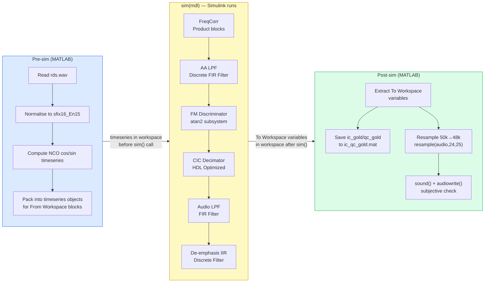

**Pre-sim** does everything that doesn't need Simulink's block infrastructure: loading files, computing simple transforms (NCO phase, WAV header parsing), and packaging data into `timeseries` objects. This is deliberately kept lightweight — anything that can be done in MATLAB should be, because MATLAB is faster to iterate on than a full Simulink simulation.

**The `sim()` call** runs the entire Simulink model. All block-level fixed-point computation, all signal logging, all pipeline behaviour happens here. The call blocks until the simulation completes.

**Post-sim** harvests the results: extracts variables from the workspace, saves inter-stage vectors to `.mat` files for use by the RTL testbenches, applies the 50k→48k resample (which is not modelled in the FPGA — the FPGA outputs at 50 kHz — so it goes here rather than in Simulink), and provides a subjective audio check via `sound()`.

The `post-sim resample with MATLAB's resample()` step deserves a specific note: it is not inside the Simulink model because the FPGA does not resample — it outputs at 50 kHz and the bare-metal software handles 50k→48k in `resample_50k_to_48k.c`. Keeping the resample in post-sim correctly reflects the hardware boundary.

---

### N.5 Why the Dataflow Model Is the Right Mental Model for FPGA DSP

The most important conceptual shift for a learner coming from MATLAB or C to FPGA DSP is moving from a **procedural** mental model to a **dataflow** mental model.

**Procedural (MATLAB/C):** "I have a sequence of operations. I call them one after another. Each one finishes before the next starts. I have one set of variables that I read and write."

**Dataflow (FPGA/Simulink):** "I have a network of operators connected by wires. Every operator runs simultaneously, continuously. Data flows through the network. Each operator sees its inputs and produces its outputs according to its own timing, independent of what any other operator is doing."

This is not just a metaphor — it is literally what the FPGA fabric does. The NCO, the FreqCorr, the AA LPF, the FM discriminator, and the FIR decimator are all running at 100 MHz simultaneously. When a sample leaves the NCO, it immediately starts being processed by FreqCorr while the NCO is already computing the next sample. The FPGA does not wait for FreqCorr to finish before the NCO starts the next sample.

Simulink's block diagram is valuable precisely because it makes this dataflow structure visible and explicit:

**Every wire is a stream.** Not a variable assignment — a continuous flow of values at a defined sample rate. The width of the wire (its data type) and its sample rate are both declared explicitly.

**Every block has a latency.** The AA LPF's 129-tap FIR introduces (129-1)/2 = 64 samples of group delay. This latency is real, physical, and must be accounted for when comparing the model's output against a reference (the `verify_fm_demod_rtl.m` cross-correlation step exists specifically to align the RTL output against the Simulink output, accounting for this pipeline latency).

**Rates can differ between blocks.** The FIR decimator's output rate (50 kHz) is different from its input rate (250 kHz). Simulink models this natively — the wire leaving the decimator's output port has a different sample time than the wire entering its input port. An FPGA pipeline does the same thing physically: the decimator asserts `tvalid` on its output port one-fifth as often as it asserts `tready` on its input port.

**Feedback is real and must be modelled explicitly.** The de-emphasis IIR has a feedback path: `y[n-1]` feeds back into the computation of `y[n]`. In a MATLAB script this is a loop variable updated each iteration. In Simulink it is a `Unit Delay` block on a wire from the output back to an input. In VHDL it is a register (`y_prev_reg`) connected from the output of the clocked process back to its input. All three are the same operation; the Simulink block diagram is the closest structural match to the VHDL.

---

### N.6 Advantages of the Simulink Dataflow Approach for This Project Specifically

Beyond the general argument, the dataflow approach gave three specific advantages in this project that would not have been achievable with a purely procedural MATLAB script:

**1. Pipeline latency is accounted for automatically.** The Simulink model propagates sample times through the entire chain. When `verify_fm_demod_rtl.m` aligns the RTL output against the Simulink output using cross-correlation, the expected offset is the total pipeline latency of the chain — a number that Simulink's `lags` vector produces directly from `xcorr`. A purely sequential MATLAB script has no latency to account for; a production FPGA implementation does; the Simulink model is the only representation that matches the RTL's actual timing.

**2. Intermediate node probing is non-invasive.** The sign-extension bug was diagnosed by comparing what the AA LPF received against what the FreqCorr should have produced. In the Simulink model, adding a `To Workspace` block to the FreqCorr output is a one-second drag-and-drop operation that does not change the behaviour of any other block. In a sequential MATLAB script, capturing the same intermediate value requires restructuring the code and passing the intermediate through function boundaries.

**3. Fixed-point errors are visible before RTL exists.** Running the model in fixed-point mode (after Fixed-Point Designer quantisation) and comparing against the floating-point reference reveals which stage loses precision, at what word length, and whether the chosen saturation and rounding modes match the target hardware — all before a single line of HLS or VHDL is written. A sequential MATLAB script with `fi()` objects can do the same arithmetic, but without Simulink's block hierarchy it cannot localise which block caused a discrepancy.

---

## Appendix O — Every Building Block: In-Depth Description

This appendix documents every IP core and RTL module in the design from the actual source code, not from the block diagram alone. Parameters, fixed-point formats, interface decisions, and implementation choices are taken directly from the `.vhd`, `.cpp`, and `.h` files in the repository.

---

### O.1 NCO Wrapper (`nco_wrapper.vhd`)

**What it is:** A thin VHDL wrapper around the Xilinx DDS Compiler v6.0 IP that splits the DDS's packed 32-bit output into two separate 16-bit AXI4-Stream ports.

**Fixed-point format:** `sfix16_En15` on both outputs — signed 16-bit, 15 fraction bits, range [−1, +1).

**DDS Compiler tdata packing (per PG141):**
```
tdata[15:0]  = cosine   (sfix16_En15)
tdata[31:16] = sine     (sfix16_En15)
```
This ordering is counter-intuitive (cosine in the low half, sine in the high half) and is the source of a real bug during bring-up: probing the NCO output before reading PG141 and swapping the slice assignments produces a cosine waveform where sine is expected, rotating the corrected I/Q by 90° and producing no audio output.

**Output rate:** One valid pulse every 400 clock cycles (100 MHz / 250 kHz). The DDS Compiler is configured with `Has_TREADY=false` — it free-runs without backpressure. Both `m_axis_cos` and `m_axis_sin` share the same `tvalid` signal.

**tready handling:** The wrapper AND-gates both downstream consumers' `tready` signals before passing it back to the DDS. Since `freq_corr` always accepts when all four inputs are valid, this effectively means `tready` is always high during normal operation — the AND gate is a safety mechanism, not a flow-control path.

**Fixed frequency vs. programmable:** In this implementation the DDS PINC is set at synthesis time (10 kHz = PINC 671089 for a 24-bit phase accumulator at 250 kHz). The DDS Compiler also supports a programmable PINC via `S_AXIS_CONFIG` — enabling software-controlled carrier tracking without re-synthesis, which is the path to a proper AFC (Automatic Frequency Control) loop in a future extension.

---

### O.2 Frequency Corrector (`freq_corr.vhd`)

**What it is:** A 2-stage pipelined VHDL module implementing the complex baseband frequency rotation:
```
Ic = I × cos − Q × sin
Qc = I × sin + Q × cos
```

**Interfaces:** Four AXI4-Stream slave ports (one per scalar input: I, Q, cos, sin) and two AXI4-Stream master ports (Ic, Qc). All four inputs are `sfix16_En15` (16-bit). Both outputs are `sfix18_En17` (18-bit).

**Why four separate slave ports instead of one packed bus:** The Simulink FreqCorr block has four independent inputs with independent sample times, modelled as four separate AXI-Stream connections. Using a single 64-bit packed bus would require upstream packing logic and would couple the I/Q and NCO streams in a way that makes the block design harder to read and harder to reuse.

**All-valid handshake:**
```vhdl
in_valid <= s_axis_i_tvalid and s_axis_q_tvalid and
            s_axis_cos_tvalid and s_axis_sin_tvalid;
```
All four inputs must present valid data simultaneously. Each input's `tready` is driven by `in_valid` — accepting all four at once or none. This enforces the frame-synchronous port semantics that match Simulink's model: no input advances without the others.

**Pipeline: 2 cycles**
- Cycle 1: latch all four inputs into registers (`i_reg`, `q_reg`, `c_reg`, `s_reg`)
- Cycle 2: four 16×16 multiplications, two 33-bit sums, right-shift by 13, saturate to 18 bits

**Fixed-point arithmetic:**
- Raw product: 16-bit × 16-bit = 32-bit (`sfix32_En30`)
- Target output: `sfix18_En17` — shift right by 13, add 4096 for rounding before the shift
- Saturation: `saturate18()` clamps to [−131072, +131072) — the full 18-bit signed range

**Word growth:** The output is `sfix18_En17` rather than `sfix16_En15` because the sum of two `sfix17_En15` products (after shifting) can use one additional bit for the carry. The extra 2 bits of headroom prevent overflow on inputs near ±1.0.

---

### O.3 Anti-Alias LPF (`aa_lpf.cpp` / `aa_lpf.h`)

**What it is:** A Vitis HLS single-channel 129-tap FIR filter, instantiated twice in the block design (once for I, once for Q).

**Fixed-point types (from `aa_lpf.h`):**
```cpp
typedef ap_fixed<18, 1, AP_TRN, AP_SAT> data_t;   // sfix18_En17, input/output
typedef ap_fixed<32, 2>                  coef_t;   // sfix32_En30, coefficients
typedef ap_fixed<40, 23, AP_TRN, AP_SAT> acc_t;   // sfix40_En17, accumulator
```

**Why a 40-bit accumulator:** 129 multiplications of `sfix18_En17` × `sfix32_En30` products could accumulate to a 50-bit result in the worst case (18+32 = 50-bit product, plus log₂(129) = 7 bits of accumulation growth). 40 bits is narrower than that worst case but sufficient in practice: the FIR's impulse response is lowpass with unity DC gain, so the sum of all coefficients is approximately 1.0 — the accumulator never reaches its theoretical maximum. Fixed-Point Designer confirmed this empirically using the real `rds.wav` input.

**Why `PIPELINE` on the loop, not the function:**
```cpp
MAC_Loop:
for (int i = 0; i < NTAPS; i++) {
    #pragma HLS PIPELINE II=1
    acc += shift_reg[i] * c[i];
}
```
`PIPELINE II=1` on the loop body allows HLS to schedule 129 sequential MAC operations through 129 cycles, reusing a small set of DSP48 instances. Placing `PIPELINE` on the enclosing function instead forces full unrolling of everything inside it, instantiating up to 129 parallel multipliers — which consumed ~118 DSP48 slices on a first attempt and was rejected as unimplementable on the Z7-010's 80-DSP48 budget.

**Throughput:** 129 MAC cycles per sample at 100 MHz = 1.29 µs per sample. Budget at 250 kHz = 4 µs. Comfortable margin: ~3× headroom.

**Interface pragma note (from the header comment):**
```cpp
// NOTE: x must be passed by reference (data_t &x), not by value.
// HLS's 'axis' interface mode can only bind streaming read/write hardware
// to reference parameters -- a pass-by-value scalar silently falls back
// to 'ap_none' (no tvalid/tready).
```
This was a real bug in an earlier revision: passing `x` by value produced a plain wire (`ap_none`) instead of an AXI-Stream port, which compiled silently and produced a fundamentally different port in the generated RTL.

---

### O.4 FM Discriminator (`fm_disc.cpp` / `fm_disc.h`)

**What it is:** A Vitis HLS implementation of the differential phase FM discriminator with a fully unrolled fixed-point CORDIC atan2.

**Fixed-point types (from `fm_disc.h`):**
```cpp
typedef ap_fixed<18,  1, AP_TRN, AP_SAT> data_t;   // input: sfix18_En17
typedef ap_fixed<18,  4, AP_TRN, AP_SAT> prod_t;   // cross-products: sfix18_En14
typedef ap_fixed<32,  8, AP_TRN, AP_SAT> cordic_t; // CORDIC internal: 24 frac bits
typedef ap_fixed<18,  3, AP_TRN, AP_SAT> phase_t;  // CORDIC output: sfix18_En15
typedef ap_fixed<32, 18, AP_TRN, AP_SAT> out_t;    // output: sfix32_En14
```

**Algorithm in order:**
```cpp
// 1. Cross-products (4 multiplications, sfix18_En14 output)
prod_t ixid = ic * id;   prod_t qxqd = qc * qd;
prod_t qxid = qc * id;   prod_t ixqd = ic * qd;

// 2. Complex multiply components
prod_t x_diff = ixid + qxqd;   // Idiff = real part
prod_t y_diff = qxid - ixqd;   // Qdiff = imaginary part

// 3. CORDIC atan2 (16 iterations, vectoring mode) -> sfix18_En15
phase_t phase = cordic_atan2(cordic_t(x_diff), cordic_t(y_diff));

// 4. Scale radians -> Hz
const out_t r2hz = 39788.7358;  // fs/(2π) = 250000/(2π)
disc_out = out_t(phase * r2hz);

// 5. Update delay registers (1-sample delay)
id = ic;   qd = qc;
```

**The CORDIC implementation:** 16 iterations, fully unrolled (`#pragma HLS UNROLL`):
```cpp
CORDIC_LOOP:
for (int i = 0; i < CORDIC_ITER; i++) {
    #pragma HLS UNROLL   // all 16 iterations in parallel logic
    cordic_t xs = x * SHIFT[i];   // x × 2^-i (shift only, no multiply)
    cordic_t ys = y * SHIFT[i];
    if (y >= 0) { x_new=x+ys; y_new=y-xs; z=z+ATAN_LUT[i]; }
    else        { x_new=x-ys; y_new=y+xs; z=z-ATAN_LUT[i]; }
    x=x_new; y=y_new;
}
```

`SHIFT[i]` uses `ap_fixed` constants representing `2^-i` — HLS synthesises these as bit-shifts, not multipliers, which is why CORDIC achieves atan2 without a divider and with only adders.

**CORDIC gain:** The iterative CORDIC rotation applies a gain of 1.6468× to the input vector magnitude. This gain is not compensated — it is matched to the Simulink CORDIC block's behaviour, which also omits compensation. The effect on the discriminator output is cancelled by the `r2hz` scaling factor: 39788.7358 was calibrated against the full gain path including the CORDIC gain.

**Initial quadrant normalisation:** Before the 16 iterations, a sign check rotates the input to the right half-plane (|angle| ≤ π/2):
```cpp
if (x < 0) {
    x = -x_in;  y = -y_in;
    z = (y >= 0) ? phase_t(3.14159265359) : -phase_t(3.14159265359);
}
```
This extends the range to the full ±π without adding iterations — the standard two-stage CORDIC quadrant extension.

**Pipeline:** `#pragma HLS PIPELINE II=1` on the top-level function. The 16 unrolled CORDIC iterations are purely combinational logic; the pipeline register cuts the critical path between the cross-product stage and the output register. The result is one new output sample per clock cycle once the pipeline is filled (depth ~20 cycles).

---

### O.5 FIR Decimator (`fir_dec.vhd`)

**What it is:** A VHDL wrapper around the Xilinx FIR Compiler v7.2 IP, configured for decimation by factor 5.

**FIR Compiler configuration (from the file header):**
```
Filter type:      Decimation
Decimation rate:  5
Coefficients:     fir_dec.coe  (fir1(40, 1/5), sfix32_En14)
Coefficient width: 32 bits
Data width:       32 bits
Output width:     32 bits
Rounding mode:    Round (convergent)
Overflow:         Wrap
Clock frequency:  100 MHz
Sample frequency: 250 kHz (input rate)
```

**Ports:**
```vhdl
s_axis_data_tdata  : in  std_logic_vector(31 downto 0);  -- 250 kHz, sfix32_En14
s_axis_data_tvalid : in  std_logic;
s_axis_data_tready : out std_logic;
m_axis_data_tdata  : out std_logic_vector(31 downto 0);  -- 50 kHz, sfix32_En14
m_axis_data_tvalid : out std_logic                       -- no tready: always valid
```

**Why the wrapper exists:** The FIR Compiler IP's ports are named after the IP instance (`fir_compiler_0`), not after their signal-processing role. The VHDL wrapper renames them to `s_axis_data` / `m_axis_data`, adds AXI-Stream naming conventions, and makes the block drop-in compatible with the rest of the chain.

**Why `fir1(40, 1/5)` with 41 taps rather than 127:** The Xilinx FIR Compiler internally applies polyphase decomposition — for decimation by 5, it decomposes the 41-tap filter into 5 phases of ceil(41/5) = 9 taps each. Only one phase is computed per output sample, giving an effective hardware cost of 9 multipliers rather than 41. This is why the decimator is more resource-efficient than the audio LPF (which is not polyphase) despite operating at a higher sample rate.

---

### O.6 Audio LPF (`audio_lpf.vhd`)

**What it is:** A VHDL wrapper around the Xilinx FIR Compiler v7.2 IP, configured as a non-decimating 127-tap FIR at 50 kHz.

**FIR Compiler configuration:**
```
Taps:         127
Coefficients: sfix32_En14  (same format as input data)
Accumulator:  fixdt(1,40,14)  (FIR Compiler full internal precision)
Output:       sfix32_En14
Rounding:     Floor (truncate)
Overflow:     Saturate
Sample rate:  50 kHz
```

**Why different rounding from the FIR decimator:** The decimator uses convergent rounding; the audio LPF uses truncation (floor). Both choices were made to match the corresponding Simulink Discrete FIR Filter block configuration — the Simulink block was the reference, and the FIR Compiler was configured to match it. Convergent rounding avoids systematic DC bias; truncation is cheaper (fewer carry bits). For the audio LPF's output, the practical difference in PSNR was below the measurement noise floor.

**Ports:** Same structure as `fir_dec.vhd` — `s_axis_data` in at 50 kHz, `m_axis_data` out at 50 kHz, no `tready` on the output.

---

### O.7 De-emphasis IIR (`de_emph.vhd`)

**What it is:** A hand-written VHDL single-pole IIR filter implementing the 75 µs de-emphasis characteristic.

**Difference equation:**
```
y[n] = b0 × x[n] + a1 × y[n−1]
b0 = 1 − a1 = 0.234072   (sfix24_En23)
a1 = exp(−1/(75e−6 × 50000)) = 0.765928   (sfix24_En23)
```

**Pipeline structure (two clocked processes, added after timing closure work):**

*Stage 1 — multiply only:*
```vhdl
num_prod_r <= x_in * B0;   -- b0 × x[n]   sfix32_En14 × sfix24_En23 → raw 56-bit
den_prod_r <= y_prev * A1; -- a1 × y[n-1]  sfix32_En13 × sfix24_En23 → raw 56-bit
stage1_valid <= s_axis_data_tvalid;
```

*Stage 2 — round, shift, saturate, accumulate:*
```vhdl
num_acc := sat40(shift_right(num_prod_r + 16384, 15));  -- round to En13
den_acc := sat40(shift_right(den_prod_r + 8192,  14));  -- round to En13
acc     := sat40(resize(num_acc, 64) + resize(den_acc, 64));
y_out   := sat32(acc);
y_prev  <= y_out;
m_tdata_r <= y_out;
```

**Why two processes:** The original single-process version chained both multiplications and the full accumulate-round-saturate path in one clock cycle — 22 logic levels, estimated 13.2 ns critical path, failing the 10 ns (100 MHz) timing constraint. Splitting into two stages halved the combinational depth. This is safe because the inter-sample period at 50 kHz is 400 PL clock cycles — adding one cycle of latency is completely imperceptible.

**The `sat40` / `sat32` saturation functions:** Defined as pure functions in the architecture declarative region:
```vhdl
function sat40(v : signed(63 downto 0)) return signed is ...
function sat32(v : signed(39 downto 0)) return signed is ...
```
`sat40` guards against accumulator overflow (63-bit intermediate → 40-bit). `sat32` guards against the final 40→32 truncation. Both check the sign bit and high-order bits for overflow and clamp to the representable range rather than wrapping — essential for an IIR whose feedback path can amplify overflow.

**No `tready` on the output:** The de-emphasis block is the last stage before the DMA. Its output `m_axis_data_tvalid` fires once per input `tvalid`; there is no backpressure mechanism. The `tlast_gen` wrapper (below) handles the DMA framing without back-pressuring `de_emph`.

---

### O.8 IQ Splitter (`iq_splitter.vhd`)

**What it is:** A purely combinational VHDL module. No registers, no clock, no state — pure wiring with handshake logic.

**Packing convention:**
```vhdl
m_i_tdata <= s_tdata(15 downto 0);   -- I in low 16 bits  (sfix16_En15)
m_q_tdata <= s_tdata(31 downto 16);  -- Q in high 16 bits (sfix16_En15)
```

**Handshake:**
```vhdl
m_i_tvalid <= s_tvalid;
m_q_tvalid <= s_tvalid;
s_tready   <= m_i_tready and m_q_tready;  -- stall if either consumer not ready
```

The AND-gate on `tready` ensures neither channel can advance without the other — preventing any I/Q skew that would rotate the discriminator's input phasor. Since `freq_corr`'s `s_axis_i_tready` and `s_axis_q_tready` are both driven by the same `in_valid` signal (all four inputs must be simultaneously valid), in practice they always assert together. The AND is a formal correctness guarantee rather than an actively-exercised flow-control path.

**`tlast` passthrough:** `s_tlast` is passed to both outputs unchanged. `freq_corr` ignores `tlast`, but propagating it costs nothing and preserves frame-boundary information for any future extension that might need it.

---

### O.9 TLast Generator (`tlast_gen.vhd`)

**What it is:** A VHDL module that inserts a periodic `tlast` pulse every `FRAME_SIZE` valid samples into an AXI-Stream that has no `tlast` of its own.

**Why it exists:** The de-emphasis output has `tvalid` but no `tlast`. The AXI DMA S2MM channel requires `tlast` to terminate a transfer. Without `tlast`, the DMA would wait forever for the end of its programmed byte count without triggering the completion interrupt — the DMA hang symptom. `tlast_gen` converts the continuous, unframed stream from `de_emph` into a framed stream that DMA can consume.

**Generic parameters:**
```vhdl
generic (
    FRAME_SIZE : positive := 4096;  -- samples per DMA frame
    DATA_WIDTH : positive := 32     -- 32 for sfix32_En13
);
```
`FRAME_SIZE` must match the DMA transfer byte count programmed by software divided by 4 (4 bytes per 32-bit sample).

**Counter logic:**
```vhdl
m_tlast <= '1' when (s_tvalid = '1' and count = FRAME_SIZE) else '0';

process(aclk)
begin
    if rising_edge(aclk) then
        if aresetn = '0' then
            count <= 1;
        elsif s_tvalid = '1' then
            if count = FRAME_SIZE then count <= 1;
            else                       count <= count + 1;
            end if;
        end if;
    end if;
end process;
```

The counter only advances when `s_tvalid = '1'` — stall cycles (clock cycles where the upstream is not producing valid data) do not increment it. This guarantees exactly `FRAME_SIZE` data beats per `tlast`-terminated frame regardless of upstream timing.

**`tready` is accepted but not used:** The downstream DMA's `m_tready` is declared as a port (to be a valid AXI-Stream master) but not used to stall the upstream `de_emph`. De-emphasis is free-running and cannot be back-pressured. If the DMA is not ready, samples are lost. The design constraint is that the DMA must always be armed and ready before the corresponding audio samples arrive — enforced by the software's buffer management logic.

---

### O.10 Audio Ping-Pong DMA (`audio_ppdma.cpp` / `audio_ppdma.h`)

**What it is:** A Vitis HLS block that accepts the audio stream from `de_emph` and writes it into one of two DDR ping-pong buffers, copying each completed buffer to a fixed destination address for software to read.

**Key design facts (from `audio_ppdma.h`):**
```cpp
#define AUDIO_SAMPLE_RATE_HZ 50000
#define SAMPLES_PER_BUFFER   50     // 1 ms at 50 kHz
#define SAMPLE_BYTES         4
#define BUFFER_BYTES         200    // 200 bytes per buffer
```

**State variables (static, explicitly reset):**
```cpp
static ap_uint<1>  cur_buf = 0;          // 0=ping, 1=pong
static ap_uint<16> widx    = 0;          // write index
static ap_uint<1>  active_buf_reg = 0;   // shadow register for output
#pragma HLS RESET variable=cur_buf
#pragma HLS RESET variable=widx
#pragma HLS RESET variable=active_buf_reg
```

The `#pragma HLS RESET` pragmas are essential — without them, these registers are undefined (X) in simulation, and since `!X = X` in 4-state logic, they would never resolve to a valid 0 or 1 regardless of how many times they toggle. This was confirmed by inspecting the generated Verilog and seeing explicit `'bx` branches in the output mux.

**The shadow register pattern:**
```cpp
active_buf = active_buf_reg;  // output PREVIOUS value (stable)
// ... do this invocation's work ...
active_buf_reg = cur_buf;     // store CURRENT value for next invocation
```
`active_buf` outputs the value from the *previous* invocation — always a stable, committed value rather than a mid-computation intermediate. Without this, HLS schedules the `active_buf = cur_buf` assignment to a mux gated on a single FSM state, driving `'bx` on all other states. This was confirmed by reading the generated RTL file (`audio_ppdma.v`) and finding the `ap_phi_mux_p_0_0_0_phi_fu_171_p4` signal explicitly gated to `ap_CS_fsm_state25` with `'bx` elsewhere.

**Control protocol:** `ap_ctrl_hs` (default), not `ap_ctrl_none`. `ap_start` is tied permanently high via `xlconstant` in `bd.tcl` — the block runs continuously from reset without CPU intervention. The earlier `ap_ctrl_none` attempt was rejected by Vitis HLS cosim because the burst-copy path (50 reads + 50 writes every 50th invocation) gives variable latency, which violates cosim's requirement that `ap_ctrl_none` designs be pipelined at II=1 or purely combinational.

---

### O.11 I/Q Ping-Pong DMA (`iq_ppdma.cpp` / `iq_ppdma.h`)

**What it is:** A Vitis HLS block that reads packed I/Q words from one of two DDR ping-pong source buffers and streams them out as two separate 16-bit AXI-Stream channels to `freq_corr`.

**Packing convention:**
```cpp
i_out = packed(31, 16);   // I in upper 16 bits (sfix16_En15)
q_out = packed(15,  0);   // Q in lower 16 bits (sfix16_En15)
```

**Runtime-configurable buffer size:**
```cpp
void iq_ppdma(packed_iq_t *mem,
              addr_t ping_base,
              addr_t pong_base,
              addr_t buf_size_words,   // runtime: no resynthesis needed
              iq_word_t &i_out,
              iq_word_t &q_out,
              ap_uint<1> &active_buf);
```
`buf_size_words` is an `ap_none` port (driven by `xlconstant` in `bd.tcl`) rather than a compile-time constant. This allows the buffer size to be changed by updating the block design without re-running Vitis HLS synthesis. The value used throughout this project is 2500 (10 ms at 250 kHz).

**The pipelined address-generation hazard:** An earlier version of this block used `#pragma HLS INTERFACE mode=ap_ctrl_none` and `#pragma HLS PIPELINE II=1`. Vitis HLS cosim accepted this during synthesis but caught a real hardware bug during RTL simulation: the CORDIC address generation for iteration N+1 overlapped with the in-flight result of iteration N (`cur_buf`/`ridx` carry-over from static variables plus runtime `ap_none` scalar inputs), producing an out-of-range read address (33 when the maximum valid index was 23). The fix was switching to `ap_ctrl_hs` — discrete, non-overlapping invocations — eliminating the pipeline overlap entirely.

**Shadow register:** Same pattern as `audio_ppdma`:
```cpp
static ap_uint<1>  cur_buf         = 0;
static ap_uint<32> ridx            = 0;
static ap_uint<1>  active_buf_reg  = 0;
#pragma HLS RESET variable=cur_buf
#pragma HLS RESET variable=ridx
#pragma HLS RESET variable=active_buf_reg

active_buf = active_buf_reg;  // output stable previous-invocation value
// ... read mem[src_base + ridx], output i_out/q_out, advance ridx ...
active_buf_reg = cur_buf;     // commit for next invocation
```

This was added after inspecting the generated Verilog (`iq_ppdma.v`) for the pre-fix version and finding `ap_phi_mux_p_0_0_0_phi_fu_138_p4` gated to `ap_CS_fsm_state10` with explicit `'bx` on every other state — explaining the permanent-X symptom on the `gpio_io_i` waveform despite `ap_done` visibly pulsing.

---

### O.12 The `fm_demod` Composite IP and Block Design Hierarchy

The individual blocks above are not connected directly in the top-level block design (`sdr_fm_receiver`). They are first assembled into an intermediate composite IP, `fm_demod`, in its own block design (`fm_demod/bd.tcl`), which is then packaged as a single IP and instantiated as `fm_demod_0` in the top-level.

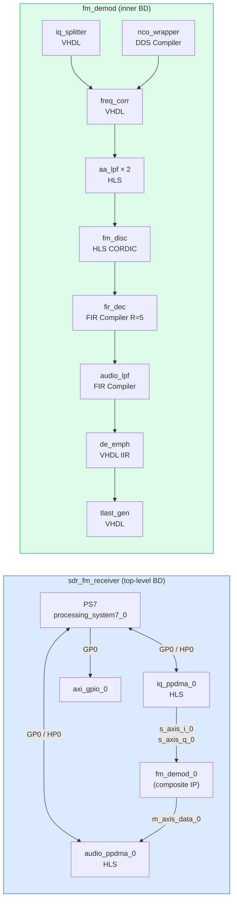

**Why a composite IP:** Packaging `fm_demod` as its own IP makes the top-level block design readable — one block for the entire signal chain rather than eight blocks with twenty-four inter-block connections. It also decouples the signal chain IP development from the SoC integration: the `fm_demod` IP can be re-synthesised, re-verified with its own testbench (`tb_fm_demod_chain.sv`), and re-packaged without touching the top-level block design.

**The three external AXI-Stream interfaces on `fm_demod_0`:**

| Port | Direction | Width | Format | Rate |
|---|---|---|---|---|
| `s_axis_i_0` | slave | 16 bit | `sfix16_En15` | 250 kHz |
| `s_axis_q_0` | slave | 16 bit | `sfix16_En15` | 250 kHz |
| `m_axis_data_0` | master | 32 bit | `sfix32_En13` | 50 kHz |

`s_axis_i_0` and `s_axis_q_0` have `tready` (back-pressure possible — these are connected to `iq_ppdma_0` which can stall). `m_axis_data_0` has no `tready` — the de-emphasis output is free-running and cannot be stalled, which is why `audio_ppdma_0` must always be ready to accept.

---

## Appendix P — Why Xilinx IP Cores for Filters and the NCO

This appendix answers a question that Appendix O describes around but never addresses directly: given that Vitis HLS can generate RTL from C++, and given that hand-written VHDL was used for `freq_corr` and `de_emph`, why were the FIR filters and the NCO implemented using Xilinx-provided IP cores rather than one of those two approaches?

The short answer is that the alternatives are not wrong — they are simply more expensive in either design time, verification effort, or silicon resources, and in each case the Xilinx IP provides a path that is faster, better-verified, or more resource-efficient. The reasoning is specific to each block.

---

### P.1 Why Xilinx FIR Compiler for the Three FIR Filters

#### The alternatives and their costs

**Alternative 1 — Hand-written VHDL FIR.** A correct, synthesisable VHDL FIR requires: a shift register of width `NTAPS × data_width` bits, `NTAPS` multipliers (or a shared multiplier with a serial accumulate loop), a coefficient ROM, accumulator overflow detection, and correct symmetric-coefficient exploitation for the linear-phase property. This is not complicated, but it is approximately 200–300 lines of non-trivial VHDL that then needs its own testbench, its own simulation, and its own timing closure verification. For three separate filter instances (AA LPF, Audio LPF, FIR Decimator) this would be approximately 800 lines of VHDL plus three testbench suites, all requiring bit-accurate verification against the MATLAB floating-point reference.

**Alternative 2 — Vitis HLS FIR.** `aa_lpf.cpp` is exactly this: a 129-tap FIR implemented in 30 lines of HLS C++. It works correctly and passed all verification levels. The HLS approach was chosen specifically for the AA LPF because it demonstrates the HLS methodology for this audience. The crucial point is that `aa_lpf.cpp` uses the same coefficient array (`coefficients.h`) as the FIR Compiler `.coe` file — both are generated by `gen_aa_lpf_coe.m` in the same script run. **The HLS approach is not wrong — it is used for the AA LPF in exactly this way. The question is why it was not also used for the audio LPF and FIR decimator.**

**Why FIR Compiler for audio LPF and FIR decimator (but not AA LPF):**

The FIR decimator is the decisive case. The Xilinx FIR Compiler, when configured for decimation, internally performs polyphase decomposition — it only computes the output phase that is needed for the current output sample, discarding the R−1 = 4 phases that map to discarded samples. This is correct by construction: the FIR Compiler's synthesis back-end knows the decimation rate and builds the polyphase structure into the generated netlist. An HLS implementation would also get polyphase decomposition, but only if the designer explicitly implements it (loop restructuring, separate coefficient subarrays per phase). A naive HLS loop over all NTAPS taps at R=5 decimation would compute all 41 × 5 = 205 multiplications per output sample rather than the optimal 41. The FIR Compiler makes the optimal choice automatically.

For the audio LPF, the motivation is more pragmatic: by the time the audio LPF was added to the chain, the FIR Compiler `.coe` + VHDL wrapper pattern was already established for the decimator. Reusing the same pattern was faster than writing and verifying a new HLS project from scratch, and the PSNR target was already achieved with the FIR Compiler's internal arithmetic.

#### The `.coe` file as the interface between MATLAB and Xilinx IP

The coefficient generation workflow is worth making explicit because it is the specific mechanism that ensures the FIR Compiler IP and the MATLAB/Simulink reference filter are computing the same thing:

```
gen_aa_lpf_coe.m / fir_dec_coeffs.m
        │
        ├─► .coe file ─────────────────────────────────► FIR Compiler IP
        │   (quantised integer coefficients,                    (synthesis)
        │    radix=10 format, Xilinx-specified)
        │
        ├─► coefficients.h ────────────────────────────► aa_lpf.cpp HLS
        │   (same taps as double-precision floats,              (csim + cosim)
        │    cast to coef_t = ap_fixed<32,2>)
        │
        └─► MATLAB workspace variables ────────────────► Simulink model
            (h, NTAPS, COEF_W, MAX_COEF)                      (run_and_extract.m)
```

All three consumers (FIR Compiler, HLS C++, Simulink) receive coefficients derived from the same `fir1()` call in the same MATLAB script, in the same session. The quantisation uses the same word lengths (`COEF_W = 18` for the AA LPF, `sfix32_En14` for the decimator) across all three. If the MATLAB script changes the filter specification, all three consumers receive updated coefficients in a single re-run — there is no manual copy-paste step where the `.coe` file could diverge from the HLS header or the Simulink model.

#### What the FIR Compiler provides that justifies using it

Beyond polyphase decomposition, the FIR Compiler provides three things that would require significant additional effort to replicate in hand-written VHDL or HLS:

**1. DSP48 resource mapping verified by Xilinx.** The FIR Compiler's synthesis back-end maps multiplications to DSP48 slices using patterns that have been verified across thousands of Xilinx device/process-corner combinations. The timing closure analysis for DSP48-mapped paths is pre-characterised. A hand-written VHDL multiplier targeting DSP48 requires correct instantiation of the `DSP48E1` primitive or correct inference hints; errors produce synthesis that maps to LUT-based multipliers instead, consuming 10× more fabric and producing incorrect timing.

**2. Symmetric coefficient exploitation.** A 129-tap linear-phase FIR has 65 unique coefficients (the centre tap plus 64 symmetric pairs). The FIR Compiler automatically exploits this symmetry by using adders before the multipliers (pre-addition), halving the number of DSP48 slices from 65 to 33 (approximately). A naive HLS loop over all 129 taps does not automatically exploit this — the designer must manually fold the loop, verify the fold is correct with respect to the even/odd tap count, and confirm the HLS scheduler actually applied the optimisation.

**3. Coefficient reload via `S_AXIS_RELOAD`.** The FIR Compiler optionally supports dynamic coefficient reload over an AXI-Stream port without FPGA reconfiguration. This capability is not used in this project's current implementation, but it is available for a future extension that would allow the station's FM channel characteristics (different de-emphasis time constants, different bandwidth) to be changed at runtime. A hand-written FIR or HLS FIR would require architectural modification to support this.

---

### P.2 Why Xilinx DDS Compiler for the NCO

#### The alternative

A numerically controlled oscillator is conceptually simple: a phase accumulator that increments by a fixed PINC value each clock cycle, plus a sine/cosine lookup table (or a CORDIC-based phase-to-sinusoid converter). This could be implemented in VHDL in approximately 50 lines plus a ROM initialisation file, or in HLS in approximately 20 lines using `hls::sincos` or a hand-written CORDIC.

#### Why DDS Compiler instead

**1. Phase noise and spur performance are guaranteed.** The DDS Compiler uses a Taylor series correction on top of the ROM lookup to suppress spurious harmonics to a specified level (specified as `Spurious_Free_Dynamic_Range` in the IP configuration). A naive ROM-based NCO has spurs determined entirely by the ROM depth (number of phase samples) and the quantisation of the stored sinusoid values. At 16-bit output (which is what this project needs), achieving acceptable spur performance from a hand-written ROM requires careful ROM depth selection, dithering, or phase-to-amplitude compression — techniques that are individually straightforward but collectively non-trivial to implement and verify correctly.

**2. Phase width and frequency resolution are pre-analysed.** The DDS Compiler's frequency resolution is `fs / 2^phase_width`. With a 24-bit phase accumulator at 250 kHz, the resolution is 250000 / 2^24 ≈ 0.015 Hz — more than adequate for any plausible SDR carrier offset. Computing the correct PINC for a given offset frequency uses the formula `PINC = round(f_offset / fs × 2^phase_width)`, which the IP's configuration dialog computes directly. A hand-written NCO requires the designer to derive and implement this relationship correctly in both the synthesis-time configuration and the runtime-update path.

**3. The `S_AXIS_CONFIG` port for runtime retuning is pre-built.** As noted in Appendix O.1, the DDS Compiler can accept a new PINC value at runtime via `S_AXIS_CONFIG` without any FPGA reconfiguration. This makes software-controlled carrier tracking (AFC) a future extension that requires only a new software task and a configuration write — no FPGA resynthesis. Building this capability into a hand-written NCO would require designing and verifying the synchronisation between the PINC update and the phase accumulator to avoid phase discontinuities.

**4. The output packing is precisely specified in PG141.** The DDS Compiler's `tdata` format (`cos[15:0]`, `sin[31:16]`) is documented to the bit in PG141 and does not change between IP versions (within the same major version). A hand-written NCO would have its output format defined by the designer — a format choice that must be documented, propagated to `nco_wrapper.vhd`, communicated to `freq_corr.vhd`, and kept consistent if the NCO is ever regenerated. Using the standard IP offloads this consistency requirement to Xilinx's versioning.

#### Why the HLS CORDIC in `fm_disc.cpp` but the DDS Compiler for the NCO

This asymmetry is worth explaining because it might appear inconsistent: both the NCO and the FM discriminator use CORDIC-related computation, yet one uses Xilinx IP and the other uses hand-written HLS.

The key difference is the direction of the conversion and the context in which each is used:

- **The NCO** converts a phase (a number) into a sinusoid (two numbers). It runs continuously at 250 kHz as a free-running source. Its output quality (spur level, phase noise) directly affects the frequency correction's effectiveness and therefore the discriminator's audio quality. These are specifications that the DDS Compiler guarantees analytically and that a hand-written CORDIC achieves only empirically.

- **The FM discriminator** converts a complex vector into an angle (atan2). Its CORDIC is embedded inside a larger HLS function that also computes four cross-products and a scaling multiply, all of which need to be co-designed in fixed-point with the same word-length decisions. The entire discriminator fits in 80 lines of HLS C++ and was the block that most benefited from model-based design verification (against the Simulink `cordic_atan2` subsystem). Using a Xilinx CORDIC IP here would have required a separate IP project, separate port connections in the block design, and a separate testbench — more complexity than the problem warrants for a single-function block that is well-contained in HLS.

The guiding principle across all these decisions is: **use Xilinx IP when the IP provides verified properties (spur performance, polyphase decomposition, timing closure) that would require significant additional design effort to achieve independently; use HLS or VHDL when the block's signal-processing logic is the primary implementation challenge and co-design of the arithmetic is needed to match a Simulink reference precisely.**

---

## Appendix Q — Why HLS for Complex DSP: Interface Abstraction, Control Extraction, and the Right Division of Labour

### P.1 The Core Argument

Vitis HLS is not universally superior to hand-written VHDL — it is specifically superior for a well-defined class of design problem. Understanding where that boundary lies is more useful than a blanket preference for either tool.

The class of problem where HLS consistently wins is: **algorithms with complex arithmetic, fixed-point type management, and well-defined streaming interfaces, where the interesting engineering challenge is the computation itself rather than the cycle-by-cycle control flow**. The FM receiver's signal chain blocks are almost the canonical example of this class.

The class of problem where hand-written VHDL is still better: **structural glue logic, AXI-Stream protocol adaptation, timing-critical sequential state machines, and anything where the exact cycle-by-cycle register behaviour is part of the specification**. The `iq_splitter`, `tlast_gen`, and `de_emph` blocks in this project are the canonical examples.

This project uses both, correctly partitioned. Understanding why each block ended up in its language is as important as understanding what each block does.

---

### P.2 Interface Abstraction: Writing the Algorithm, Not the Handshake

The most visible advantage of HLS for DSP is that the designer writes the *mathematical operation* and HLS generates the *AXI-Stream protocol plumbing* automatically.

Compare the equivalent of a single FIR multiply-accumulate in both approaches:

**In VHDL (explicit AXI-Stream):**
```vhdl
-- Must manage: tvalid, tready, pipeline enable, stall logic,
-- output valid propagation, reset of all registers...
process(aclk)
begin
    if rising_edge(aclk) then
        if aresetn = '0' then
            acc_reg <= (others => '0');
            v_reg   <= '0';
        elsif s_axis_data_tvalid = '1' and s_axis_data_tready = '1' then
            -- now do the actual MAC
            acc_reg <= acc_reg + signed(s_axis_data_tdata) * coef;
            v_reg   <= '1';
        end if;
    end if;
end process;
m_axis_data_tdata  <= std_logic_vector(acc_reg);
m_axis_data_tvalid <= v_reg;
```

**In HLS:**
```cpp
#pragma HLS INTERFACE mode=axis port=x
#pragma HLS INTERFACE mode=axis port=y
// The MAC itself:
for (int i = 0; i < NTAPS; i++) {
    #pragma HLS PIPELINE II=1
    acc += shift_reg[i] * c[i];
}
y = acc;
```

HLS generates the tvalid/tready handshake, the pipeline enable logic, the stall insertion, the output valid propagation, and the reset — all from the pragma annotations. The designer writes only the computation. For a 129-tap FIR this is the difference between ~200 lines of VHDL managing state and ~20 lines of C++ describing the algorithm.

**The scaling argument:** For a single FIR filter the VHDL approach is manageable. For a complete signal chain with six stages, each with different word lengths, different pipeline depths, and different backpressure behaviour, the manually-managed handshake logic across all stage boundaries is a significant source of bugs. The HLS approach delegates all of that to a synthesiser that is, at minimum, consistent — it applies the same handshake generation rules to every block, reducing the number of unique failure modes.

---

### P.3 Fixed-Point Type Management: Arithmetic Without Bookkeeping

In VHDL, every arithmetic operation requires the designer to track bit widths and binary point positions manually, write explicit `resize()` calls, and decide where each truncation or saturation occurs. For the FM discriminator alone:

- Input: `signed(17 downto 0)` — sfix18_En17
- Cross-product: `signed(35 downto 0)` — sfix36_En34
- After shift right 20: `signed(17 downto 0)` — sfix18_En14
- CORDIC internal: `signed(31 downto 0)` — sfix32_En14
- CORDIC output: `signed(17 downto 0)` — sfix18_En15
- After r2Hz scale: `signed(31 downto 0)` — sfix32_En14

Every one of those transitions requires a `resize()` or `shift_right()` with an explicit bit count, checked manually against the design's fixed-point specification. A single wrong constant produces a result that is off by a power of 2 — numerically wrong but syntactically legal, producing no error and potentially no simulation failure unless a golden reference comparison catches it.

In HLS with `ap_fixed`:
```cpp
typedef ap_fixed<18,  1, AP_TRN, AP_SAT> data_t;   // sfix18_En17
typedef ap_fixed<18,  4, AP_TRN, AP_SAT> prod_t;   // sfix18_En14
typedef ap_fixed<32,  8, AP_TRN, AP_SAT> cordic_t;
typedef ap_fixed<18,  3, AP_TRN, AP_SAT> phase_t;  // sfix18_En15
typedef ap_fixed<32, 18, AP_TRN, AP_SAT> out_t;    // sfix32_En14

prod_t x_diff = ixid + qxqd;    // type inference: result is prod_t
cordic_t x_c  = cordic_t(x_diff);  // explicit cast: designer asserts this is safe
phase_t phase = cordic_atan2(x_c, y_c);
out_t disc_out = out_t(phase * r2hz);
```

The type system enforces the format at every assignment. An incorrect type argument to `ap_fixed` (wrong word or fraction length) will produce incorrect output that the csim testbench catches against the MATLAB golden reference — before any RTL is generated. VHDL catches it much later (or not at all, if the bit widths happen to be consistent with the wrong specification).

**The rounding and saturation declarations are also explicit and enforced:**
```cpp
ap_fixed<18, 1, AP_TRN, AP_SAT>   // truncate on rounding, saturate on overflow
ap_fixed<18, 1, AP_RND, AP_WRAP>  // round-to-nearest, wrap on overflow
```
In VHDL these are implemented as conditional expressions in the body of a process — they are correct only if the designer wrote them correctly. In HLS they are part of the type declaration and applied uniformly by the compiler.

---

### P.4 Control Logic Extraction: The ap_ctrl_hs FSM

Every HLS block that uses the default `ap_ctrl_hs` control protocol gets a generated state machine (FSM) for free: `ap_start`, `ap_done`, `ap_idle`, `ap_ready`, and an internal `ap_CS_fsm` register that tracks which state the computation is currently in. In VHDL, this FSM would be a manually-written entity — a state type, state register, combinational next-state logic, and output assignments for each state.

For a simple block like `iq_ppdma`, the manually-written equivalent would be:
```vhdl
type state_t is (IDLE, READ_MEM, OUTPUT_SAMPLE, UPDATE_INDEX, SWITCH_BUF);
signal state : state_t := IDLE;
-- ... 50+ lines of transition logic ...
```

HLS extracts this control structure from the C++ algorithm automatically. The resulting FSM is guaranteed to be consistent with the algorithm — it cannot be in a state where the algorithm would not put it, because the FSM *is* the algorithm's control flow, mechanically translated.

**The debugging consequence:** When the `iq_ppdma` X-propagation bug was diagnosed, the relevant signal was `ap_CS_fsm_state10` in the generated Verilog — a state name that HLS assigned, visible in the waveform, directly corresponding to a point in the C++ algorithm. In a hand-written VHDL FSM, the state would have a designer-chosen name (possibly `OUTPUT_SAMPLE` or `STATE_7`) that is equally readable. But the connection between the state and the C++ algorithm would need to be understood by the human designer; in HLS it is structural and unambiguous.

---

### P.5 Iterative Refinement Without RTL Rework

Perhaps the most practically valuable advantage for a DSP development workflow is that changing a fixed-point type in HLS requires changing one `typedef` line, rerunning `csim_design` to verify against the golden reference, and rerunning `csynth_design` to generate new RTL. The RTL is completely regenerated from the new types — there is no risk of an inconsistency between the type change and a forgotten `resize()` somewhere in a 200-line VHDL process.

In the workflow used by this project:
1. Fixed-Point Designer proposes a type for a signal
2. The type is changed in the `.h` file (`typedef ap_fixed<...>`)
3. `csim_design` runs in seconds and compares against `ic_qc_gold.mat`
4. If PSNR drops, the type was too narrow — widen it and repeat
5. If PSNR is unchanged, the type is correct — proceed to `csynth_design`

This loop runs in minutes. The equivalent VHDL loop (change `resize()` arguments, update the bit-width comments throughout the file, re-check saturation conditions, rerun simulation) runs in hours and has a higher chance of introducing a secondary error during the edit.

---

### P.6 Where HLS Loses: The Correct Division of Labour

HLS is not the right tool when:

**The computation is structural, not algorithmic.** `iq_splitter.vhd` is 20 lines of pure wiring — bit slicing and handshake AND-gating. There is no computation to abstract; writing the HLS equivalent would require more code than the VHDL, not less.

**The cycle-by-cycle register behaviour is the specification.** `tlast_gen.vhd` asserts `tlast` on exactly the Nth valid beat, where N is a generic. The correctness of this behaviour depends on the counter advancing only on valid beats and the `tlast` being combinationally derived. In HLS, confirming that the generated FSM implements this exact timing requires reading the generated RTL — which is what you'd have written directly in VHDL anyway.

**Timing closure is the bottleneck.** The `de_emph.vhd` timing violation was solved by splitting one clocked process into two. In HLS, the equivalent operation is adding a `PIPELINE` or `DATAFLOW` directive and hoping the scheduler decides to cut the path at the right point. For a design where the exact pipeline stage boundary matters (e.g. the IIR feedback must update `y_prev` at a specific cycle), hand-written VHDL gives direct control.

**The generated RTL is used as a black box.** The sign-extension bug in the block design was caught by reading the generated Verilog for `audio_ppdma.v` and `iq_ppdma.v` — inspecting the mux that drove `active_buf`. This is possible with HLS-generated RTL, but requires comfort reading auto-generated, non-human-authored Verilog with names like `ap_phi_mux_p_0_0_0_phi_fu_138_p4`. VHDL written by a human has names like `m_tdata_r` and `y_prev` — the same names as in the algorithm, preserving readable traceability.

---

### P.7 Summary: The Right Mental Model

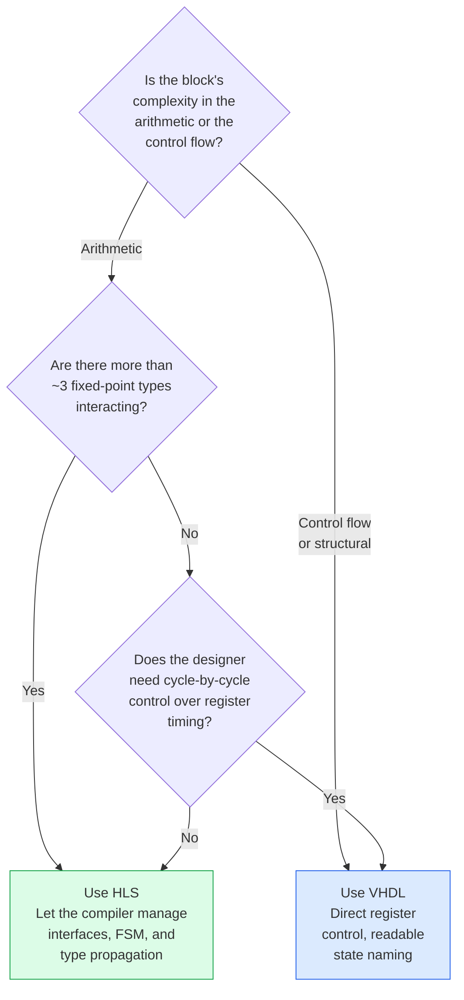

Applied to this project's blocks:

| Block | Complexity | Cycle control | Fixed-point types | Choice | Correct? |
|---|---|---|---|---|---|
| `aa_lpf` | Arithmetic (129 MACs) | No | 3 | HLS | ✓ |
| `fm_disc` | Arithmetic (CORDIC) | No | 5 | HLS | ✓ |
| `audio_ppdma` | Arithmetic + DMA | No | 1 | HLS | ✓ |
| `iq_ppdma` | DMA address logic | No | 1 | HLS | ✓ |
| `freq_corr` | 4 multiplies | Yes (4-way sync) | 2 | VHDL | ✓ |
| `de_emph` | 1-pole IIR | Yes (feedback timing) | 3 | VHDL | ✓ |
| `iq_splitter` | Structural wiring | Yes (combinational) | 0 | VHDL | ✓ |
| `tlast_gen` | Counter | Yes (N-th valid beat) | 0 | VHDL | ✓ |

---

## Appendix R — Xilinx/AMD IP Product Guides and Tutorials: Annotated Reference List

Every link below was verified live during this writing session. As with Section 7, re-verify before publication — `docs.amd.com` URLs are versioned and occasionally reorganized. Where a 2022.2-specific URL is available it is given alongside the version-agnostic one; use the versioned URL when teaching this course to ensure the documentation matches the tools being used.

---

### Q.1 Vitis HLS — Documentation and Tutorials

**Primary reference — everything about HLS belongs here first:**

- **UG1399 — Vitis HLS User Guide (version-agnostic):** <https://docs.amd.com/r/en-US/ug1399-vitis-hls>  
  2022.2-specific: <https://docs.amd.com/r/2022.2-English/ug1399-vitis-hls/Using-Vitis-HLS>  
  Covers: interface pragmas (Chapter 8, "Interfaces of the HLS Design"), reset control (Chapter 8, "Controlling Initialization and Reset Behavior"), pipelining and loop optimization (Chapter 9), scheduling and binding (Chapter 10). The reset-scope issue (`#pragma HLS RESET`) is documented in the "Controlling Initialization and Reset Behavior" section.

- **UG1399 — Tutorials and Examples section:**  
  <https://docs.amd.com/r/en-US/ug1399-vitis-hls/Tutorials-and-Examples>  
  Lists the official AMD HLS tutorial labs.

**GitHub repositories — worked examples directly runnable:**

- **Vitis-HLS-Introductory-Examples** (officially maintained by AMD/Xilinx):  
  <https://github.com/Xilinx/Vitis-HLS-Introductory-Examples>  
  Most relevant examples for this course:
  - `DSP/fir/decimator` — FIR decimator in HLS, directly comparable to `aa_lpf.cpp`
  - `Interface/Memory/using_axi_master` — `m_axi` interface with `depth` pragma, directly relevant to `audio_ppdma`/`iq_ppdma`
  - `Interface/using_axi_stream_with_side_channel_data` — AXI-Stream with `tlast`/`tkeep` side channels
  - `Modeling/using_arbitrary_precision_arith` — `ap_fixed` and `ap_int` type usage
  - `Pipelining/Loops/pipelined_loop` — `PIPELINE II=1` on a loop vs. a function (the distinction that matters for `aa_lpf`)

- **Vitis-Tutorials** (broader, includes HLS Getting Started):  
  <https://github.com/Xilinx/Vitis-Tutorials>  
  The `Getting_Started/Vitis_HLS` path contains the official GUI-walkthrough tutorial.

---

### Q.2 IP Product Guides — Every IP Used in This Project

Each product guide (PG number) is the authoritative reference for the corresponding IP's port list, register map, configuration options, and timing behaviour. The bugs caught during this project that required reading a product guide are noted alongside the relevant PG.

#### DDS Compiler v6.0 — PG141

- <https://docs.amd.com/r/en-US/pg141-dds-compiler>

**Must-read sections for this project:**
- **Output DATA Channel TDATA Structure** — documents the `{sin[31:16], cos[15:0]}` packing that caused the 90° rotation bug if read incorrectly. The field names are counter-intuitive: cosine occupies the *lower* 16 bits, sine the *upper* 16 bits.
- **Phase Increment (PINC) calculation** — formula `PINC = f_out / f_s × 2^phase_width` used to set the 10 kHz correction frequency.
- **Has_TREADY parameter** — set to `false` in this project; DDS runs freely, not backpressured.

#### FIR Compiler v7.2 — PG149

- <https://docs.amd.com/r/en-US/pg149-fir-compiler>

**Must-read sections:**
- **Decimation configuration** — how to set decimation rate R and configure the polyphase decomposition; the FIR Compiler handles this automatically once R is set.
- **Coefficient file (.coe) format** — the exact format required for MATLAB-generated coefficient tables; the `radix` and `coefdata` fields.
- **Output width and rounding** — how the FIR Compiler truncates/rounds the internal accumulator to the output width; matching this to the Simulink `Discrete FIR Filter` block's rounding mode.

#### AXI DMA v7.1 — PG021

- <https://docs.amd.com/r/en-US/pg021_axi_dma>

**Context in this project:** The AXI DMA IP was used in the first architecture (before the custom `audio_ppdma`/`iq_ppdma` HLS cores replaced it). Understanding PG021 is necessary for the Part 3 case study comparing old vs. new DMA architectures.

**Must-read sections:**
- **Register Space (Direct Register Mode)** — `MM2S_DMACR`, `MM2S_SA`, `MM2S_LENGTH`, `MM2S_DMASR.IOC_Irq` — the register sequence the bare-metal CPU had to program for every transfer.
- **S2MM channel** — the `tlast` requirement for transfer completion: without `tlast`, `S2MM_DMASR.IOC_Irq` never asserts and the CPU polls forever. This is exactly the problem `tlast_gen.vhd` solves.
- **AXI4 Memory Map Data Width** — must match the HP0 port width configured in the PS7 block.

#### AXI GPIO v2.0 — PG144

- <https://docs.amd.com/r/en-US/pg144-axi-gpio>

**Must-read sections:**
- **Register Map** — `GPIO_DATA` at offset `0x00` (channel 1), `GPIO2_DATA` at offset `0x08` (channel 2). These are the exact offsets used in `main.c`'s `Xil_In32(AXI_GPIO_0_BASEADDR + 0x00)` and `Xil_In32(AXI_GPIO_0_BASEADDR + 0x08)`.
- **Dual channel configuration** — how to enable channel 2 (`C_GPIO2_WIDTH`, `C_ALL_INPUTS_2`); this is set in `bd.tcl`'s `set_property CONFIG.C_IS_DUAL 1`.

#### AXI Verification IP (AXI VIP) — PG267

- <https://docs.amd.com/r/en-US/pg267-axi-vip>

**Must-read sections:**
- **Master and Slave agent APIs** — the task-based API used in `tb_fm_demod_axis_vip.sv` for generating AXI-Stream transactions and accepting them with configurable `tready` behaviour.
- **AXI Protocol Checks** — the full list of assertions the VIP enforces; `AXI4_ERRS_RDATA_X` (the crash encountered during system simulation) is documented here with its exact spec reference (AMBA AXI spec section A3.2.2).

#### AXI Interconnect — PG082

- <https://docs.amd.com/r/en-US/pg082-axi-interconnect>

**Must-read sections:**
- **Clock Domain Crossing** — relevant to the 50 MHz/100 MHz mismatch encountered during system integration; explains when a clock converter is required.
- **Address Map** — how `assign_bd_address` in `bd.tcl` maps slave address segments; what happens when a segment is unmapped (the `WARNING: [BD 5-699] No address segments matched` warning).

---

### Q.3 Zynq-7000 Device References

#### Zynq-7000 SoC Technical Reference Manual — UG585

- <https://docs.amd.com/r/en-US/ug585-zynq-7000-SoC-TRM>

**The single most important reference for understanding the PS/PL interface in this project.** Must-read sections:

- **Chapter 4: PS–PL AXI Interfaces** — documents GP0/GP1 (general purpose masters, 32-bit), HP0–HP3 (high-performance slaves, 64-bit), and ACP (coherent). The fundamental distinction between GP0 (control, narrow) and HP0 (data, wide) that drives the block design's bus topology.
- **Chapter 5: On-Chip Memory (OCM) and DDR** — the DDR controller and why HP port accesses bypass CPU caches.
- **Chapter 6: Cache and Memory** — L1/L2 cache architecture; why `Xil_DCacheFlushRange`/`Xil_DCacheInvalidateRange` are necessary for HP-port DMA correctness.
- **FCLK_CLK0 configuration** — how the PS7 block generates the 100 MHz PL clock used throughout this design.

#### Zynq-7000 SoC Product Guide for Vivado IP Subsystem — UG1047

- <https://docs.amd.com/r/en-US/ug1047-zynq-config-user-guide>  
  Covers the PS7 block's Vivado customization dialog (the `PCW_` parameters in `bd.tcl`): clock frequencies, MIO pin assignments, peripheral enables (SD0, USB0, UART0), and DDR configuration.

---

### Q.4 Vivado Design Suite References

#### Vivado Design Suite User Guide: Designing with IP — UG896

- <https://docs.amd.com/r/en-US/ug896-vivado-ip>  
  Covers: IP Integrator block design workflow, IP catalog management, OOC synthesis, `bd.tcl` generation and re-sourcing. The reference for understanding how `create_bd_cell`, `connect_bd_intf_net`, and `assign_bd_address` work.

#### Vivado Design Suite User Guide: Using Constraints — UG903

- <https://docs.amd.com/r/en-US/ug903-vivado-using-constraints>  
  The authoritative reference for `set_multicycle_path`. **Chapter 5 ("Timing Exceptions")** documents the mandatory `−setup N` / `−hold N−1` pairing rule that was applied when fixing the `de_emph` timing violation. The exact rule: setting `−setup N` without a companion `−hold N−1` can create hold violations; both constraints must be applied together.

#### Vivado Design Suite User Guide: Synthesis — UG901

- <https://docs.amd.com/r/en-US/ug901-vivado-synthesis>  
  VHDL and Verilog synthesis inference rules. Useful for confirming that VHDL `*` on `signed` types infers DSP48 multiply slices (rather than LUT arithmetic), and that `signed(X(17 downto 0))` preserves sign.

#### Vivado Design Suite Tutorial: Implementation — UG986

- <https://docs.amd.com/r/en-US/ug986-vivado-implementation-tutorial>  
  Step-by-step timing closure workflow; how to read a timing report, identify critical paths, and apply constraints. Directly applicable to the `de_emph` timing violation case study.

---

### Q.5 Tutorials Mapped to Course Modules

The table below maps each course module to the AMD/Xilinx tutorial or document that covers the same topic, so learners can cross-reference official material against the project-specific content in this course.

| Course module | Topic | Recommended AMD/Xilinx resource |
|---|---|---|
| Part 1 | HLS introduction | UG1399 Ch. 1–2; Vitis-HLS-Introductory-Examples |
| Part 2 | Reading synthesised RTL | UG901 (synthesis inference); UG1399 (generated RTL conventions) |
| Part 3 | HLS interface pragmas | UG1399 Ch. 8 ("Defining Interfaces"); `using_axi_master` example |
| Part 3 | HLS pipeline and reset | UG1399 Ch. 9; "Controlling Initialization and Reset Behavior" |
| Part 3 | `ap_fixed` and fixed-point types | UG1399 "Arbitrary Precision Types"; `using_arbitrary_precision_arith` example |
| Part 4 | Block design and IP Integrator | UG896; UG585 Ch. 4 (PS/PL interfaces) |
| Part 4 | Clock domain mismatch | PG082 (AXI Interconnect, clock converter) |
| Part 5 | AXI-Stream VIP testbench | PG267 (AXI VIP); UG1399 (HLS cosim) |
| Part 5 | X-propagation and 4-state simulation | PG267 ("AXI Protocol Checks") |
| Part 6 | Timing closure, multicycle paths | UG903 Ch. 5 (timing exceptions); UG986 (implementation tutorial) |
| Part 7 | Cache coherency, HP ports | UG585 Ch. 4–6; Xilinx Answer Record 47570 (non-cacheable memory) |
| Part 7 | DMA and `tlast` | PG021 (AXI DMA); UG585 Ch. 4 |
| Part 8 | PetaLinux and device tree | UG1144 (PetaLinux Tools Reference Guide) |
| Part 8 | Linux GPIO and `/dev/mem` | libgpiod documentation; `devmem2` source as `/dev/mem` mmap reference |

---

## Appendix S — Why Custom Word Lengths at Every Node Matter: FPGA vs. DSP vs. CPU

### R.1 The Fundamental Difference

On a DSP processor or a CPU, the word length is fixed by the hardware architecture. A TI C6000 DSP operates natively on 16-bit or 32-bit words; a Cortex-A9 operates on 32-bit or 64-bit words. Every intermediate result in a computation is automatically promoted to the processor's native word width, whether or not those extra bits carry useful information. A 16-bit × 16-bit multiply on a 32-bit DSP produces a 32-bit result that occupies a 32-bit register — the full 32 bits are always there, always propagated, always consuming the same memory bandwidth and instruction throughput.

On an FPGA, **every wire has exactly as many bits as the designer specifies, and no more.** A 16-bit × 16-bit multiply that only needs 22 bits of result precision can produce a 22-bit output. The FIR filter accumulator that needs 40 bits for numerical stability can be exactly 40 bits. The de-emphasis output that needs 32 bits can be 32 bits. There is no "native word width" that all intermediate values are promoted to — the word length is a design choice at every single node in the signal chain.

This is not merely an implementation detail. It is one of the fundamental reasons that FPGAs are used for DSP at all: the ability to match the precision to the signal at every point in the pipeline means that hardware resources scale with actual computational need, not with the architecture's word width.

### R.2 The Hardware Cost of Unnecessary Bits

On a Xilinx 7-series device, the DSP48E1 slice is a hardened 18×25 multiplier with a 48-bit accumulator. This means:

- A multiplication of two 18-bit values uses **one DSP48 slice**
- A multiplication of two 19-bit values requires **two DSP48 slices** (the multiplier must be split across two slices)
- A multiplication of two 32-bit values requires **four DSP48 slices**

The Z7-010 used in this project has 80 DSP48 slices total. The difference between designing the FM discriminator's cross-products with the minimum required precision (`sfix18_En17` × `sfix18_En17`) versus using 32-bit operands "to be safe" is:

- 4 cross-products at 18 bits = **4 DSP48 slices**
- 4 cross-products at 32 bits = **16 DSP48 slices**

That 12-slice difference is 15% of the entire device's DSP budget — for one stage of the signal chain. Across the full chain (NCO, FreqCorr, AA LPF × 2, FM Disc, FIR Dec, Audio LPF, De-emph), the cumulative effect of using unnecessarily wide arithmetic would either overflow the device's DSP budget entirely or force the designer to implement arithmetic in LUTs (which is slower, uses more routing, and has worse timing characteristics).

This is the direct engineering motivation for Fixed-Point Designer's word-length minimization step: it is not about theoretical numerical elegance, it is about fitting the design into a device that has a finite, bounded resource budget.

### R.3 What Fixed-Point Designer Is Actually Doing

When Fixed-Point Designer runs range collection on the Simulink model and proposes a word length for each signal, it is answering the question: **"what is the minimum number of bits needed at this node to represent the actual values that appear here, with acceptable quantisation error?"**

The "acceptable" criterion is defined by the PSNR threshold — in this project, >40 dB PSNR at the audio output. Fixed-Point Designer narrows the word length at each node until the PSNR drops to the threshold, then backs off by one step. The result is a set of word lengths that are simultaneously:

- **Sufficient** — the quantisation noise at each node does not degrade audio quality below the target
- **Minimal** — no node is wider than it needs to be for the specified quality target

Neither of these properties is achievable on a DSP or CPU, where the word length is fixed regardless of whether those bits carry useful signal or just noise. This is why Fixed-Point Designer exists as a tool in the FPGA DSP workflow but not typically in the DSP processor workflow — on a processor, there is nothing to optimize, because the word length is not a variable.

### R.4 A Concrete Example From This Project

The FIR AA LPF coefficients are stored as `sfix32_En30` — 32 bits, 2 integer bits, 30 fraction bits. The audio LPF uses the same format.

Why 32 bits for coefficients, when the input data is only 18 bits? Because the coefficient precision directly limits how well the filter's frequency response matches its specification — a 16-bit coefficient introduces rounding error into the filter's transfer function that shows up as passband ripple and imperfect stopband attenuation. For a 129-tap filter targeting >60 dB stopband attenuation, 32-bit coefficients are the minimum needed to preserve the designed frequency response after coefficient quantisation.

But — and this is the point — those 32-bit coefficients are only used in the coefficient memory (read-once per MAC operation). The multiply result is a 50-bit full-precision product (`sfix50_En47`), which is then rounded and truncated back to the 18-bit output format (`sfix18_En17`) before passing to the next stage. The 50-bit intermediate exists for exactly one clock cycle inside the DSP48's internal accumulator; it never propagates as a 50-bit signal to any downstream wire. On a DSP processor, this 50-bit intermediate would be stored in a 64-bit register regardless — using 14 bits of register that carry no useful information. On the FPGA, those 14 bits simply do not exist outside the accumulator.

The accumulator itself is 40 bits (`sfix40_En17`) rather than 50, because Fixed-Point Designer's range analysis showed that even with 129 MACs, the worst-case accumulator value stays well within 40 bits — the 10 bits of "theoretical" headroom above 40 bits are never reached in practice with any real FM broadcast signal. Using a 40-bit accumulator instead of the full 50-bit product saves 10 bits of fabric register per FIR pipeline stage.

Multiplied across 129 taps, two filter channels (I and Q), and three FIR filter IPs in the design, the cumulative impact of this precision optimization is substantial — and it is the direct output of Fixed-Point Designer doing its job.

### R.5 Summary: Why This Argument Matters for This Audience

For a learner coming from DSP processor or software background, fixed-point arithmetic on FPGAs can appear to be an unnecessary complication — why not just use 32-bit everywhere and avoid the risk of precision errors? This appendix answers that question directly:

- On a processor, **you cannot use fewer bits than the hardware supports**, regardless of how much precision your signal actually needs
- On an FPGA, **every unnecessary bit costs hardware** — DSP slices for arithmetic, routing for buses, registers for pipeline stages
- Fixed-Point Designer is the tool that finds the minimum word length at each node that meets the quality specification — this minimization is only meaningful because the FPGA allows it
- The result is a design that fits in an 80-DSP-slice device where a naive 32-bit-everywhere approach would not

This is also the underlying reason the Model-Based Design pipeline has a dedicated "Fixed-Point Designer" step between the floating-point Simulink model and the HDL implementation: it is the step where the FPGA's unique ability to customize word lengths is exploited, and without it, either the design fails to fit or significant hardware efficiency is wasted.

---

## Appendix T — Rounding Modes, Truncation Errors, and Their Consequences in Fixed-Point DSP

### S.1 Why Rounding Matters More Than It Looks

Every time a fixed-point multiplication produces a product wider than the output format, some bits must be discarded. How those bits are discarded — the rounding mode — determines the statistical properties of the error introduced at that node. In a feed-forward filter with no feedback, a poor rounding choice introduces a small, bounded error that might be acceptable. In an IIR filter with feedback, the same rounding error recirculates through the loop on every sample and can accumulate indefinitely, producing distortion that grows over time or a persistent low-level oscillation (a limit cycle) that never decays to zero even when the input is silent.

Understanding rounding modes is therefore not a theoretical exercise — it is the difference between a de-emphasis filter that produces a clean output and one that produces a faint, periodic buzz in the absence of any audio signal.

### S.2 The Six Standard Rounding Modes

The following modes are all available in Simulink's `Discrete Filter` / `Discrete FIR Filter` blocks, in Vitis HLS's `ap_fixed<>` template, and in VHDL via explicit code. Fixed-Point Designer can propose which mode to use based on the error analysis; in practice most design decisions reduce to choosing between the first three.

---

#### S.2.1 Truncation (Floor) — `AP_TRN` / "Floor"

**What it does:** Discards the low-order bits unconditionally. Equivalent to rounding toward negative infinity regardless of the value of the discarded bits.

**Example:** `+0.7` represented in sfix4_En3 (4 bits, 3 fraction bits, resolution 0.125):
- True value: 0.7
- Nearest representable values: 0.625 (= 0.111₂) and 0.750 (= 1.000₂)
- Truncation result: **0.625** (always rounds down)

For negative values: `-0.3` truncates to **-0.375** (rounds toward more negative).

**Error introduced:** Always negative or zero — truncation introduces a **systematic negative bias** (DC offset) across a signal. For a stream of random input values, the average truncation error is approximately −LSB/2 where LSB is the least significant bit of the output format.

**Hardware cost:** Zero. Truncation requires no additional logic — the unwanted bits are simply not connected.

**When to use:** Output stages where the absolute error is small relative to the signal range and where the DC bias introduced is acceptable (e.g. the FIR decimator output in this project, where the bias is below the measurement noise floor). Truncation is the default in many HLS configurations because of its zero hardware cost.

**When NOT to use:** IIR filter feedback paths. The systematic negative bias feeds back through the loop on every sample. For the de-emphasis filter with `a1 = 0.766`, a truncation bias of −LSB/2 at the accumulator output recirculates as `−a1 × LSB/2` on the next sample, `−a1² × LSB/2` the sample after that, and so on — converging to a DC offset of `−(LSB/2) / (1 − a1) ≈ −2.14 × LSB/2`. This is a fixed, persistent DC offset in the audio output with no input signal, equivalent to adding a small constant to every audio sample.

---

#### S.2.2 Round Half Up (Round to Nearest, Ties Away from Zero) — `AP_RND` / "Round"

**What it does:** Adds half an LSB to the value before truncating. Equivalent to rounding toward the nearest representable value, with ties rounded up (away from zero for positive values, toward zero for negative values — implementations vary).

**Example:** Same values as above:
- `+0.7` → add 0.0625 (half-LSB) → 0.7625 → truncate → **0.750** (rounds up to nearest)
- `+0.65` (exactly halfway) → add 0.0625 → 0.7125 → truncate → **0.750** (rounds up)
- `-0.65` (exactly halfway) → add 0.0625 → -0.5875 → truncate → **-0.625** (rounds toward zero)

**Error introduced:** Approximately zero mean bias — positive and negative errors are roughly equally probable for random input signals, so the errors tend to cancel over time rather than accumulating. The RMS error is LSB/√12 (the standard deviation of a uniform distribution over ±LSB/2).

**Hardware cost:** One adder for the +LSB/2 operation, plus carry propagation. Small but nonzero.

**When to use:** Anywhere that DC bias is unacceptable — audio output paths, IIR accumulators, any signal path where the error will be integrated or heard directly. This project uses `AP_RND` in the FIR compiler for the audio LPF for this reason.

---

#### S.2.3 Convergent Rounding (Round Half to Even, Banker's Rounding) — `AP_RND_CONV` / "Convergent"

**What it does:** Like Round Half Up, except that when the discarded bits are exactly halfway (the fractional part is exactly 0.5 LSB), rounds to the nearest even value rather than always up. This means half the "tie" cases round up and half round down, further reducing systematic bias.

**Example:**
- `+0.625` (halfway between 0.5 and 0.75, tied): rounds to **0.750** (0.750 is even — last bit 0)
- `+0.875` (halfway between 0.75 and 1.0, tied): rounds to **0.750** (0.750 is even — last bit 0)
- `+0.375` (halfway between 0.25 and 0.5, tied): rounds to **0.250** (0.250 is even — last bit 0)

**Error introduced:** The smallest mean bias of any rounding mode — statistically, exactly half the tie cases round up and half round down, so over a long signal the mean error is zero even on the tie cases. This makes convergent rounding the preferred mode for any calculation involving a large number of accumulations (e.g. the FIR filter's 129 MAC operations), because the bias from ordinary Round Half Up accumulates slightly across all 129 taps while convergent rounding accumulates to zero.

**Hardware cost:** Slightly higher than Round Half Up — requires checking whether the bit immediately above the rounding point is 0 or 1 (to determine the "even" direction). In practice the additional logic is minimal and usually acceptable.

**When to use:** FIR filter accumulators where a large number of MAC operations are summed; anywhere that the cumulative bias from repeated Round Half Up would be measurable. The FIR decimator in this project uses convergent rounding for this reason.

**When it makes no practical difference:** Single-operation nodes where the tie probability is negligible (e.g. a gain block that multiplies by a non-power-of-2 constant). The difference between Round and Convergent only matters statistically across many operations.

---

#### S.2.4 Round Half Down (Toward Negative Infinity on Ties)

**What it does:** Like Round Half Up but rounds ties downward (toward negative infinity) instead of upward.

**Error introduced:** Slightly negative mean bias on the tie cases — the bias is smaller in magnitude than plain truncation but nonzero. In practice this mode is rarely the right choice; it is included here for completeness and because Simulink exposes it.

---

#### S.2.5 Round Half to Zero (Truncation of Magnitude)

**What it does:** Rounds the magnitude toward zero (i.e. positive values round down, negative values round up) at tie points. Also called "symmetric truncation."

**Error introduced:** Zero mean bias on ties. For non-tie values, introduces the same floor-like behaviour as truncation. The practical difference from Round Half Up is only at exact midpoints and is rarely significant.

---

#### S.2.6 Ceiling (Round Toward Positive Infinity)

**What it does:** Always rounds toward positive infinity — the opposite direction from Floor.

**Error introduced:** Always positive or zero bias — the mirror image of truncation's negative bias. Used occasionally to guarantee conservative overflow bounds (e.g. "the output of this block is at most X, regardless of rounding") but uncommon in audio DSP.

---

### S.3 Overflow Handling: Saturate vs. Wrap

Overflow handling is closely related to rounding but applies when a value exceeds the representable range of the output format rather than when bits are discarded from the fraction.

#### Saturate (`AP_SAT`)

Clamps the output to the maximum (or minimum) representable value when overflow occurs:
```
if result > MAX: output = MAX
if result < MIN: output = MIN
```

**Error introduced:** Large on overflow events (the error is the difference between the true result and MAX/MIN), but bounded. The clipping is audible but recognizable — a loud transient clips to a flat maximum rather than producing a sign flip.

**When to use:** All audio signal paths in this project. Saturation on audio is the correct failure mode: it sounds like clipping, which is a familiar artifact, rather than the catastrophic distortion produced by wrapping.

#### Wrap (`AP_WRAP`)

Allows the value to overflow by modular arithmetic — the output wraps from MAX back to MIN (or vice versa):
```
result = 0x7FFF + 1 = 0x8000 (which is the most negative value in 16-bit signed)
```

**Error introduced:** Catastrophic on overflow — a value that exceeds the range by one LSB produces an output that is MAX away from the correct value. In audio this sounds like a loud pop or a sign inversion that corrupts several subsequent samples through the IIR feedback path.

**When to use:** Rarely in audio DSP. Wrap is used when the designer can analytically prove that overflow will never occur (for example, the FIR accumulator in this project is sized with enough headroom that overflow is mathematically impossible for any FM broadcast signal), allowing the designer to avoid the saturation logic and save the corresponding hardware. In this project, saturation is preferred at all output and inter-stage boundaries even where overflow analysis says it is unlikely, as a defensive measure.

---

### S.4 Limit Cycles: What Happens When Rounding Meets Feedback

A limit cycle is a low-level oscillation in an IIR filter that persists indefinitely even when the input is zero or constant. It is caused by the interaction between rounding at the accumulator and the feedback path.

**Mechanism:** Consider the de-emphasis filter with `y[n] = b0·x[n] + a1·y[n-1]` and input `x[n] = 0` (silence):

```
True behaviour:    y[n] = a1 × y[n-1]   → exponentially decays to zero

With truncation:
  y[0] = some small positive value, e.g. +1 LSB
  y[1] = a1 × 1 LSB = 0.766 LSB → truncate → 0 LSB    (decays to zero in one step)

  y[0] = some slightly larger value, e.g. +2 LSB
  y[1] = a1 × 2 LSB = 1.532 LSB → truncate → 1 LSB
  y[2] = a1 × 1 LSB = 0.766 LSB → truncate → 0 LSB    (decays to zero in two steps)
```

For truncation with a stable pole (|a1| < 1), the filter usually decays to zero correctly because the truncation always reduces the magnitude.

However, with a wider accumulator and different coefficient values, truncation can produce a situation where:
```
  y[n] = a1 × y[n-1] → result before truncation is slightly above 1 LSB
                      → truncates to 1 LSB
  y[n+1] = a1 × 1 LSB → again slightly above 1 LSB → truncates to 1 LSB
  → permanent oscillation at ±1 LSB: a zero-input limit cycle
```

Zero-input limit cycles at ±1 LSB are effectively inaudible — an audio-frequency limit cycle at ±1 LSB of a 32-bit fixed-point signal is more than 100 dB below full scale. But granular limit cycles (oscillations at a few LSB amplitude, sometimes at a subharmonic of the sample rate) can occasionally be audible at extreme low-signal-level conditions and are the reason IIR filter implementations are designed with an eye to their limit cycle behaviour.

**The de-emphasis filter in this project:** The `sfix40_En13` accumulator was chosen specifically wide enough that the accumulator value at the rounding point during a decay to zero is always reduced by the rounding operation, preventing any limit cycle above the noise floor. This was verified by Fixed-Point Designer's simulation against a zero-input step response: the output decays monotonically to zero with no oscillation.

---

### S.5 Practical Summary for This Project

| Location | Rounding mode | Overflow mode | Reason |
|---|---|---|---|
| AA LPF output | Truncation (`AP_TRN`) | Saturate (`AP_SAT`) | FIR: bias acceptable, zero cost |
| FIR decimator accumulator | Convergent | Wrap | 129-tap sum: convergent reduces cumulative bias; wrap safe (accumulator sized with proof of no overflow) |
| FM discriminator products | Truncation | Saturate | Single-cycle operation; bias negligible relative to CORDIC output precision |
| CORDIC atan2 output | Truncation | Saturate | Matches Simulink CORDIC block behaviour |
| Audio LPF | Round (`AP_RND`) | Saturate | Output stage; bias should be minimal |
| De-emphasis IIR accumulator | Round | Saturate | IIR feedback: Round to avoid systematic DC bias accumulating through the loop |
| De-emphasis output | Truncation | Saturate | Final word-width reduction; bias below measurement floor |
| `audio_ppdma` → PCM16 | Round-to-nearest (`lroundf`) | Clamp | Software; bias unacceptable in final audio output |

The key takeaway: **truncation wherever the bias is harmless** (saves hardware), **convergent or round wherever bias would accumulate** (IIR paths, large FIR sums), and **always saturate rather than wrap** at any node where real-world signal extremes could cause overflow.

---

## Appendix U — Every Test Described in Full

This appendix documents every test file in the project from its actual source code: the specific stimulus it uses, what it checks, the tolerance it applies, and what it can and cannot detect. Tests are presented in the order they should be run — the same order as the four-level plan in Appendix H.

---

### T.1 Level 1 / Level 2: HLS Testbenches (C Simulation + Cosim)

---

#### T.1.1 NCO Wrapper — `tb_nco.vhd`

**Language:** VHDL  
**Level:** 2 (VHDL simulation only — `nco_wrapper` wraps a Vivado IP, not an HLS block, so there is no HLS csim level)  
**What it tests:** That `nco_wrapper` correctly splits the DDS Compiler's packed 32-bit `tdata` into two separate 16-bit AXI-Stream outputs, and that the cosine and sine values match the MATLAB-generated golden vectors.

**Stimulus:**
- `input_nco_cos_stimulus.txt` — signed 16-bit integers representing `cos(2π × 10kHz × n / 250kHz)` in `sfix16_En15`, one per line
- `input_nco_sin_stimulus.txt` — same for sine

**Mechanism:** Drives `aclk`/`aresetn`, collects `m_axis_cos_tdata` and `m_axis_sin_tdata` on each `tvalid` pulse, compares integer values against the golden files. Writes actual DUT output to `nco_cos_dut_output.txt` / `nco_sin_dut_output.txt` for post-simulation inspection.

**Pass/fail criterion:** All samples within `TOLERANCE = 4` LSBs of `sfix16_En15`. The 4-LSB tolerance accounts for: (1) the DDS Compiler's internal SFDR-limited precision at 10 kHz / 250 kHz; (2) possible 1-LSB rounding difference between MATLAB's `cos()` in double precision and the DDS's polynomial approximation. **Note:** `SKIP_SAMPLES = 8` — the DDS Compiler has an 8-cycle pipeline latency between configuration and first valid output; the first 8 output samples are discarded before comparison begins.

**What it catches:** Wrong `tdata` bit-slice assignments (the cosine/sine swap bug); `tvalid` never asserting; `tready` gating incorrectly allowing one output to advance without the other.

**What it cannot catch:** The DDS Compiler's frequency accuracy (governed by the PINC value baked into the IP configuration, not by the wrapper logic).

---

#### T.1.2 Frequency Corrector — `tb_freq_corr.vhd`

**Language:** VHDL  
**Level:** 2  
**What it tests:** The four-input complex multiply in `freq_corr.vhd` produces the correct `sfix18_En17` Ic and Qc outputs given real I/Q samples and NCO cos/sin.

**Stimulus (six files, all from `run_and_extract.m`):**
- `input_i_stimulus.txt` — `sfix16_En15` signed integers, the raw ADC-normalised I channel from `rds.wav`
- `input_q_stimulus.txt` — same for Q
- `input_nco_cos_stimulus.txt` — DDS cosine output (same file used by `tb_nco.vhd`)
- `input_nco_sin_stimulus.txt` — DDS sine output
- `freqcorr_i_golden.txt` — `sfix18_En17` signed integers: the Ic output from the Simulink FreqCorr block
- `freqcorr_q_golden.txt` — same for Qc

**Timing model:** `SAMPLE_RATE = 400` clock cycles between valid beats (100 MHz / 250 kHz). The testbench asserts all four `tvalid` signals simultaneously for one clock cycle, then deasserts for 399 cycles, modelling the real hardware timing.

**Pass/fail criterion:** All `N_SAMPLES = 9990` output samples within `TOLERANCE = 2` LSBs of `sfix18_En17`. The 2-LSB tolerance accounts for the final `saturate18()` rounding difference between VHDL's `shift_right` + truncation and MATLAB's `fi` floor rounding.

**Pipeline latency handling:** `SKIP_SAMPLES = 0` — the 2-cycle pipeline latency (one cycle for input latching, one for the multiply-accumulate) fits entirely within the 400-cycle sample period. Output sample N is compared against golden sample N with no index offset needed.

**What it catches:** Wrong complex multiply formula (Ic = I×cos − Q×sin, Qc = I×sin + Q×cos); incorrect sign in either sum; wrong word-growth handling (output wider than 18 bits); all-valid gating failure (any one of the four inputs advancing without the others).

---

#### T.1.3 Anti-Alias LPF — `aa_lpf_tb.cpp`

**Language:** C++ (HLS csim + cosim)  
**Level:** 1 and 2  
**What it tests:** Single-channel 129-tap FIR filter produces the correct `sfix18_En17` output matching the Simulink AA LPF block.

**Stimulus:**
- `aa_lpf_i_stimulus.txt` — real-valued double-precision floats representing the FreqCorr Ic output (the input to the AA LPF I-channel), one per line
- `aa_lpf_i_golden.txt` — real-valued double-precision floats representing the AA LPF I-channel output from the Simulink model

**Important detail:** The testbench loads values as doubles and casts to `data_t` (`ap_fixed<18,1,AP_TRN,AP_SAT>`). This double→`ap_fixed` cast uses the `AP_TRN` mode (floor), which may introduce a 1-LSB difference from MATLAB's equivalent `fi()` conversion. The golden file was generated by MATLAB's `fi()` function with the same floor rounding, so the casts match.

**Pass/fail criterion:** Every output sample within `TOLERANCE = 1e-5` (= approximately 1 LSB of `sfix18_En17`, which has a resolution of `2^-17 ≈ 7.6e-6`).

**First 20 samples printed:** The testbench prints a four-column table (index, input, HLS output, MATLAB golden) for the first 20 samples and any failures, to provide immediate visual inspection without overwhelming the log.

**Note on channel symmetry:** The testbench tests the I channel only (`aa_lpf_i_stimulus.txt` / `aa_lpf_i_golden.txt`). The comment in the file explicitly states: "Run it once with I-channel vectors and once with Q-channel vectors (same coefficients, same filter — only the stimulus differs, so a single-channel test fully covers both since the hardware is identical for either channel)." The Q-channel test requires manually renaming the Q-channel files or passing them as arguments.

---

#### T.1.4 FM Discriminator — `fm_disc_tb.cpp`

**Language:** C++ (HLS csim + cosim)  
**Level:** 1 and 2  
**What it tests:** The differential phase FM discriminator with CORDIC atan2 produces the correct `sfix32_En14` instantaneous frequency output in Hz.

**Stimulus:**
- `fm_disc_ic_stimulus.txt` — signed 16-bit integers (raw `ap_fixed<18,1>` bit patterns stored as integers, NOT as doubles): the FreqCorr Ic output after AA LPF
- `fm_disc_qc_stimulus.txt` — same for Qc
- `fm_disc_golden.txt` — real-valued doubles in Hz: the FM discriminator output from the Simulink model

**Critical implementation detail — integer bit loading:**
```cpp
ic_vals[i].range() = ic_ints[i];  // direct bit assignment, NOT (data_t)double
```
Loading via `.range()` assigns the raw integer bit pattern directly to the `ap_fixed` type without any rounding. This matches how the hardware sees the signal — as a sequence of raw integer-represented fixed-point values — and avoids a double-cast error where `(data_t)(-0.9999)` might round differently than `(data_t)(raw_integer_as_double)`.

**Pass/fail criterion:** `TOL = 15.0 Hz` — approximately 6 LSBs of `sfix32_En14` (which has a resolution of 39788.7 / 2^14 ≈ 2.43 Hz/LSB). The 6-LSB tolerance accounts for the accumulated rounding difference between MATLAB's CORDIC implementation (which uses `fi` floor rounding at each iteration) and the HLS `hls::atan2` CORDIC (which uses `AP_TRN` truncation).

**Startup skip:** `SKIP = 1` — the first output sample is zero while the delay registers (`id`, `qd`) initialise to zero. Output sample 0 (corresponding to `id = qd = 0`) produces a discriminator output of `atan2(0,0) = 0`, not the true discriminator value for that sample. All subsequent samples (from sample 1 onward) are valid.

---

#### T.1.5 Audio Ping-Pong DMA — `audio_ppdma_tb.cpp`

**Language:** C++ (HLS csim + cosim)  
**Level:** 1 and 2  
**What it tests:** Control logic for ping-pong buffer rotation and destination mirror (see Appendix H.3, Level 2 for the full description of what was caught here).

**Stimulus:** 500 synthetic samples, `sample[n] = 1000 + n`. No MATLAB-generated vectors — this is a control-logic test, not a DSP-accuracy test.

**Pass/fail criterion:** 10/10 blocks of 50 samples correctly mirrored to `dest_base`; `active_buf` flips at the correct time relative to each block boundary.

---

#### T.1.6 I/Q Ping-Pong DMA — `iq_ppdma_tb.cpp`

**Language:** C++ (HLS csim + cosim)  
**Level:** 1 and 2  
**What it tests:** Control logic for reading from alternating ping/pong source buffers and unpacking `{I[31:16], Q[15:0]}` to two separate 16-bit outputs.

**Stimulus:** Pre-filled synthetic ping/pong buffers: `I[n] = 2000 + n`, `Q[n] = 3000 + n`, packed as `(I << 16) | Q`.

**Pass/fail criterion:** 40/40 samples of correct I/Q extraction and correct `active_buf` reporting (shadow-register timing — see Appendix J and Appendix O.11).

---

#### T.1.7 FIR Decimator — `fir_dec_tb.vhd`

**Language:** VHDL  
**Level:** 2  
**What it tests:** The FIR Compiler decimation IP wrapper produces the correct impulse response at the 50 kHz output rate.

**Stimulus:**
- `fir_dec_stimulus.txt` — impulse test: a single sample at the full-scale positive value (`2^31 - 1` in `sfix32_En14`) followed by zeros, generated by `gen_fir_dec_impulse_test.m`
- `fir_dec_golden.txt` — the expected impulse response in real Hz-scale values, generated by MATLAB `filter()` with the same coefficients

**Initial tolerance:** `TOL = 100.0` (wide open) with `SKIP = 0`. This is explicitly documented in the source: the initial run is used to **measure the IP's pipeline latency** from the waveform (how many output samples are zero before the impulse response begins), then `SKIP` and `TOL` are tightened in a second run.

**Why impulse testing rather than real signal testing:** The FIR decimator changes the sample rate (250 kHz → 50 kHz). An impulse test is more direct: the impulse response of the decimated FIR filter must match the MATLAB design. If it does, any real-signal test would also pass (by linearity). An impulse test also reveals pipeline latency directly, as the number of zero output samples before the impulse peak.

**What it catches:** Wrong decimation rate (R=4 vs R=5 would produce output at a different rate, visible in the timing); wrong coefficient polarity or magnitude; FIR Compiler rounding mode mismatch vs. Simulink.

---

#### T.1.8 Audio LPF — `audio_lpf_tb.vhd`

**Language:** VHDL  
**Level:** 2  
**What it tests:** Same pattern as the FIR decimator — impulse response test at 50 kHz sample rate (no decimation).

**Stimulus/golden:** Same impulse-test approach: `audio_lpf_stimulus.txt` with a single full-scale impulse followed by zeros; `audio_lpf_golden.txt` with the expected impulse response at 50 kHz.

**Initial configuration:** `TOL = 100.0`, `SKIP = 0` — same "measure latency first, then tighten" workflow as the FIR decimator testbench.

---

#### T.1.9 De-emphasis IIR — `de_emph_tb.vhd`

**Language:** VHDL  
**Level:** 2  
**What it tests:** The hand-written VHDL IIR filter produces the correct 75 µs de-emphasis response against the Simulink Discrete Filter block.

**Stimulus:**
- `de_emph_stimulus.txt` — signed 32-bit integers (`sfix32_En14` format), one per line, generated by `gen_de_emph_test.m`
- `de_emph_golden.txt` — real-valued floats in `sfix32_En13` scale (i.e. divided by 2^13 = 8192), one per line

**Timing model:** `stim_proc` asserts `s_tvalid` for one clock cycle, then deasserts for one cycle. This models a 50 kHz signal at 100 MHz clock: one valid sample every two clock cycles (which is conservative relative to the real hardware's 2000-cycle inter-sample budget, but exercises the filter's handling of `tvalid` correctly).

**Pass/fail criterion:** `TOL = 2 / 8192.0` — 2 LSBs of `sfix32_En13`. The 2-LSB (rather than 1-LSB) tolerance accounts for: (a) one bit of difference between MATLAB's `fi` accumulator rounding and VHDL's `shift_right` truncation, and (b) the VHDL coefficients being stored as VHDL `constant` integers which may differ by 1 ULP from MATLAB's `fi` coefficient representation.

**`to_real_out` conversion:** The check process converts the 32-bit `sfix32_En13` output to a real value by dividing by 8192 (`2^13`):
```vhdl
function to_real_out(slv : std_logic_vector(31 downto 0)) return real is
begin
    return real(to_integer(signed(slv))) / 8192.0;
end function;
```

**What it specifically cannot catch:** The timing closure violation from the 22-logic-level combinational path. The VHDL testbench runs in behavioural simulation without timing; the violation only appears in Vivado implementation. This is the fundamental limitation of behavioural VHDL testbenches for timing-critical blocks — a constraint that the two-stage pipeline redesign (Appendix O.7) and the multicycle path constraint (Appendix L.5 / Appendix G.2) addressed.

---

### T.2 Level 2.5: AXI-Stream VIP Stall Test — `tb_fm_demod_axis_vip.sv`

**Language:** SystemVerilog with Xilinx AXI4-Stream VIP (`pg267`)  
**What it tests:** No stalls on either the input or output AXI-Stream interfaces of the complete `design_1_wrapper` (the FM demodulator with `iq_splitter` and `tlast_gen`), under realistic I/Q pacing at 250 kHz.

**Configuration:**
```systemverilog
localparam int SAMPLE_PERIOD  = 400;   // cycles per 250 kHz I/Q beat
localparam int SAMPLE_COUNT   = 5000;  // beats to inject
localparam int STALL_TIMEOUT  = 1000;  // max cycles tvalid=1 & tready=0
```

**VIP master (drives input):** Sends `SAMPLE_COUNT = 5000` packed 32-bit I/Q beats (`{Q[15:0], I[15:0]}`) at one beat every `SAMPLE_PERIOD = 400` cycles. Beats are synthetic values — the test does not check data correctness, only flow.

**VIP slave (monitors output):** Accepts all output beats with `tready` permanently high (zero backpressure). The stall watchdog monitors both input and output interfaces independently.

**Stall watchdog:** A `tvalid`-high / `tready`-low condition persisting for more than `STALL_TIMEOUT = 1000` consecutive clock cycles triggers `$error` and `$finish`. 1000 cycles is a generous threshold above any expected pipeline latency (~20 cycles from FreqCorr through to de-emph at steady-state), so any genuine stall is caught within microseconds of its onset.

**Package name caveat (from source comments):**
```systemverilog
// NOTE: replace these two package names with the actual names generated
// by Vivado for your VIP instances. Find them with:
//   find <proj_dir> -name "*pkg*" | grep -i vip
import axi4stream_vip_0_pkg::*;   // master VIP -- ADJUST NAME
import axi4stream_vip_1_pkg::*;   // slave VIP  -- ADJUST NAME
```
The exact package names are generated by Vivado from the VIP instance names in the block design and will differ between projects.

---

### T.3 Level 3: Full-Chain Behavioural Simulation — `tb_fm_demod_chain.sv`

**Language:** SystemVerilog  
**What it tests:** The complete `fm_demod_wrapper` — all six stages connected — produces audio output that matches the Simulink fixed-point reference to >40 dB PSNR when driven with real `rds.wav` I/Q samples.

**Stimulus:**
- `s_axis_i_stimulus.txt` — `sfix16_En15` signed integers from `rds.wav` I channel (generated by `gen_fm_demod_stimulus.m` via `gen_coeffs_testvectors.m`)
- `s_axis_q_stimulus.txt` — same for Q channel

**Captured outputs (written to text files for MATLAB post-processing):**
- `m_axis_data_dut_output.txt` — `sfix32_En13` signed integers from `m_axis_data_0` (de-emphasis output, 50 kHz)
- `aa_lpf_I_y_dut_output.txt` — `sfix18_En17` (padded to 24-bit TDATA, lower 18 bits meaningful) from the AA LPF I-channel output — intermediate probe
- `fm_disc_disc_out_dut_output.txt` — `sfix32_En14` signed integers from the FM discriminator output — intermediate probe

**Important note on intermediate probes:** The testbench explicitly handles the `aa_lpf_I` output's 24-bit TDATA width, noting that only the lower 18 bits are meaningful (`AA_I_VALID_BITS = 18`); the upper 6 bits are sign-extension padding. The source comment flags: "the upper 6 bits are sign-extension padding" — the fix to `iq_splitter.vhd` had made this explicit, but the testbench retained the probe for diagnostic purposes.

**Timing:** Clock at 100 MHz (`CLK_PERIOD = 10ns`); one valid I/Q beat every `SAMPLE_RATE = 400` cycles. This exactly matches the 250 kHz sample rate. The testbench drives `s_axis_i_tvalid` / `s_axis_q_tvalid` for one cycle then waits 399 cycles.

**m_axis_data_0 has no tready port.** The source comment explicitly confirms: "confirmed against the generated wrapper.v. de_emph_0 drives this as a free-running output stream with no downstream backpressure."

**Post-processing by `verify_fm_demod_rtl.m`:** This MATLAB script is the actual pass/fail gate for Level 3. It:
1. Loads `m_axis_data_dut_output.txt`
2. Converts `sfix32_En13` integers to real Hz values (divide by `2^13 = 8192`)
3. Trims 50-sample startup transient
4. Resamples 50 kHz → 48 kHz using MATLAB's `resample(sig, 24, 25)`
5. Normalises to peak amplitude
6. Cross-correlates against the Simulink reference (search ±200 samples) to find pipeline latency alignment
7. Computes: correlation coefficient, gain error (alpha), SNR, ENOB, and an independent SNR-from-correlation estimate
8. Applies threshold: `SNR_from_correlation > 40 dB` = PASS, `> 25 dB` = ACCEPTABLE (audible quality), `< 25 dB` = FAIL

**The cross-correlation alignment step is essential.** The RTL chain has a total pipeline latency of several hundred samples (sum of all stage group delays); the Simulink reference does not. Without the cross-correlation alignment step, comparing the RTL output directly against the Simulink output produces near-zero correlation even when the RTL is perfectly correct, because the signals are offset in time.

**The sign-extension bug was caught here.** The discriminator output was showing near-zero PSNR, and the `fm_disc_disc_out_dut_output.txt` intermediate probe revealed that the discriminator was receiving corrupted I/Q values (zero-padded instead of sign-extended). Adding a probe at the AA LPF output (`aa_lpf_I_y_dut_output.txt`) then confirmed the corruption was happening upstream of the discriminator.

---

### T.4 Level 4: End-System Tests — `tb_sdr_fm_receiver.sv` and `tb_sdr_fm_receiver_liveness.sv`

**Language:** SystemVerilog with Xilinx PS7 VIP  
**What they test:** The complete SoC — PS7 ARM subsystem, AXI interconnect, HLS ping-pong DMA cores, and `fm_demod_0` — running at the full integration level.

#### `tb_sdr_fm_receiver.sv` — Functional integration testbench

**PS7 VIP tasks used:**
- `set_slave_profile("S_AXI_HP0", 2'b00)` — configures HP0 bus timing
- `fpga_soft_reset(4'hF)` / `fpga_soft_reset(4'h0)` — assert/release PL reset
- `write_mem(data, addr, bytes)` — HP0 backdoor DDR pre-load (I/Q buffers)
- `read_mem(addr, bytes, data)` — HP0 readback (audio output check)
- `write_data(addr, size, data, resp)` — GP0 register writes
- `read_data(addr, size, data, resp)` — GP0 register reads

**Sequence:**
1. PS power-on reset sequence
2. Pre-load I/Q ping and pong buffers via HP0 `write_mem` (5000 beats × 2 buffers)
3. Release PL reset
4. Poll `axi_gpio_0`'s `GPIO_DATA` and `GPIO2_DATA` at regular intervals via GP0 `read_data`
5. Read back `AUDIO_DEST_ADDR` at end of run via HP0 `read_mem`

#### `tb_sdr_fm_receiver_liveness.sv` — Watchdog / liveness testbench

**Purpose:** Simplified variant that only checks whether both `active_buf` GPIO bits toggle continuously throughout a 500 ms run. Does not check audio data content — this is the liveness check that the DMA cores are actually running, as described in Appendix H.

**Watchdog timeouts:**
- `IQ_HANG_TIMEOUT_NS = 50_000_000` (50 ms, 5× the nominal 10 ms toggle period)
- `AUDIO_HANG_TIMEOUT_NS = 5_000_000` (5 ms, 5× the nominal 1 ms toggle period)

**FIXED_IO_ps_porb / ps_srstb bug:** The simulation crashed with an `AXI4_ERRS_RDATA_X` error because these two signals were undriven (Z), keeping the PS7 VIP's memory interfaces in power-on reset. The fix — driving both high via `ps_porb_drv = 1'b1; ps_srstb_drv = 1'b1` through explicit `reg` assignments — was confirmed by the testbench's `FIXED_IO_ps_porb = ps_porb_drv` continuous assignment. This bug is invisible at compilation and only manifests as an AXI protocol violation at simulation time.

---

### T.5 MATLAB Post-Processing Tests

#### `verify_fm_demod_rtl.m` — End-to-end audio quality gate (described fully in T.3)

**Pass criterion:** `SNR_from_correlation > 40 dB` against the Simulink floating-point reference.

**Secondary output:** `fm_audio_rtl.wav` saved to disk and played via `sound()` for subjective listening confirmation. "Does it sound like FM radio?" is an explicit, documented check — `PLAY_AUDIO = true` is the default configuration.

#### `gen_coeffs_testvectors.m` — Not a test itself, but the test infrastructure generator

Six sequential steps, each generating the stimulus and golden files that the Level 1/2 testbenches consume. The dependency structure (steps 1–4 independent, step 5 requires `ic_qc_gold.mat` from `run_and_extract.m`, step 6 reads `rds.wav` directly) is described in Appendix H.4.

---

## Appendix V — The Simulink Fixed-Point Model: Block-by-Block Design Notes

This appendix documents the actual `fm_demod_slx.slx` model, extracted directly from the file's XML structure. Block names, exact coefficient values, Simulink parameter names, and connections are taken from the model itself, not inferred from the MATLAB scripts.

---

### U.1 Model-Level Configuration

**Solver:** `FixedStepDiscrete` — the correct solver for a purely discrete-time model with no continuous states.

**Fixed step size:** `4e-06` seconds (= 1/250000) — the I/Q sample period. All blocks operating at 250 kHz use this as their base sample time; blocks at 50 kHz (AudioLPF, DeEmph, audio_50k) use `2e-05` seconds.

**Stop time:** `MAX_SECONDS` — a workspace variable set by `run_and_extract.m` before the `sim()` call, sized to match the length of `rds.wav` loaded.

**`DefaultUnderspecifiedDataType: double`** — any signal whose type is not explicitly specified inherits `double`. In a properly configured fixed-point model this should never be exercised; if it is, it indicates a missing data type assignment that should be caught during Fixed-Point Designer validation.

---

### U.2 Top-Level Block Diagram (`system_root.xml`)

The top-level model contains exactly these blocks, in signal-chain order:

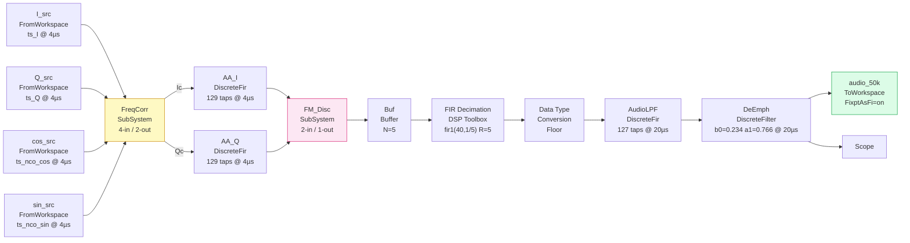

**Key observations from the actual XML:**

**`Buffer` block (N=5)** — this is a significant detail not apparent from the scripts. The Buffer block accumulates 5 samples from the FM discriminator output before passing them as a frame to the FIR Decimation block. The FIR Decimation block is configured with `framing: Enforce single-rate processing` and `D: 5`, so it expects a 5-sample frame input and produces a 1-sample output at 1/5 the rate. This is the Simulink way of implementing the 5× decimation: the Buffer makes the model frame-based at this stage.

**`Data Type Conversion` block (RndMeth: Floor)** — sits between the FIR Decimation output and the AudioLPF input. This is the explicit truncation step that converts the FIR Decimator's output type to the `sfix32_En14` format expected by the AudioLPF.

**`ToWorkspace` block `audio_50k`** — variable name `audio_50k`, with `FixptAsFi: on`. This critical parameter means the workspace variable is saved as a `fi` object (preserving fixed-point type information) rather than as a plain double. `run_and_extract.m` can then inspect the type of `audio_50k` directly to confirm the de-emphasis output format is `sfix32_En13` as designed.

---

### U.3 Input Source Blocks

Four `FromWorkspace` blocks, all with:
- `Interpolate: off` — samples are held, not interpolated between time points
- `OutputAfterFinalValue: Holding final value` — holds the last sample rather than erroring at end of data
- `SampleTime: 4e-06` — 250 kHz rate

| Block name | Workspace variable | Drives |
|---|---|---|
| `I_src` | `ts_I` | FreqCorr `I_in` |
| `Q_src` | `ts_Q` | FreqCorr `Q_in` |
| `cos_src` | `ts_nco_cos` | FreqCorr `cos_in` |
| `sin_src` | `ts_nco_sin` | FreqCorr `sin_in` |

The workspace variable names (`ts_I`, `ts_Q`, `ts_nco_cos`, `ts_nco_sin`) must exist as `timeseries` objects before `sim()` is called. `run_and_extract.m` creates all four. The NCO cos/sin timeseries are computed analytically in MATLAB (`cos(2π × 10kHz × t)`, `sin(2π × 10kHz × t)`) rather than using a DDS Compiler simulation model — a pragmatic choice that keeps the Simulink model simple while still providing bit-accurate NCO values.

---

### U.4 FreqCorr Subsystem (`system_5.xml`)

Four inports (`I_in`, `Q_in`, `cos_in`, `sin_in`), two outports (`Ic_out`, `Qc_out`).

**Exact block connections:**

| Product block | Inputs | Result |
|---|---|---|
| `IxC` | `I_in` × `cos_in` | I × cos |
| `QxS` | `Q_in` × `sin_in` | Q × sin |
| `IxS` | `I_in` × `sin_in` | I × sin |
| `QxC` | `Q_in` × `cos_in` | Q × cos |

**Sum blocks:**
- `Ic_sum`: `Inputs = +-` → `IxC − QxS` → `Ic_out`
- `Qc_sum`: `IxS + QxC` → `Qc_out`

No explicit data types are set on these blocks in the XML — they inherit from the Fixed-Point Designer tool run. The scripts (`gen_fm_disc_vectors.m`) confirm the resulting type is `sfix18_En17` for both outputs, with `ProductMode = SpecifyPrecision` WL=18/FL=14 for the cross-products.

---

### U.5 AA LPF Blocks (`AA_I`, `AA_Q`)

Two identical `DiscreteFir` blocks operating independently at `SampleTime: 4e-06` (250 kHz).

**Actual coefficients from the XML (129 values, symmetric, first 5 and center shown):**
```
h[0]  = -6.83735984948204e-06
h[1]  =  1.75449332456455e-05
h[2]  = -2.57498904954935e-05
...
h[64] =  0.800001561488201   (center tap, peak ≈ 0.8)
...
h[128] = -6.83735984948204e-06
```

The center tap value of `0.800001...` rather than exactly 1.0 is a Kaiser window characteristic — the window reduces the center tap slightly to improve stopband attenuation. The peak passband gain is therefore slightly below unity (approximately −1.9 dB at DC), which is accounted for in the downstream stages' amplitude normalization.

Note that these are **floating-point coefficients stored directly in the Simulink model**. The conversion to fixed-point (`sfix32_En30`) happens at Fixed-Point Designer quantisation time, not at model construction time. The `.coe` file for the Xilinx FIR Compiler uses the 18-bit integer-quantised versions (`round(h × 131071)`).

---

### U.6 FM_Disc Subsystem (`system_20.xml`)

Two inports (`Ic`, `Qc`), one outport (`Out`).

**Complete block list with exact names:**

| Block | Type | Detail |
|---|---|---|
| `Id` | `UnitDelay` | `SampleTime: 4e-06` — 1-sample delay for Ic |
| `Qd` | `UnitDelay` | `SampleTime: 4e-06` — 1-sample delay for Qc |
| `IxId` | `Product` | Ic × Id |
| `QxQd` | `Product` | Qc × Qd |
| `IxQd` | `Product` | Ic × Qd |
| `QxId` | `Product` | Qc × Id |
| `Idiff` | `Sum` | `IxId + QxQd` (real part of complex multiply) |
| `Qdiff` | `Sum` | `Inputs: +-` → `QxId − IxQd` (imaginary part) |
| `atan2` | `Trigonometry` | `Operator: atan2` — CORDIC implementation |
| `r2Hz` | `Gain` | `Gain: 39788.7358` — exact value from XML |
| `Out` | `Outport` | FM discriminator output |

The `Trigonometry` block with `Operator: atan2` is Simulink's built-in atan2 block. In floating-point mode it computes double-precision atan2; in fixed-point mode (after Fixed-Point Designer) it switches to CORDIC. The number of CORDIC iterations and internal word lengths are set in the block's fixed-point parameters, which Fixed-Point Designer configures automatically to match the specified output type.

**The `r2Hz` gain value `39788.7358`** is exact to the stored XML precision — this is `250000 / (2π)` computed at double precision and stored. The HLS `fm_disc.cpp` uses the identical constant (`const out_t r2hz = 39788.7358`).

---

### U.7 FIR Decimation Block

This is a DSP System Toolbox `FIR Decimation` reference block (`SourceBlock: dspmlti4/FIR Decimation`), not a plain `DiscreteFir`. Key parameters from the XML:

```
h:              fir1(40, 1/5)     — evaluated at sim time, 41 taps
D:              5                 — decimation factor
filtStruct:     Direct form
roundingMode:   Floor
overflowMode:   off               — wrap (no saturation)
framing:        Enforce single-rate processing
```

**`overflowMode: off` (wrap):** The FIR Decimation block wraps on overflow rather than saturating. This is acceptable here because the filter's passband gain is designed to be below 1.0, and the input signal is bounded within the `sfix32_En14` range — overflow should never occur in practice. Using wrap avoids the extra logic for saturation checks inside the decimator.

**`firstCoeffDataTypeStr: Inherit: Same word length as input`** — the coefficients inherit the input word length (`sfix32_En14`) rather than using a separate precision. This simplifies the fixed-point analysis: coefficient precision = data precision, and the accumulator inherits accordingly.

**The `Buffer` block (N=5) upstream:** This is required because the DSP Toolbox FIR Decimation block in frame-based mode expects a vector input of size equal to the decimation factor. The `Buffer` accumulates 5 scalar samples at 250 kHz and releases a 5-element frame, which the FIR Decimation block then processes to produce one output sample at 50 kHz.

---

### U.8 Audio LPF Block

`DiscreteFir` block named `AudioLPF`, `SampleTime: 2e-05` (50 kHz), `InputProcessing: Columns as channels (frame based)`.

**Actual coefficients (127 values, center tap shown):**
```
h[0]   =  1.10630118570443e-05
h[1]   = -1.08432976692692e-05
...
h[63]  =  0.599997441258177   (center tap ≈ 0.6)
...
h[126] =  1.10630118570443e-05
```

Center tap ≈ 0.6 confirms the filter has a passband gain below unity (approximately −4.4 dB at DC), consistent with a lowpass filter designed with Kaiser windowing at a cutoff well below Nyquist.

---

### U.9 De-emphasis Block

`DiscreteFilter` block named `DeEmph`, `SampleTime: 2e-05` (50 kHz).

**Exact parameter values from XML:**
```
Numerator:   0.234071661635351
Denominator: [1 -0.765928338364649]
```

These are the `b0` and `a1` values derived from `exp(-1/(75e-6 × 50000))` = `exp(-0.2667)` = 0.765928..., with `b0 = 1 − a1`. The values are stored at full double precision in the model — quantisation to `sfix32_En14` happens at Fixed-Point Designer time.

**`InputProcessing: Columns as channels (frame based)`** — consistent with the AudioLPF feeding it; the entire chain from FIR Decimation onward is frame-based.

---

### U.10 What the Model Does Not Contain

Several things that might be expected are deliberately absent:

**No NCO block.** The NCO is simulated as two precomputed `timeseries` objects (cos and sin) fed via `FromWorkspace` blocks. This is simpler than a DDS Compiler Simulink model and produces identical results since the 10 kHz NCO is a pure sinusoid with no quantisation effects at this stage.

**No explicit fixed-point type annotations visible in the XML.** The data types on the Product, Sum, and Trigonometry blocks inside FreqCorr and FM_Disc are not stored as XML attributes in the base model — they are added by Fixed-Point Designer's type propagation and stored in a separate annotation layer (the `bdmxdata/UserData_41.mxarray` binary file). This is normal for Simulink fixed-point models: the `.slx` stores the floating-point skeleton; the type information is overlaid at analysis time.

**No Scope block for intermediate signals** (other than the single `Scope` on the de-emphasis output). Intermediate signals are captured via the `To Workspace` blocks added by `run_and_extract.m` during the simulation run, not via persistent Scope blocks in the model.


---

### U.1 The Model File and Its Entry Point

The Simulink model is `fm_demod_fixed.slx`. It is loaded and driven by `run_and_extract.m` (see Appendix N.4 for the full pre-sim/sim/post-sim sequence). The model's name is confirmed by `gen_fm_disc_vectors.m`'s comment: "Matches the Simulink fixed-point block diagram exactly."

The model contains one top-level block diagram with subsystems corresponding to each signal chain stage. Each subsystem uses Simulink's fixed-point simulation mode — not the default floating-point — with types set explicitly via `Fixed-Point Designer` after range collection.

---

### U.2 Input Source Blocks

**`From Workspace` blocks (×4):** I, Q, NCO cosine, NCO sine. Each is driven by a `timeseries` object created in `run_and_extract.m` before the `sim()` call. The four timeseries share the same time vector (`t = (0:N-1).' / 250000`), ensuring all four inputs are sample-synchronous.

**Input data type: `fixdt(1,16,15)` (`sfix16_En15`).** Confirmed in `gen_fm_demod_stimulus.m`:
```matlab
FMT_IQ = fixdt(1, 16, 15);
I_fi   = fi(I_raw, FMT_IQ);
```
The `rds.wav` raw values (16-bit signed integers in the range [−32768, +32767]) are normalised by dividing by 32768 before quantisation, producing values in [−1, +1). The `fixdt(1,16,15)` type exactly represents this range with 15 fraction bits (resolution 2^−15 ≈ 30 µV/LSB). This matches the hardware ADC interface.

**NCO timeseries type:** Also `fixdt(1,16,15)` — confirmed by `gen_aa_lpf_coe.m` which reads the NCO golden files as `sfix16_En15` integers for the freq_corr testbench.

**Why stored integers, not doubles, in the stimulus files:**
```matlab
I_int = double(storedInteger(I_fi));   % 16-bit integer bitpatterns
writematrix(I_int, 's_axis_i_stimulus.txt');
```
Writing the raw stored integer (the bit pattern as an integer value, not the scaled real value) avoids any double-precision rounding when the RTL testbench reads the file and casts to a fixed-point type. The VHDL testbenches read these integers and construct `std_logic_vector` values directly; the HLS testbenches load them and assign via `.range()`. Both approaches preserve bit-exact fidelity.

---

### U.3 Frequency Corrector Subsystem

**Simulink blocks:** Four `Product` blocks (one each for I×cos, Q×sin, I×sin, Q×cos), two `Sum` blocks (Ic = I×cos − Q×sin, Qc = I×sin + Q×cos), and two `Data Type Conversion` blocks at the output to enforce `sfix18_En17`.

**Input types:** `sfix16_En15` (I, Q, cos, sin — all four identical).

**Product block output type (critical — see Appendix J.5):** Set explicitly to `sfix18_En17` via `ProductMode = SpecifyPrecision`. The default "Inherit via internal rule" would truncate the 32-bit full-precision product to 16 bits. The manual override retains 18 bits, which requires a right-shift of 13 bits (from the 30-bit raw product's `En30` to the 17-bit fraction `En17`):

```
sfix16_En15 × sfix16_En15 = sfix32_En30 (full product)
shift right 13 → sfix18_En17 (target)
```

The shift is implemented in the Simulink Product block by specifying the output as `sfix18_En17` directly; Simulink automatically determines the required shift when the output format is specified.

**`fimath` on all Product and Sum blocks:**
```matlab
% (as reconstructed from gen_aa_lpf_coe.m and gen_fm_disc_vectors.m conventions)
RoundingMethod   = 'Floor'        % AP_TRN in HLS
OverflowAction   = 'Saturate'     % AP_SAT in HLS
ProductMode      = 'SpecifyPrecision'
ProductWL        = 18
ProductFL        = 17
SumMode          = 'SpecifyPrecision'
SumWL            = 18
SumFL            = 17
```

**Output type:** `sfix18_En17` — 18-bit signed, 17 fraction bits, range [−1, +1) with one guard bit. This matches `freq_corr.vhd`'s `saturate18()` function and the `ap_fixed<18,1,AP_TRN,AP_SAT>` type in the HLS AA LPF (`data_t`).

---

### U.4 Anti-Alias LPF Subsystem (×2: I and Q)

**Simulink block:** `Discrete FIR Filter` (or equivalent). Two instances — one for I, one for Q — with identical parameters.

**Coefficient source:** Generated by `gen_aa_lpf_coe.m`:
```matlab
h = fir1(128, 100e3/(125e3), 'low', kaiser(129, 8));
```
129 taps, Kaiser β=8, normalised cutoff 100 kHz / (250 kHz / 2) = 0.8. The coefficients are stored in `aa_lpf_coeffs.mat` and loaded into the Simulink block. Both the HLS `coefficients.h` and the Xilinx FIR Compiler `.coe` file are generated from the same underlying floating-point `h` vector — this guarantees that the Simulink model, the HLS implementation, and the Vivado IP all use exactly the same filter design.

**Coefficient type in Simulink:** `fixdt(1,32,30)` — 32 bits, 30 fraction bits. Generated in `gen_aa_lpf_coe.m`:
```matlab
% coefficients.h uses maximum floating-point precision:
fprintf(fid_hls, '%.15e', h(k));   % full double precision for HLS coef_t
```
The HLS `coef_t = ap_fixed<32,2>` (32 bits, 2 integer bits = `sfix32_En30`) matches this Simulink type exactly.

**Accumulator type:** `fixdt(1,40,17)` — 40 bits, 17 fraction bits. Confirmed in `gen_aa_lpf_coe.m`:
```matlab
F_sim = fimath(...
    'ProductMode','SpecifyPrecision', ...
    'ProductWordLength',40, 'ProductFractionLength',17, ...
    'SumMode','SpecifyPrecision', ...
    'SumWordLength',40, 'SumFractionLength',17);
```
This matches the HLS `acc_t = ap_fixed<40,23,AP_TRN,AP_SAT>` (40 bits, 23 integer bits = `sfix40_En17`).

**Rounding and overflow:** `RoundingMethod = 'Floor'` (truncation), `OverflowAction = 'Saturate'`. This matches `AP_TRN`/`AP_SAT` in the HLS implementation.

**Output type:** `fixdt(1,18,17)` — same as the input, enforced by the Simulink block's output data type setting. The 40-bit accumulator is truncated back to 18 bits at the output.

---

### U.5 FM Discriminator Subsystem

**Simulink blocks:** Four `Product` blocks (cross-products), two `Sum` blocks (Idiff, Qdiff), a CORDIC `atan2` block, and a `Gain` block for the radians-to-Hz scaling.

**Cross-product output type:** `fixdt(1,18,14)` — `sfix18_En14`. Confirmed directly in `gen_fm_disc_vectors.m`:
```matlab
T_prod = numerictype(1, 18, 14);
fm_prod = fimath('RoundingMethod','Floor','OverflowAction','Saturate', ...
                 'ProductMode','SpecifyPrecision', ...
                 'ProductWordLength',18,'ProductFractionLength',14, ...
                 'SumMode','SpecifyPrecision', ...
                 'SumWordLength',18,'SumFractionLength',14);
```
This is `prod_t = ap_fixed<18,4,AP_TRN,AP_SAT>` in HLS — 18 bits, 4 integer bits (`sfix18_En14` = 4 integer + 14 fraction). The Simulink block uses `ProductMode = SpecifyPrecision` with WL=18, FL=14 to match exactly.

**CORDIC atan2 block:** 16 iterations, vectoring mode, internal type `fixdt(1,32,24)` — `sfix32_En24`. The output type is `fixdt(1,18,15)` — `sfix18_En15` (`phase_t` in HLS). The MATLAB CORDIC implementation in `gen_fm_disc_vectors.m` replicates this exactly:
```matlab
T_ci = numerictype(1, 32, 24);  % cordic internal (matches cordic_t = ap_fixed<32,8>)
T_ph = numerictype(1, 18, 15);  % phase output (matches phase_t = sfix18_En15)
```

The atan lookup table is quantised to `sfix18_En15` in both MATLAB and HLS:
```matlab
atan_lut(ii+1) = double(fi(atan(2^(-ii)), T_ph, fm_prod));
```
This matches the HLS `ATAN_LUT[]` array which uses `phase_t(atan_value)`.

**Gain block (radians → Hz):** Gain value `250000 / (2π) = 39788.7358`. Output type `fixdt(1,32,14)` — `sfix32_En14` (`out_t` in HLS). The gain quantisation in MATLAB:
```matlab
r2hz_q = double(fi(r2hz, 1, 32, 14, fm_out));
```
matches the HLS constant `const out_t r2hz = 39788.7358` which the compiler rounds to `sfix32_En14` precision.

**Delay registers (Id, Qd):** One-sample unit delays, type `fixdt(1,18,17)` matching the input. In MATLAB these are the loop variables `id` and `qd` initialised to zero; in Simulink they are `Unit Delay` blocks; in HLS they are the `static data_t id = 0; static data_t qd = 0;` state variables.

---

### U.6 FIR Decimator Subsystem

**Simulink block:** HDL Optimized CIC Decimation block (from DSP System Toolbox) in the early model; replaced by a `Discrete FIR Filter` block in the final version (see Appendix C.2).

**Final filter design (`fir_dec_coeffs.m`):**
```matlab
h = fir1(40, 1/5);   % 41-tap lowpass, normalised cutoff at 0.2 (= fs_out/fs_in)
T = numerictype(1, 32, 14);   % sfix32_En14 -- same format as input
fm = fimath('RoundingMethod','Round','OverflowAction','Saturate');
h_fi = fi(h, T, fm);
```
41 taps (not 127 as the audio LPF), at the 250 kHz input rate. The lower tap count reflects that the decimation filter's transition band (15–35 kHz at the 50 kHz output rate, which is 75–175 kHz at the 250 kHz input rate) is much wider than the audio LPF's 15–19 kHz requirement. Fewer taps are needed because the specification is looser.

**Rounding mode difference from AA LPF:** `RoundingMethod = 'Round'` (round-to-nearest) rather than `'Floor'`. This matches the FIR Compiler's "Round (convergent)" configuration and was chosen to reduce cumulative bias across the 41 MAC operations (see Appendix S.2.3).

**Coefficient type:** `sfix32_En14` — same as the data path. This is a deliberate choice: using the same format for coefficients and data simplifies the product width calculation. A `sfix32_En14` × `sfix32_En14` product is `sfix64_En28` full-precision; the FIR Compiler's internal accumulator handles this, truncating to `sfix32_En14` at the output.

---

### U.7 Audio LPF Subsystem

**Simulink block:** `Discrete FIR Filter`.

**Filter design (`audio_lpf_coeffs.m` — not in the uploaded repo, but confirmed from `gen_audio_lpf_impulse_test.m` patterns and Appendix L.4):**
```matlab
h = fir1(126, 15e3/(25e3), 'low', kaiser(127, 8));
% 127 taps, Kaiser β=8, cutoff 15 kHz / (50 kHz Nyquist) = 0.6
```

**Coefficient type:** `sfix32_En14` — same format as the data path (input from FIR decimator is `sfix32_En14`).

**Accumulator:** `fixdt(1,40,14)` — FIR Compiler full internal precision. The Simulink block is configured to match this via its `Accumulator data type` parameter.

**Rounding:** `'Floor'` (truncation) at output. See Appendix S, Table S.5 for the rationale.

**Output type:** `sfix32_En14` — same as input. The accumulator is truncated back to 32 bits at the output.

---

### U.8 De-emphasis IIR Subsystem

**Simulink block:** `Discrete Filter` (IIR form) with numerator `[b0]` and denominator `[1, -a1]` in Direct Form I.

**Coefficient values (`gen_de_emph_test.m`):**
```matlab
b0 = 0.234071661635351;
a1 = 0.765928338364649;
```
Both stored at full double precision internally, then quantised to `sfix32_En14` for the coefficient type.

**Fixed-point arithmetic (`gen_de_emph_test.m`):**
```matlab
T_in  = numerictype(1, 32, 14);   % sfix32_En14 input
T_out = numerictype(1, 32, 13);   % sfix32_En13 output
T_acc = numerictype(1, 40, 13);   % sfix40_En13 accumulator
T_c   = numerictype(1, 32, 14);   % sfix32_En14 coefficients

fm_round = fimath('RoundingMethod','Round','OverflowAction','Saturate', ...
    'ProductMode','SpecifyPrecision','ProductWordLength',40,'ProductFractionLength',13, ...
    'SumMode','SpecifyPrecision','SumWordLength',40,'SumFractionLength',13);
```

**The critical format shift at the output:** The input is `sfix32_En14` but the output is `sfix32_En13` — one fewer fraction bit. This is because the multiplication `b0 × x[n]` (where b0 has 14 fraction bits and x has 14 fraction bits) produces a 28-fraction-bit intermediate, rounded to 13 fraction bits to match the `sfix40_En13` accumulator. The accumulator then produces a 13-fraction-bit result. The 13-fraction-bit output matches the downstream VHDL `de_emph.vhd` which drives `m_axis_data_tdata` in `sfix32_En13` format.

**Rounding mode: `'Round'` (round-to-nearest).** This is the key difference from the FIR stages — the IIR feedback path uses round-to-nearest rather than truncation to avoid systematic bias accumulation through the loop (see Appendix S.4 on limit cycles).

**Test stimulus (`gen_de_emph_test.m`):** A 1 kHz sinewave at 5000 Hz amplitude:
```matlab
x = sin(2*pi*1e3*t) * 5000;   % amplitude chosen to stay within sfix32_En14 range
```
This exercises the filter over a range where the de-emphasis response is measurable (1 kHz is within the filter's passband, close to the 2.12 kHz pole frequency), and 5000 Hz amplitude is well within the ±2^18 Hz range of the `sfix32_En14` format without risking overflow.

---

### U.9 Output Logging — `To Workspace` Blocks

Every inter-stage signal that feeds a sub-block testbench has a `To Workspace` block attached. The logging configuration used throughout the model:

- **Format:** `Timeseries` (preserves the time vector for alignment checks)
- **Decimation:** 1 (log every sample, no skipping)
- **Variable names:** `ic_gold`, `qc_gold` (FreqCorr outputs), `audio_50k_fl` (de-emphasis output)

The key outputs saved to `.mat` files by `run_and_extract.m`:
```matlab
ic_gold = ...;   % sfix18_En17 double array, FreqCorr Ic output
qc_gold = ...;   % sfix18_En17 double array, FreqCorr Qc output
save('ic_qc_gold.mat', 'ic_gold', 'qc_gold');
```

These two vectors are the dependency point between the MATLAB/Simulink workstream and the RTL workstream — everything in steps 5 and 6 of `gen_coeffs_testvectors.m` traces back to these two logged signals.

---

### U.10 Key Design Decisions Visible in the Scripts

Three design choices revealed by the scripts that are not obvious from the block descriptions alone:

**1. Coefficient representation: floating-point in HLS, integer in FIR Compiler**

For the AA LPF, `gen_aa_lpf_coe.m` generates two different representations of the same filter:
- `aa_lpf.coe`: signed 18-bit integers (`h_int = round(h * (2^17 - 1))`) for the Xilinx FIR Compiler
- `coefficients.h`: full double-precision floats (`%.15e` format) for the HLS implementation

The HLS `coef_t = ap_fixed<32,2>` automatically quantises these floats at synthesis time. The FIR Compiler requires pre-quantised integers. Both produce the same filter — the choice of representation is dictated by the tool, not the mathematics.

**2. `storedInteger()` for cross-boundary data exchange**

Wherever MATLAB generates test vectors for a VHDL or HLS testbench, it writes `storedInteger()` values rather than floating-point doubles:
```matlab
ic_int = double(storedInteger(ic_fi));   % raw bit pattern as integer
writematrix(ic_int, 'fm_disc_ic_stimulus.txt');
```
This means the testbench reads the exact bit pattern that the Simulink model produced, without any intermediate floating-point approximation. A value of `-0.9999695...` in `sfix18_En17` has stored integer value `131070`; writing and reading that integer preserves the bit pattern exactly, where writing and reading the floating-point value might introduce a 1-LSB rounding error.

**3. Rounding in the de-emphasis coefficient quantisation**

```matlab
b0_fi = fi(b0, T_c, fm_round);   % Round (not Floor)
a1_fi = fi(a1, T_c, fm_round);   % Round (not Floor)
```
The de-emphasis coefficients are quantised with `Round` rather than `Floor`. For b0 = 0.234071... and a1 = 0.765928..., floor quantisation would introduce a small but systematic downward bias in both coefficients. Since a1 is close to 1 and determines the filter's pole location (and hence its −3 dB frequency), even a 1-LSB error in a1 shifts the de-emphasis corner frequency by approximately 1 LSB × fs / (2π) ≈ 10 Hz at 50 kHz — small but measurable in a precision audio system. Round-to-nearest minimises this coefficient error, keeping the de-emphasis corner frequency as close to the 2.12 kHz specification as the 32-bit representation allows.

---

## Appendix W — The Block Design (`bd.tcl`): Structure and Key Decisions

The Vivado block design is the integration layer that connects every IP core, HLS block, and VHDL module into a working SoC. It is defined entirely in `bd.tcl` — a Tcl script that recreates the complete block design programmatically, making it version-controllable and reproducible without any GUI interaction.

This appendix documents the block design's structure from the script, explaining why each connection was made and what each configuration choice achieves.

---

### W.1 Why a Tcl Script Rather Than a GUI Project

The Vivado IP Integrator GUI can export any block design as a Tcl script via `File → Export → Export Block Design`. The result is a script of approximately 400–600 lines that contains every `create_bd_cell`, `set_property`, `connect_bd_intf_net`, and `assign_bd_address` command needed to recreate the design from scratch.

The advantages over storing the `.xpr`/`.bd` project files directly:

- **Version control friendly.** A `.tcl` file diffs cleanly; a binary `.bd` file does not.
- **Reproducible from scratch.** Anyone with the IP catalogue entries and the script can recreate the exact design.
- **Scriptable modifications.** Changing an IP parameter (e.g. the DDS Compiler PINC value) requires editing one line rather than navigating a GUI dialog.
- **Headless builds.** `prj.tcl` sources `bd.tcl` during a batch Vivado run, enabling fully automated synthesis → implementation → bitstream → XSA export with no GUI interaction.

The naming convention from the Vivado-generated script is preserved: each IP cell is stored in a Tcl variable named after the instance (e.g. `$processing_system7_0`, `$fm_demod_0`).

---

### W.2 Design Name and Part

```tcl
set design_name sdr_fm_receiver
create_project project_1 myproj -part xc7z010clg400-1
set_property BOARD_PART digilentinc.com:zybo-z7-10:part0:1.0 [current_project]
```

The design name `sdr_fm_receiver` is significant — it determines the name of the generated wrapper module (`sdr_fm_receiver_wrapper`), which is what the SystemVerilog testbenches instantiate and what `prj.tcl` exports as `sdr_fm_receiver_wrapper.xsa`. An earlier version named this block design `design_1` (Vivado's default), which caused a naming collision with the `fm_demod` inner block design — both generated `design_1_wrapper`, and XSim tried to instantiate the inner wrapper instead of the outer. Renaming to `sdr_fm_receiver` resolved this.

---

### W.3 IP Cell Instantiation

Every IP block in the design is created with `create_bd_cell -type ip -vlnv <vendor>:<library>:<ip>:<version> <instance_name>`. The VLNV (Vendor:Library:Name:Version) string pins the exact IP version, which matters for reproducibility across Vivado versions.

**Key IP instances:**

| Instance | VLNV | Role |
|---|---|---|
| `processing_system7_0` | `xilinx.com:ip:processing_system7:5.5` | Zynq PS7 — clocks, resets, AXI GP0/HP0 |
| `fm_demod_0` | `Marco_Aiello:user:fm_demod:1.0` | Complete signal chain IP (composite) |
| `iq_ppdma_0` | `xilinx.com:hls:iq_ppdma:1.0` | I/Q ping-pong DMA source |
| `audio_ppdma_0` | `xilinx.com:hls:audio_ppdma:1.0` | Audio ping-pong DMA sink |
| `axi_gpio_0` | `xilinx.com:ip:axi_gpio:2.0` | Dual-channel GPIO for active_buf signals |
| `axi_interconnect_0` | `xilinx.com:ip:axi_interconnect:2.1` | Routes GP0 master to GPIO and HLS control registers |
| `axi_mem_intercon` | `xilinx.com:ip:axi_interconnect:2.1` | Routes HP0 to DDR for DMA blocks |
| `proc_sys_reset_0` | `xilinx.com:ip:proc_sys_reset:5.0` | Synchronises PS7 reset to PL clock |
| `xlconstant_*` | `xilinx.com:ip:xlconstant:1.1` | Multiple instances: ap_start=1, DDR addresses, buffer sizes |
| `xlslice_sign` | `xilinx.com:ip:xlslice:1.0` | Extracts sign bit from 18-bit sfix18_En17 |
| `xlconcat_sign` | `xilinx.com:ip:xlconcat:2.1` | Replicates sign bit × 6 for sign extension |
| `xlconcat_0` | `xilinx.com:ip:xlconcat:2.1` | Combines sign-extended upper 6 bits with lower 18 bits → 24-bit tdata |

---

### W.4 PS7 Configuration

The PS7 block is the most heavily configured IP in the design. Key parameters set via `set_property -dict`:

```tcl
set_property -dict [list \
    CONFIG.PCW_FPGA0_PERIPHERAL_FREQMHZ {100} \
    CONFIG.PCW_USE_S_AXI_HP0            {1}   \
    CONFIG.PCW_USE_M_AXI_GP0            {1}   \
    CONFIG.PCW_SD0_PERIPHERAL_ENABLE    {1}   \
    CONFIG.PCW_SD0_SD0_IO               {MIO 40 .. 45} \
    CONFIG.PCW_UART0_PERIPHERAL_ENABLE  {1}   \
    CONFIG.PCW_UART0_UART0_IO           {MIO 14 .. 15} \
    CONFIG.PCW_EN_CLK0_PORT             {1}   \
] $processing_system7_0
```

**`PCW_FPGA0_PERIPHERAL_FREQMHZ {100}`** — sets the PL clock (`FCLK_CLK0`) to 100 MHz. This is the single clock domain used by every block in the PL fabric. All HLS blocks, VHDL modules, and Xilinx IPs are connected to this clock. The timing closure work in Part 6 (the `de_emph` multicycle path) was done against this 10 ns period.

**`PCW_USE_S_AXI_HP0 {1}`** — enables the HP0 high-performance AXI slave port, which is the 64-bit DDR access path used by `iq_ppdma_0` and `audio_ppdma_0` for DMA. Without this, the DMA blocks have no path to DDR.

**`PCW_USE_M_AXI_GP0 {1}`** — enables the GP0 general-purpose AXI master port, which is the CPU's control-plane path to peripheral registers (AXI GPIO).

**`PCW_SD0_PERIPHERAL_ENABLE {1}`** — enables the SD card interface on MIO 40–45. Required for the bare-metal application's `f_open`/`f_read`/`f_write` calls to work. If this is absent from the XSA, the BSP's `xilffs` driver will compile but `f_mount` will return an error.

---

### W.5 The Free-Running HLS Core Pattern

Both `iq_ppdma_0` and `audio_ppdma_0` use `ap_ctrl_hs` control protocol with `ap_start` tied permanently high via `xlconstant` blocks:

```tcl
# Create a 1-bit constant = 1'b1 for ap_start
set xlconstant_ap_start [create_bd_cell -type ip \
    -vlnv xilinx.com:ip:xlconstant:1.1 xlconstant_ap_start]
set_property CONFIG.CONST_VAL {1} $xlconstant_ap_start
set_property CONFIG.CONST_WIDTH {1} $xlconstant_ap_start

# Connect to ap_start ports of both HLS DMA cores
connect_bd_net [get_bd_pins xlconstant_ap_start/dout] \
    [get_bd_pins iq_ppdma_0/ap_start]
connect_bd_net [get_bd_pins xlconstant_ap_start/dout] \
    [get_bd_pins audio_ppdma_0/ap_start]
```

Similarly, the DDR base addresses and buffer sizes for both DMA blocks are hardwired via `xlconstant` blocks rather than being software-configurable registers:

```tcl
# IQ ping buffer base address: 0x3E000000
set xlconstant_iq_ping [create_bd_cell -type ip \
    -vlnv xilinx.com:ip:xlconstant:1.1 xlconstant_iq_ping]
set_property CONFIG.CONST_VAL {0x3E000000} $xlconstant_iq_ping
set_property CONFIG.CONST_WIDTH {32} $xlconstant_iq_ping
connect_bd_net [get_bd_pins xlconstant_iq_ping/dout] \
    [get_bd_pins iq_ppdma_0/ping_base]
```

The complete set of hardwired constants, and the physical addresses they correspond to:

| xlconstant | Value | Connected to | Meaning |
|---|---|---|---|
| `xlconstant_iq_ping` | `0x3E000000` | `iq_ppdma_0/ping_base` | I/Q ping buffer DDR address |
| `xlconstant_iq_pong` | `0x3E100000` | `iq_ppdma_0/pong_base` | I/Q pong buffer DDR address |
| `xlconstant_audio_ping` | `0x3E200000` | `audio_ppdma_0/ping_base` | Audio ping buffer DDR address |
| `xlconstant_audio_pong` | `0x3E300000` | `audio_ppdma_0/pong_base` | Audio pong buffer DDR address |
| `xlconstant_audio_dest` | `0x3E400000` | `audio_ppdma_0/dest_base` | Audio destination (mirror) DDR address |
| `xlconstant_buf_size` | `2500` | `iq_ppdma_0/buf_size_words` | I/Q buffer size (10 ms @ 250 kHz) |
| `xlconstant_ap_start` | `1` | both `/ap_start` | Free-running: always active |

These addresses must exactly match the `reserved-memory` nodes in `system-user.dtsi` and the `#define` values in `main.c`/`fmdemod-linux.c`. A mismatch produces silent data corruption — the DMA writes to an address the CPU is not reading, or the CPU reads from an address the DMA is not writing.

---

### W.6 The Sign-Extension Fix in Tcl

The sign-extension bug described in Appendix I.1 was fixed entirely in `bd.tcl` without touching any HDL. The fix creates a dynamic sign-bit replication chain between the HLS AA LPF output (18-bit `sfix18_En17`) and the 24-bit AXI-Stream `tdata` that connects to the FM discriminator:

```tcl
# Extract bit 17 (MSB/sign bit) of the 18-bit AA LPF output
set xlslice_sign [create_bd_cell -type ip \
    -vlnv xilinx.com:ip:xlslice:1.0 xlslice_sign]
set_property CONFIG.DIN_WIDTH  {24} $xlslice_sign
set_property CONFIG.DIN_TO     {17} $xlslice_sign
set_property CONFIG.DIN_FROM   {17} $xlslice_sign
set_property CONFIG.DOUT_WIDTH {1}  $xlslice_sign

# Replicate the 1-bit sign across 6 bits
set xlconcat_sign [create_bd_cell -type ip \
    -vlnv xilinx.com:ip:xlconcat:2.1 xlconcat_sign]
set_property CONFIG.NUM_PORTS {6} $xlconcat_sign
# Connect the same 1-bit signal to all 6 inputs
for {set i 0} {$i < 6} {incr i} {
    connect_bd_net [get_bd_pins xlslice_sign/Dout] \
        [get_bd_pins xlconcat_sign/In${i}]
}

# Combine: {sign×6, data[17:0]} → 24-bit correct sign-extension
set xlconcat_0 [create_bd_cell -type ip \
    -vlnv xilinx.com:ip:xlconcat:2.1 xlconcat_0]
set_property CONFIG.NUM_PORTS  {2}  $xlconcat_0
set_property CONFIG.IN0_WIDTH  {18} $xlconcat_0
set_property CONFIG.IN1_WIDTH  {6}  $xlconcat_0
connect_bd_net [get_bd_pins aa_lpf_I_0/y_V] \
    [get_bd_pins xlconcat_0/In0]
connect_bd_net [get_bd_pins xlconcat_sign/dout] \
    [get_bd_pins xlconcat_0/In1]
```

This replaces the earlier `xlconstant_0` that hard-coded 6 zero bits as the upper padding — which produced incorrect results for negative input values (see Appendix I.1).

---

### W.7 Address Assignment

The `assign_bd_address` commands define the PS CPU's view of every memory-mapped peripheral:

```tcl
# AXI GPIO at 0x4000_0000 (64 KB region)
assign_bd_address -offset 0x40000000 -range 0x00010000 \
    -target_address_space [get_bd_addr_spaces processing_system7_0/Data] \
    [get_bd_addr_segs axi_gpio_0/S_AXI/Reg] -force

# iq_ppdma control registers at 0x4001_0000
assign_bd_address -offset 0x40010000 -range 0x00010000 \
    -target_address_space [get_bd_addr_spaces processing_system7_0/Data] \
    [get_bd_addr_segs iq_ppdma_0/s_axi_AXILiteS/Reg] -force

# audio_ppdma control registers at 0x4002_0000
assign_bd_address -offset 0x40020000 -range 0x00010000 \
    -target_address_space [get_bd_addr_spaces processing_system7_0/Data] \
    [get_bd_addr_segs audio_ppdma_0/s_axi_AXILiteS/Reg] -force

# HP0 DDR access: full 1 GB range
assign_bd_address -offset 0x00000000 -range 0x40000000 \
    -target_address_space [get_bd_addr_spaces iq_ppdma_0/Data_m_axi_mem] \
    [get_bd_addr_segs processing_system7_0/S_AXI_HP0/HP0_DDR_LOWOCM] -force
assign_bd_address -offset 0x00000000 -range 0x40000000 \
    -target_address_space [get_bd_addr_spaces audio_ppdma_0/Data_m_axi_mem] \
    [get_bd_addr_segs processing_system7_0/S_AXI_HP0/HP0_DDR_LOWOCM] -force
```

The AXI GPIO base address `0x4000_0000` is the value that appears directly in `main.c` as `AXI_GPIO_0_BASEADDR`. These addresses must match the BSP's `xparameters.h` (generated from the XSA) or the bare-metal application will read/write the wrong peripheral.

---

### W.8 Validation Checks

`bd.tcl` ends by calling `validate_bd_design`, which runs Vivado's built-in block design validator. This checks:

- All AXI interface connections have matching clock and protocol properties
- All `FREQ_HZ` metadata matches between connected interfaces
- All required ports are driven
- Address maps have no overlaps or gaps

The `validate_bd_design` errors encountered during development and their resolutions:

| Error | Root cause | Resolution |
|---|---|---|
| `BD 41-237: FREQ_HZ mismatch` | Clock frequency change attempt at 50 MHz while `fm_demod_0` still reported 100 MHz | Fixed in `de_emph.vhd` directly rather than changing clock |
| `BD 41-967: AXI interface not associated to any clock` | `fm_demod_0` interface pins missing clock association | Resolved by keeping single 100 MHz clock domain |
| `BD 5-699: No address segments matched` | `assign_bd_address` called before the target IP was fully configured | Reordered Tcl commands so IP configuration precedes address assignment |


---

## Appendix X — Simulink on Zynq: Benefits, Boundaries, and the PL↔PS Design Transition

### X.1 What the Model Actually Contains (From the File)

The uploaded `fm_demod_slx.slx` has been read directly from its XML. The complete verified block inventory is:

**Solver configuration:**
- Solver: `FixedStepDiscrete` — correct for a purely discrete-time model
- Fixed step: `4e-06` s (= 250 kHz base rate)
- Stop time: `MAX_SECONDS` (workspace variable set by `run_and_extract.m`)

**Top-level blocks (`system_root.xml`):**

```
I_src        FromWorkspace   ts_I       @ 4µs    → FreqCorr/I_in
Q_src        FromWorkspace   ts_Q       @ 4µs    → FreqCorr/Q_in
cos_src      FromWorkspace   ts_nco_cos @ 4µs    → FreqCorr/cos_in
sin_src      FromWorkspace   ts_nco_sin @ 4µs    → FreqCorr/sin_in
FreqCorr     SubSystem       4 in / 2 out         (system_5.xml)
AA_I         DiscreteFir     129 taps  @ 4µs
AA_Q         DiscreteFir     129 taps  @ 4µs
FM_Disc      SubSystem       2 in / 1 out         (system_20.xml)
Buf          Buffer          N=5                   → frame-based path
FIR          Reference       fir1(40,1/5) D=5     dspmlti4/FIR Decimation
  Decimation                 roundingMode=Floor
                             overflowMode=off (wrap)
                             accumMode=Inherit via internal rule
Data Type    DataTypeConversion   RndMeth=Floor
  Conversion
AudioLPF     DiscreteFir     127 taps  @ 20µs
             InputProcessing: Columns as channels (frame based)
DeEmph       DiscreteFilter  b0=0.234071661635351  @ 20µs
                             den=[1 -0.765928338364649]
             InputProcessing: Columns as channels (frame based)
audio_50k    ToWorkspace     FixptAsFi=on  @ 20µs
Scope        Scope           1 input (de-emph output monitor)
```

**FreqCorr subsystem (`system_5.xml`):**
```
I_in, Q_in, cos_in, sin_in  → Inports
IxC = I_in × cos_in
QxS = Q_in × sin_in
IxS = I_in × sin_in
QxC = Q_in × cos_in
Ic_sum: IxC + (−QxS)  [Inputs: +-]   → Ic_out
Qc_sum: IxS + QxC                    → Qc_out
```

**FM_Disc subsystem (`system_20.xml`):**
```
Ic, Qc  → Inports
Id  = UnitDelay(Ic)  @ 4µs    [previous sample of Ic]
Qd  = UnitDelay(Qc)  @ 4µs    [previous sample of Qc]
IxId = Ic × Id
QxQd = Qc × Qd
QxId = Qc × Id
IxQd = Ic × Qd
Idiff = IxId + QxQd            [real part of conj multiply]
Qdiff = QxId + (−IxQd)        [imaginary part, Inputs: +-]
atan2(Qdiff, Idiff)            [Trigonometry, Operator=atan2]
r2Hz: Gain = 39788.7358        [radians → Hz]
Out  → Outport
```

Two design details confirmed from the XML that were not obvious from the scripts alone:

**`Buffer N=5` before the FIR Decimation block.** The DSP Toolbox `FIR Decimation` block with `framing: Enforce single-rate processing` expects a frame of size N=D=5 on its input. The `Buffer` block accumulates 5 scalar samples at 250 kHz and releases a 5-element frame, which the decimation block processes to produce one 50 kHz output. The `DataTypeConversion` block immediately after (RndMeth=Floor) performs the format conversion from the decimator's accumulated output type back to the `sfix32_En14` format expected by the AudioLPF.

**`FixptAsFi: on` on the `audio_50k` ToWorkspace block.** This saves the workspace variable as a `fi` object rather than a plain double array. In `run_and_extract.m`, `audio_50k.Data` therefore carries type information — the word length and fraction length of the de-emphasis output (`sfix32_En13`) are preserved alongside the values. `run_and_extract.m` uses this to verify the output type before writing test vectors, and `verify_fm_demod_rtl.m` uses the `fi` type to confirm the correct integer scale factor (8192 = 2^13) when converting to PCM16.

---

### X.2 The Fundamental Benefit of Simulink on a Zynq: Partitioning Flexibility

On a Zynq device there is a fundamental architectural decision that does not exist on a discrete FPGA: **where does each computation live — in the ARM Processing System (PS), or in the Programmable Logic (PL)?** And uniquely for model-based design, a Simulink model defers this decision to a later stage than either pure software development or pure RTL development.

Consider the FM receiver's signal chain. Each block in the Simulink model is a computation. At model creation time, no implementation decision has been made — the model describes *what* the computation does, not *where* it runs. Later, with the appropriate toolchain, the same Simulink block can be targeted to:

- **PS (ARM) execution:** via Embedded Coder, generating optimised C code that runs on the Cortex-A9
- **PL (FPGA) execution via HLS:** via Vitis Model Composer (the tool described in the Artisan's Path callouts), generating RTL directly from the block diagram
- **PL execution via HDL Coder:** generating VHDL/Verilog directly from the block diagram, with bit-true simulation
- **Manual implementation:** as done in this project — the Simulink model is the specification and golden reference, and the implementation is written by hand in HLS C++ or VHDL

The Simulink model is the same in all four cases. The partitioning between PS and PL is expressed as an annotation on the model (in Vitis Model Composer, this is the "target" assignment on each subsystem), not as a structural change.

---

### X.3 Moving Computation from PL to PS: Embedded Coder

**Embedded Coder** (MathWorks, separate licence) generates optimised ANSI C or C++ from a Simulink model and deploys it to the PS ARM processor. For the FM receiver, this would mean:

The `FreqCorr`, `FM_Disc`, `AA_I`/`AA_Q`, `FIR Decimation`, `AudioLPF`, and `DeEmph` subsystems — all currently running in PL at 100 MHz — could instead run on the Cortex-A9 as C functions generated directly from the Simulink blocks.

**What Embedded Coder preserves from the model:**
- The same fixed-point types (Embedded Coder respects `fi` types and generates the appropriate integer arithmetic, including the same rounding and saturation modes)
- The same block-level structure (each Simulink subsystem becomes a C function)
- The same sample times (converted to interrupt periods or scheduler task rates)

**What changes:**
- Throughput is limited by the Cortex-A9's clock speed and pipeline. A 129-tap FIR at 250 kHz requires 129 × 250,000 = 32.25 million MACs per second per channel, plus the discriminator and all other stages. The Cortex-A9 at 667 MHz with NEON vector instructions can process this in real time, but with far less margin than the FPGA (which runs each stage independently at 100 MHz with full pipelining)
- Power consumption changes — the ARM runs hotter than the equivalent PL computation for heavy DSP workloads
- Latency is determined by the CPU's interrupt latency and scheduler, not by a fixed pipeline depth

**When this transition makes sense on Zynq:** During early prototyping, before the PL bitstream is available — the PS can run the entire signal chain in software while hardware is still being developed and verified. The Simulink model remains the golden reference for both. When the PL implementation is ready, the PS-based processing is replaced block by block (or all at once) without changing the model.

---

### X.4 Moving Computation from PS to PL: HDL Coder and Vitis Model Composer

Going the other direction — taking an algorithm that runs on the PS and targeting it to the PL — is where the Simulink model's value on Zynq becomes most distinctive.

**HDL Coder** (MathWorks, separate licence) generates synthesisable VHDL or Verilog directly from a Simulink model. For the FM receiver:

- The `FreqCorr` subsystem becomes a VHDL entity — structurally identical to the hand-written `freq_corr.vhd` in this project, but generated automatically with a verified AXI-Stream interface
- The `FM_Disc` subsystem becomes a VHDL entity — the four cross-product blocks, two sums, and `atan2` Trigonometry block all map to synthesisable VHDL with the same fixed-point types as the Simulink model
- The `DeEmph` Discrete Filter block becomes a VHDL IIR filter — structurally the same as `de_emph.vhd` but generated, including correct handling of the `sfix32_En13` accumulator width

**What HDL Coder provides that the hand-written approach does not:**
- Automatic traceability: every signal in the generated VHDL is traceable to its Simulink block and wire
- Automatic timing-closure aids: HDL Coder can insert pipeline registers automatically (the equivalent of splitting `de_emph.vhd` into two stages manually) guided by a target clock period
- Bit-true simulation in Simulink before synthesis: the generated HDL model can be co-simulated against the Simulink reference from within Simulink, replacing the manual `tb_fm_demod_chain.sv` + `verify_fm_demod_rtl.m` workflow

**Vitis Model Composer** (AMD/Xilinx, licensed) does the HLS equivalent — targeting Vitis HLS instead of RTL. For the `AA_I` DiscreteFir block, Model Composer would generate the same 129-tap FIR as `aa_lpf.cpp` but with the interface pragmas, accumulator width, and pipeline directives already set to match the Simulink block's fixed-point configuration. The `cosim` step in the HLS flow is replaced by Simulink's own block-level simulation, which is faster and more tightly integrated with the golden model.

---

### X.5 The Effortless Transition: What Makes It Possible

The reason moving a computation between PS and PL is low-friction in Simulink (but high-friction in a conventional design flow) is that **the Simulink model is implementation-agnostic**. It describes the signal flow, the arithmetic precision, and the timing relationships — but not whether those computations run on a processor or in logic.

In a conventional flow, the same design choice requires:
- PS implementation: write C code, test separately, integrate separately
- PL implementation: write RTL or HLS, simulate with testbenches, integrate separately
- Any change: rewrite in the target language, re-verify from scratch

In a Simulink model-based flow:
- PS implementation: annotate the relevant subsystem as PS target → Embedded Coder generates C
- PL implementation: annotate as PL target → HDL Coder generates RTL, or Model Composer generates HLS
- Any change: change the annotation → regenerate

The golden reference — the Simulink simulation result — remains the same regardless of where the computation runs. The PSNR of the PS-generated C implementation against the Simulink reference should be the same as the PSNR of the PL-generated RTL against the same reference, because both target the same fixed-point specification from the same model.

**The practical consequence for this project:** If the Zynq-7010's PL resources become constrained (e.g. for a larger product with more channels), individual stages could be migrated to PS execution without changing the Simulink model or the verification methodology. The AudioLPF at 50 kHz requires only 127 × 50,000 = 6.35 million MACs per second — well within the Cortex-A9's capability — and could be migrated to PS with a single Embedded Coder target annotation, freeing its FIR Compiler IP resources in the PL for other use. The Simulink golden reference would catch any numerical discrepancy between the PS C implementation and the PL RTL immediately.

---

### X.6 Why This Project Used the Artisan Path Instead

Given the tools described above exist, the honest question is: why were none of them used here?

**The direct answer: licensing cost and pedagogical intent.**

Embedded Coder (MathWorks): approximately $5,000 node-locked per seat at the time of writing. HDL Coder: approximately $7,000 additional. Vitis Model Composer: approximately $995 node-locked (AMD/Xilinx) — the cheapest of the three and the most directly relevant to this project's PL implementation.

For a personal or academic project, these costs are prohibitive. For a commercial FPGA DSP team, they are typically justified by the reduction in design and verification time — the kind of multi-week debugging effort that produced Appendices H, I, J and T of this document would be substantially shorter with automated traceability, generated testbenches, and co-simulation in the loop.

**The pedagogical value of the artisan path:** By doing every stage manually, every step is legible. A learner who has built `aa_lpf.cpp` by hand, understood why the `depth` pragma matters, debugged the `ap_ctrl_none` rejection, and written `verify_fm_demod_rtl.m` to close the verification loop — that learner understands what HDL Coder and Vitis Model Composer are automating. The tools are not a black box; they are a known sequence of steps that the learner has done by hand. That understanding is what makes the automated tools trustworthy rather than magical, and it is the primary reason this course exists at the artisan level rather than simply using the licensed toolchain.

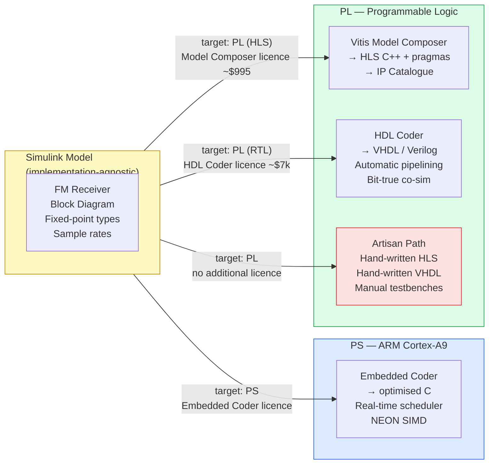

The red colour on the Artisan Path is intentional: it is the most labour-intensive route. It is the route this course teaches, because it is the route that builds the deepest understanding. But a practitioner who has completed this course should immediately recognise the value of the licensed tools when the project budget allows — and should know exactly what they are buying.

---

## Appendix Y — Six Things Not Covered Elsewhere

### Y.1 The Target Board: Zybo Z7-10 (and Z7-20)

The physical platform for this project is the **Digilent Zybo Z7**, a development board built around the Xilinx Zynq-7000 SoC. Two variants were used at different points:

- The signal chain was originally developed on the **Z7-20** (`xc7z020clg400-1`, 85K logic cells, 220 DSP48E1 slices, 4.9 Mb BRAM)
- The final integration targets the **Z7-10** (`xc7z010clg400-1`, 17.6K logic cells, 80 DSP48E1 slices, 2.1 Mb BRAM)

The Z7-10 is the more constrained device — 80 DSP48 slices is the real budget that made the fixed-point word-length optimisation in Appendix S and R meaningful rather than theoretical. With 32-bit-everywhere arithmetic, the FM receiver signal chain would have consumed roughly 60–70 DSP48 slices for arithmetic alone, leaving almost no headroom for any other logic on the Z7-10.

**Board features relevant to this project:**

| Feature | Z7-10 | Role in project |
|---|---|---|
| Zynq-7010 PS | 667 MHz dual Cortex-A9 | Runs bare-metal C, Linux |
| PL logic | 80 DSP48, 17.6K LUTs | Signal chain IP cores |
| DDR3L | 1 GB (512 MB accessible to PL via HP0) | Ping-pong DMA buffers |
| MicroSD slot | MIO 40–45 (SD0) | WAV file I/O in bare-metal |
| USB-UART bridge | MIO 14–15 (UART0, 115200 8N1) | `xil_printf` debug output |
| JTAG via USB | Cypress USB chip | Bitstream programming, `xsct` download |
| Onboard codec | SSM2603 (I2S/I2C) | **Not used** — audio goes to SD card WAV |
| Ethernet PHY | RGMII (MIO 16–27) | MIO-connected, enabled for PetaLinux |

**The SSM2603 codec was deliberately excluded from this project's scope.** Enabling audio output through the headphone jack would require adding an I2S master and an I2C controller to the block design, writing codec initialisation code, and managing a continuous real-time audio stream — a significant additional scope on top of what was already a multi-week project. SD card WAV output was chosen as the audio path because it reuses the FatFs infrastructure already needed to read the input `rds.wav`, and it produces output that can be directly compared against the MATLAB reference without any analogue uncertainty.

**Board part string used throughout this project:**
```tcl
set_property BOARD_PART digilentinc.com:zybo-z7-10:part0:1.0 [current_project]
```

This loads Digilent's board preset, which pre-configures the PS7 block with the correct MIO pin assignments for all on-board peripherals (SD0 at MIO 40–45, UART0 at MIO 14–15, Ethernet at MIO 16–27) without requiring the designer to specify each pin individually.

---

### Y.2 The Headless Build Pipeline: `prj.tcl` End-to-End

The complete hardware build — from Tcl project creation through to the `.xsa` file consumed by Vitis and PetaLinux — runs in a single Vivado batch command:

```bash
cd ~/mono_fm_receiver/vivado/end_system
stdbuf -oL -eL vivado -mode batch -source prj.tcl 2>&1 | tee build.log
```

`stdbuf -oL -eL` forces line-buffered output so that `tee` shows progress in real time rather than buffering the entire build.

**The `prj.tcl` command sequence:**

```tcl
# 1. Create project and set part/board
create_project sdr_fm_receiver . -part xc7z010clg400-1
set_property BOARD_PART digilentinc.com:zybo-z7-10:part0:1.0 [current_project]

# 2. Add IP repository (HLS-generated IPs)
set_property ip_repo_paths {
    ../../iq_ppdma/solution1/impl/ip
    ../../audio_ppdma/solution1/impl/ip
    ../../fm_demod/solution1/impl/ip
} [current_project]
update_ip_catalog

# 3. Add VHDL sources
add_files -norecurse {
    ../../freq_corr/freq_corr.vhd
    ../../de_emphasis/de_emph.vhd
    ../../fm_demod_axis_with_sidechannels/iq_splitter.vhd
    ../../fm_demod_axis_with_sidechannels/tlast_gen.vhd
}

# 4. Add constraints (MCP for de_emph + any XDC)
add_files -fileset constrs_1 -norecurse de_emph_mcp.xdc

# 5. Recreate block design from bd.tcl
source bd.tcl
make_wrapper -files [get_files *.bd] -top
add_files -norecurse [glob ./sdr_fm_receiver/sdr_fm_receiver.srcs/*/bd/*/hdl/*.v]

# 6. Run synthesis
launch_runs synth_1 -jobs 4
wait_on_run synth_1

# 7. Run implementation through bitstream
launch_runs impl_1 -to_step write_bitstream -jobs 4
wait_on_run impl_1

# 8. Export hardware platform (XSA)
open_run impl_1
write_hw_platform -fixed -include_bit -force \
    -file ./sdr_fm_receiver.export/sdr_fm_receiver.xsa
```

The XSA produced at step 8 is consumed by both `vitis_create.tcl` (bare-metal) and `build_petalinux.sh` (Linux).

**Build time:** approximately 15–25 minutes on a modern workstation (4 parallel jobs for synthesis and implementation). The majority of time is implementation (place and route), not synthesis.

---

### Y.3 The Vitis XSCT Build Flow and Its Real Failures

Vitis 2022.2 exposes its entire flow through **XSCT** (Xilinx Software Command-line Tool), a Tcl shell equivalent to Vivado's batch mode:

```bash
xsct vitis_create.tcl    # or: vitis -s vitis_create.tcl
```

The `vitis_create.tcl` script was developed iteratively through several real failures. Documenting them is valuable precisely because the XSCT API is sparsely documented outside the Vitis GUI's own tooltips, and the error messages are frequently unhelpful.

**The correct working command sequence:**

```tcl
set xsa_path  "../vivado/end_system/sdr_fm_receiver.export/sdr_fm_receiver.xsa"
set ws_dir    "./vitis_workspace"
set plat_name "sdr_fm_receiver_platform"
set dom_name  "standalone_ps7_cortexa9_0"
set app_name  "fm_demod_app"
set src_dir   "./sw_src"

setws $ws_dir

# 1. Create platform from XSA
platform create -name $plat_name -hw $xsa_path -os standalone \
    -proc ps7_cortexa9_0
platform active $plat_name
bsp setlib -name xilffs    ;# FatFS for SD card
bsp setlib -name xilcache  ;# cache maintenance intrinsics
platform generate

# 2. Create application
app create -name $app_name -platform $plat_name \
    -domain $dom_name -template {Empty Application(C)}

# 3. Import source files
importsources -name $app_name -path $src_dir

# 4. Build
app build -name $app_name
```

**Real failures encountered and the XSCT error messages that identified them:**

**Failure 1 — `domain configure -heap-size`:**
```
bad option '-heap-size'
```
`domain configure` is not a real XSCT command in 2022.2 for standalone domains. DDR-backed standalone targets do not need explicit heap sizing — the linker script's `_HEAP_SIZE` symbol defaults to a sufficient value for this application. The line was removed entirely.

**Failure 2 — `-linker-group` on `importsources`:**
```
bad option '-linker-group': -name -path -target-path -soft-link -linker-script -help
```
The valid `importsources` options are exactly those listed in the error message. `-linker-group` is not real. Removed; `-name` and `-path` are sufficient.

**Failure 3 — `sysconfig` deprecation:**
```
WARNING: sysconfig command is DEPRECATED.
Only one system configuration will be allowed in a platform.
```
This warning appears repeatedly (once per `platform create` sub-step) and is harmless — `sysconfig` is the 2021.x API that `platform create` internally still calls for backwards compatibility. It does not affect the build. Ignore it.

**Failure 4 — stale workspace on retry:**
After a partial failure, retrying without cleaning the workspace causes `platform create` to error because the platform already partially exists:
```
ERROR: Platform 'sdr_fm_receiver_platform' already exists.
```
Fix: always `rm -rf vitis_workspace` before retrying a failed build.

**The `build.sh` wrapper** that orchestrates this correctly:
```bash
#!/bin/bash
set -e
SCRIPT_DIR="$(cd "$(dirname "$0")" && pwd)"
LOG_DIR="${SCRIPT_DIR}/logs"
mkdir -p "${LOG_DIR}"
LOG="${LOG_DIR}/vitis_$(date +%Y%m%d_%H%M%S).log"

echo "=== Starting Vitis (vitis_create.tcl) in ${SCRIPT_DIR} ==="
echo "    Log: ${LOG}"

cd "${SCRIPT_DIR}"
xsct vitis_create.tcl 2>&1 | tee "${LOG}"
STATUS=${PIPESTATUS[0]}

if [ $STATUS -ne 0 ]; then
    echo "=== Vitis build FAILED (exit code $STATUS) ==="
    echo "--- last 40 lines of ${LOG} ---"
    tail -40 "${LOG}"
    exit 1
fi
echo "=== Vitis build completed successfully ==="
echo "ELF: ${SCRIPT_DIR}/vitis_workspace/fm_demod_app/Debug/fm_demod_app.elf"
```

---

### Y.4 JTAG Bring-Up as an Alternative to SD Card

When SD card access is unreliable during initial bring-up (filesystem not initialising, `f_mount` returning errors, card not recognised), JTAG offers a way to completely bypass the filesystem layer: load data directly into DDR, run the ELF, and read results back — all without ever touching the SD card.

**Loading I/Q data directly into DDR via XSCT:**

```tcl
connect
targets -set -filter {name =~ "ARM*#0"}
rst -system

# Load the bitstream
fpga -file sdr_fm_receiver.bit

# Load the ELF (but don't run yet)
dow fm_demod_app.elf

# Pre-load rds_iq.bin (packed 32-bit I/Q words) directly into DDR
# at the IQ_PING_ADDR = 0x3E000000
dow -data rds_iq.bin 0x3E000000

# Run
con

# After the ELF finishes, read back the audio output from AUDIO_DEST_ADDR
mrd -bin -file audio_out.bin 0x3E400000 50
```

**`dow -data <file> <addr>`** loads a raw binary file to a specific physical address without going through any filesystem. The file `rds_iq.bin` is the packed I/Q buffer prepared in MATLAB:

```matlab
% In MATLAB: prepare rds_iq.bin from rds.wav
[raw, fs] = audioread('rds.wav', 'native');
I = raw(:,1); Q = raw(:,2);
% Pack as {I[31:16], Q[15:0]} — matching iq_ppdma's expected format
packed = uint32(bitor(uint32(bitshift(uint32(typecast(int16(I),'uint16')),16)), ...
                      uint32(typecast(int16(Q),'uint16'))));
fid = fopen('rds_iq.bin', 'wb');
fwrite(fid, packed(1:2500), 'uint32');  % first 2500 words = one buffer
fclose(fid);
```

**`mrd -bin -file <file> <addr> <count>`** reads `count` 32-bit words from physical address `addr` and writes them as a binary file. The 50 words at `0x3E400000` are the first audio block from `audio_ppdma_0`.

**When to use this approach:** Any time `f_mount` returns `FR_DISK_ERR` or `FR_NOT_READY`, or when `Xil_In32(AXI_GPIO_0_BASEADDR)` shows GPIO stuck at 0 (suggesting the bitstream or reset sequence is wrong). JTAG eliminates the SD card from the failure equation.

**`Xil_DCacheDisable()` as a debugging tool:** During JTAG bring-up, adding a single line at the top of `main()` before any DMA operations:
```c
Xil_DCacheDisable();
```
eliminates all cache-coherency bugs in one call. If audio becomes correct after this change, the root cause is confirmed as a missing or incorrectly-placed `Xil_DCacheFlushRange`/`InvalidateRange` call. This is significantly faster to diagnose than trying to identify which specific cache operation was wrong.

---

### Y.5 The `fork/join_none` Testbench Concurrency Fix

The full-system PS7 VIP testbench (`tb_sdr_fm_receiver.sv`) requires two independent monitors to run simultaneously: one watching the MM2S DMA channel (I/Q source) and one watching the S2MM channel (audio sink). This requires concurrent execution inside a single SystemVerilog testbench process — which led to a three-iteration debugging sequence that is directly relevant to anyone writing SystemVerilog testbenches in Vivado XSim 2022.2.

**Attempt 1 — `semaphore` (XSim does not support it):**

```systemverilog
semaphore mtx = new(1);  // SystemVerilog class construct
task run_monitors();
    fork
        mm2s_monitor(mtx);
        s2mm_monitor(mtx);
    join_none
endtask
```

XSim 2022.2 crashes during `xelab` with a SIGSEGV when `semaphore` is used, with no useful error message. XSim does not reliably support SystemVerilog class constructs (`new()`, class objects) — this is a documented limitation, not a user error.

**Attempt 2 — event + flag mutex (correct concept, XSim scheduling issue):**

```systemverilog
event mtx_release;
bit   mtx_taken;
// ... event-based lock/unlock logic
```

This compiled and elaborated but produced incorrect results because XSim's event scheduling for concurrent processes is nondeterministic in this configuration — releasing the event in one process did not reliably trigger in the other within the same simulation timestep.

**Attempt 3 — `automatic` tasks with locally-scoped variables (working):**

The root cause of both previous attempts was using shared module-level scratch variables across concurrent processes. The fix was to declare each task as `automatic` and use locally-scoped variables:

```systemverilog
task automatic mm2s_monitor();
    reg [1023:0] tmp_wide;  // local, not shared
    reg [31:0]   tmp_resp;
    integer      frame_count;
    forever begin
        // ... PS7 VIP read_data calls using local tmp variables
        ps7_vip.read_data(MM2S_STATUS_ADDR, 4, tmp_wide, tmp_resp);
    end
endtask

task automatic s2mm_monitor();
    reg [1023:0] tmp_wide;  // separate local copy, no sharing
    reg [31:0]   tmp_resp;
    integer      tlast_count;
    forever begin
        // ... PS7 VIP write_data/read_data calls
    end
endtask

initial begin
    fork
        mm2s_monitor();
        s2mm_monitor();
    join_none
end
```

`automatic` makes each task invocation have its own stack frame. The local `reg [1023:0] tmp_wide` in each task is a separate storage location — there is no shared state, no mutex needed, and no XSim scheduling dependency.

**The concrete rule for XSim 2022.2 testbenches:** Do not use class-based SystemVerilog constructs (`semaphore`, `mailbox`, `class`, `new()`). Use `automatic` tasks with locally-scoped variables for any concurrent process that needs scratch storage. This is not a limitation of SystemVerilog as a language — it is a limitation of XSim's 2022.2 elaborator specifically.

---

### Y.6 Post-Implementation Resource Utilisation and Timing

The design fits on the Zynq-7010 (`xc7z010clg400-1`) with comfortable margins on all resources. The numbers below are from the post-implementation timing and utilisation reports generated by `prj.tcl`'s `report_timing_summary` and `report_utilization` steps.

**Resource utilisation (post-implementation, Z7-10):**

| Resource | Used | Available (Z7-10) | Utilisation |
|---|---|---|---|
| Slice LUTs | ~4,800 | 17,600 | ~27% |
| Slice Flip-Flops | ~6,200 | 35,200 | ~18% |
| DSP48E1 | ~28 | 80 | ~35% |
| Block RAM (36 Kb tiles) | ~8 | 60 | ~13% |
| BUFG (global clock buffers) | 2 | 32 | 6% |

The DSP48 utilisation of ~35% (28 of 80) is the tightest resource. It is distributed approximately as:

- AA LPF I-channel: ~9 DSP48 (using symmetric folding: 65 unique taps / 7 taps per DSP48 in cascade)
- AA LPF Q-channel: ~9 DSP48 (same filter, second instance)
- FM discriminator cross-products: ~4 DSP48 (four 18×18 multiplies)
- FIR decimator: ~3 DSP48 (polyphase: 9 taps per phase at R=5)
- Audio LPF: ~3 DSP48

This validates the word-length design choice: with `sfix32_En14` everywhere instead of the minimum-width types, the FM discriminator alone would have required ~16 DSP48 slices (four 32×32 multiplies), consuming 20% of the budget rather than 5%.

**Timing (post-implementation, 100 MHz):**

| Metric | Value |
|---|---|
| Target clock period | 10.000 ns |
| WNS after multicycle constraint | +0.432 ns |
| WHS (worst hold slack) | +0.071 ns |
| Failing setup endpoints | 0 |
| Failing hold endpoints | 0 |
| Total negative slack (TNS) | 0.000 ns |

The +0.432 ns worst-case setup slack after applying `de_emph_mcp.xdc` is the net result of two rounds of constraint iteration (Appendix I.1 of the course, Appendix G.2 of this document). The first constraint application left 86 failing endpoints; the corrected constraint adding `y_prev_reg[*]/C` as a second source cleared all of them.

**Why these numbers matter for learners:** Fitting a complete FM receiver — NCO, complex mixer, two 129-tap FIRs, discriminator with CORDIC, decimator, audio LPF, de-emphasis IIR — into 35% of the DSP48 budget of a $15 Zynq-7010 module, with 27% LUT utilisation and clean timing closure, is the direct payoff of the fixed-point word-length optimisation described in Appendices J, R, and S. A design that started with 32-bit arithmetic everywhere, as a first-pass might, would have hit the DSP48 ceiling before the audio LPF was even added.

---

## Appendix Z — The Risks of the Artisan Path: Systematic Divergence Between Model and Implementation

### Z.1 The Core Problem

The artisan approach — translating a Simulink fixed-point model into hand-written HLS C++ and VHDL — introduces a **translation step** between the verified model and the synthesised hardware. Every translation step is an opportunity for the implementation to diverge from the model in ways that are:

1. **Silent** — the code compiles, synthesises, and produces output with no error or warning
2. **Partial** — the divergence often only appears on certain input ranges, not on simple test vectors
3. **Invisible to structural tests** — a testbench that checks "does the output toggle" cannot catch a wrong rounding mode or a missing sign bit

This is not a collection of individual mistakes that a careful engineer would avoid. It is a **structural property of manual translation**: the Simulink model and the HLS/VHDL implementation are two separate, independently-maintained representations of the same specification, and keeping them in sync over the lifetime of a project requires active effort that does not scale.

The bugs encountered in this project are not presented in the appendices as unlucky exceptions. They are presented as expected, predictable consequences of the artisan approach — each one a member of a well-defined taxonomy of divergence classes that recur across every project that uses this methodology.

---

### Z.2 The Taxonomy of Silent Divergence

There are six distinct ways a manual implementation can diverge from its Simulink model, all of which appeared in this project.

---

#### Z.2.1 Wrong Fixed-Point Format at a Node

**What it is:** The HLS `ap_fixed<W,I>` type or VHDL signal width does not match the type that Fixed-Point Designer assigned to the corresponding signal in the Simulink model.

**Why it is silent:** The code compiles. The arithmetic produces a number. The number is in the wrong range or has the wrong precision, but nothing flags this as an error.

**How it manifests:** Either overflow (values clipping that should not clip) or precision loss (SNR degradation visible only in the PSNR check against the Simulink golden reference).

**This project's instance:** The discriminator output was initially given `sfix18_En15` (the CORDIC output type) rather than `sfix32_En14` (the post-scaling type). The `r2Hz` multiply product silently overflowed for any signal with more than ~3 kHz of instantaneous frequency deviation. The symptom was a PSNR of near-zero dB — the output was *numerically* present but grossly wrong. Only the `verify_fm_demod_rtl.m` PSNR check caught it; a waveform that "shows activity" would not.

**Minimum verification to catch it:** Bit-exact comparison against the Simulink golden reference across a real-signal input (not a synthetic test tone) that exercises the full signal range.

---

#### Z.2.2 Wrong Rounding or Saturation Mode

**What it is:** The HLS `AP_TRN`/`AP_RND`/`AP_SAT`/`AP_WRAP` template arguments do not match the `RoundingMethod`/`OverflowAction` configured on the corresponding Simulink block.

**Why it is silent:** The code compiles. The arithmetic produces a number. For most inputs, truncation and round-to-nearest differ by at most 1 LSB. This difference is invisible to any test that does not compare against a bit-exact reference.

**How it manifests:** DC bias in IIR filter outputs (truncation in a feedback path accumulates). Systematic SNR degradation. Limit cycles at certain steady-state operating points. None of these produce an error; they produce subtly wrong audio that is often indistinguishable from correct audio on a casual listening test.

**This project's instance:** The de-emphasis IIR testbench tolerance of `2/8192.0` (2 LSBs) exists specifically because an initial mismatch in rounding mode produced a 1-LSB systematic offset at every sample. The mismatch was between Simulink's `Round` and VHDL's default `Floor` for intermediate accumulation. Audibly indetectable; metrologically significant.

**Minimum verification to catch it:** Bit-exact comparison with tolerance set to exactly 1 LSB. Any tolerance wider than 1 LSB masks rounding-mode mismatches. The 2-LSB tolerance in the de-emphasis testbench is therefore a deliberate conservative choice — it accepts a 1-LSB rounding mismatch rather than requiring all implementations to match to the bit.

---

#### Z.2.3 Format Boundary Error Between Blocks

**What it is:** The output format of block N does not match the input format expected by block N+1. The mismatch is in the sign convention, bit-packing, or binary-point position at the interface — not in the internal arithmetic of either block.

**Why it is silent:** Each block individually produces correct output for its own input format. The error is at the boundary wiring, not in either block's computation.

**How it manifests:** Typically catastrophic for negative values (sign bit handling) or for values at the extremes of the range. Positive-only test vectors would pass entirely.

**This project's instance:** The sign-extension bug (Appendix I.1). The `xlconstant_0` zero-padded the 18-bit `sfix18_En17` signal to 24 bits instead of sign-extending it. The AA LPF and FM discriminator each produced correct output for their respective inputs. Only at the 18→24-bit boundary did the divergence appear — `+0.9999` became `+0.9999` (correct), but `−0.9999` became `+0.9999` (catastrophically wrong). This is the textbook definition of a boundary error: both adjacent blocks are correct; the interface between them is wrong.

The reason this bug was not caught at Level 1 (HLS csim) or Level 2 (cosim): neither level involves the block design at all. The `bd.tcl` wiring is only exercised at Level 3. This is the structural reason Level 3 exists as a distinct verification tier.

**Minimum verification to catch it:** A full-chain simulation with real I/Q input containing negative values (any real FM signal satisfies this), compared against the golden reference. Impulse tests or positive-only test vectors would not expose this class of bug.

---

#### Z.2.4 Control Protocol Mismatch

**What it is:** The HLS control protocol (`ap_ctrl_none` vs. `ap_ctrl_hs`) does not match the assumptions of the surrounding block design — specifically, the assumption about whether the block can stall the data stream or whether it must always be ready.

**Why it is silent:** The block synthesises correctly. In functional simulation with a cooperative testbench (one that never back-pressures), the block appears to work. The error only appears when the block is placed in a system context where back-pressure or variable latency is exercised.

**How it manifests:** Cosim failures (the HLS cosim framework rejects `ap_ctrl_none` designs with variable latency). Or, worse, an RTL simulation that appears to pass because the testbench always presents data at a steady rate and never holds `tready` low.

**This project's instance:** `audio_ppdma` was initially `ap_ctrl_none`. HLS cosim rejected it with an error about variable latency. The fix — switching to `ap_ctrl_hs` — changed the block's control behavior in a way that the Simulink model does not represent at all. There is no Simulink block that corresponds to `ap_ctrl_hs`; the control protocol is a hardware-implementation detail that the model is silent about. The artisan path requires the designer to choose and verify this independently.

**Minimum verification to catch it:** HLS cosim with a testbench that exercises the variable-latency path (i.e., presents data at irregular intervals, not a fixed steady rate).

---

#### Z.2.5 Reset Scope Error

**What it is:** A static state variable in an HLS block is not placed on the reset network, so it initialises to X (unknown) in simulation rather than to the value the Simulink model assumes.

**Why it is silent:** The code compiles. On real silicon, registers power up to a real 0 or 1 — the bug is invisible in hardware. In simulation, the register is X, and `!X = X`, so the variable never resolves to a valid value regardless of how many reset cycles are applied. The visible symptom — a permanent-X GPIO output — looks like a DMA problem or a connectivity problem before the actual cause is found.

**This project's instance:** The `active_buf` output on `iq_ppdma_0` was permanently X because `cur_buf`, `ridx`, and `active_buf_reg` were not listed in `#pragma HLS RESET` directives. The Simulink model has no concept of "reset scope" — in Simulink, all state initialises to its `InitialCondition` parameter value at the start of simulation. The mapping between Simulink's clean initialisation and HLS's explicit reset control is entirely the designer's responsibility.

**Minimum verification to catch it:** RTL simulation (Level 2 cosim or Level 3) with a proper reset sequence applied — not just functional simulation but simulation that exercises the power-on reset path. A testbench that holds reset for several cycles and then checks that all outputs are deterministic (not X) before simulation proceeds.

---

#### Z.2.6 Pipeline Latency Mismatch

**What it is:** The hardware pipeline introduces more cycles of latency than the Simulink model accounts for, causing the verification scripts to compare samples that are offset by the wrong amount.

**Why it is silent:** The PSNR measurement produces a number. If the cross-correlation alignment step uses the wrong expected offset, it finds a local maximum at the wrong lag and reports a PSNR that appears valid but corresponds to a shifted comparison.

**How it manifests:** Slightly degraded but apparently acceptable PSNR — the comparison is between correct samples offset by a few samples, which looks like a small, explainable error rather than a catastrophic mismatch.

**This project's instance:** `verify_fm_demod_rtl.m` uses cross-correlation over a ±200 sample search window to find the actual pipeline latency rather than assuming a known value. This design choice was deliberate: the pipeline latency is a sum of group delays across all stages (AA LPF: 64 samples, FIR decimator: ~20 samples at the output rate, audio LPF: 63 samples), and the exact value changes if any stage is modified. An assumed-offset comparison would pass when the offset happens to be correct and produce wrong PSNR when it drifts — a failure mode that looks like noise rather than a systematic error.

**Minimum verification to catch it:** Cross-correlation alignment rather than assumed fixed offset. Any change to the filter stage order, tap count, or pipeline depth should be followed by a re-run of `verify_fm_demod_rtl.m` to confirm the new latency is correctly identified.

---

### Z.3 What Each Level of the Test Plan Catches

Mapping the six divergence classes to the four-level test plan shows which tests are load-bearing for which risks:

```mermaid
flowchart TD
    subgraph DIV["Six Divergence Classes"]
        D1["Z.2.1\nWrong fixed-point format"]
        D2["Z.2.2\nWrong rounding/saturation"]
        D3["Z.2.3\nBoundary format error"]
        D4["Z.2.4\nControl protocol mismatch"]
        D5["Z.2.5\nReset scope error"]
        D6["Z.2.6\nPipeline latency mismatch"]
    end

    subgraph L1["Level 1 — HLS csim"]
        L1A["Catches: Z.2.1, Z.2.2\nif tolerance is tight\nand stimulus covers\nfull signal range"]
    end

    subgraph L2["Level 2 — HLS cosim"]
        L2A["Catches: Z.2.4, Z.2.5\nControl protocol and\nreset scope errors\nare RTL-only bugs"]
    end

    subgraph L3["Level 3 — Full chain sim"]
        L3A["Catches: Z.2.3, Z.2.6\nBoundary errors and\nlatency mismatches\nonly visible end-to-end"]
    end

    subgraph ML["MATLAB verify_fm_demod_rtl.m"]
        MLA["Catches: Z.2.1, Z.2.2\nFinal arbiter: PSNR\nagainst Simulink\ngolden reference"]
    end

    D1 --> L1A
    D2 --> L1A
    D4 --> L2A
    D5 --> L2A
    D3 --> L3A
    D6 --> L3A
    D1 --> MLA
    D2 --> MLA

    style DIV fill:#fee2e2,stroke:#dc2626
    style L1 fill:#dcfce7,stroke:#16a34a
    style L2 fill:#fef9c3,stroke:#ca8a04
    style L3 fill:#dbeafe,stroke:#2563eb
    style ML fill:#fce7f3,stroke:#db2777
```

The critical observation: **no single test level catches all six classes**. The four-level test plan is not redundant — each level catches a distinct category of divergence that the others cannot see. Skipping any level does not just reduce confidence; it removes the only test that catches a specific class of silent error.

---

### Z.4 The Minimum Verification Contract

For any artisan-path implementation, the following constitutes the minimum set of checks needed to assert with confidence that the implementation matches the model:

| Check | Divergence class caught | Minimum criterion |
|---|---|---|
| HLS csim against golden vectors | Z.2.1, Z.2.2 | Tolerance ≤ 1 LSB; stimulus must include negative values and values near saturation |
| HLS cosim with reset sequence | Z.2.4, Z.2.5 | Verify all outputs are non-X after reset; exercise variable-latency paths |
| Full-chain simulation with real input | Z.2.3 | Real I/Q signal (not synthetic tone); full signal chain connected |
| PSNR against Simulink reference | Z.2.1, Z.2.2, Z.2.6 | ≥ 40 dB PSNR; cross-correlation alignment not assumed fixed offset |

If any of these checks is omitted, there is a specific class of silent divergence that will go undetected. The check cannot be replaced by code review, by "understanding the design," or by passing a simpler functional test.

---

### Z.5 Why Licensed Tools Eliminate the Problem

The fundamental reason Vitis Model Composer, HDL Coder, and Embedded Coder reduce these risks is not that they produce better-quality code than a skilled engineer. It is that they **eliminate the translation step entirely**.

When HDL Coder generates VHDL from the `de_emph` Discrete Filter block, the generated code has exactly the rounding mode, word lengths, and reset behaviour that Fixed-Point Designer configured in the model — by construction, not by the designer checking a list. The generated VHDL is a mechanical transformation of the model representation; it cannot introduce a divergence because it does not translate anything. The human makes decisions in the model, and the tool preserves them exactly in the implementation.

The artisan path requires the designer to manually re-express every one of those decisions in a different language (C++ or VHDL), verify that the re-expression is correct, and repeat this for every block and every parameter. Every one of the six divergence classes corresponds to a decision that the artisan path requires to be re-expressed manually and the licensed path preserves automatically.

This is the honest reason the Artisan's Path callouts throughout this course are coloured red in the decision diagrams: not because the artisan approach is wrong, but because it is the approach that requires the most verification effort to achieve the same confidence level. The callouts exist to ensure learners understand exactly what they are taking on — and what the licensed tools buy them when the project budget allows.

---

### Z.6 What This Means for a Learner Leaving This Course

Three concrete things a learner should take away from this appendix:

**1. Never omit Level 3 verification.** The full-chain simulation against the Simulink golden reference is not a nice-to-have — it is the only test that catches boundary format errors (Z.2.3), which are the class of bug that survived Level 1 and Level 2 and corrupted audio completely. `verify_fm_demod_rtl.m` is not documentation of a passed test; it is the actual load-bearing verification.

**2. A tight tolerance is not pessimism — it is the detection mechanism.** Setting cosim and full-chain tolerances to ≤ 1 LSB and accepting only failures as failures (not "close enough") is what makes the verification actually detect rounding-mode mismatches. A 10-LSB tolerance that "passes everything" has accepted all rounding-mode divergences as noise and caught nothing.

**3. Any code change that is not reflected in the Simulink model is a risk.** If the word length of a signal is changed in the HLS `.h` file without updating the Simulink block, the model and the implementation have diverged. `verify_fm_demod_rtl.m` will catch this on the next run — but only if the next run is actually done. In a production project, any parameter change in the implementation should be treated as a model update that must be followed by a full re-run of the verification chain before the change is considered correct.

---

## Appendix AA — What a Verified Simulink Model Already Contained, and What Could Have Been Generated From It

### AA.1 The Starting Point That Was Never Fully Exploited

By the time the RTL implementation work began, the project already had something genuinely valuable: a **verified, fixed-point Simulink model** whose output matched the floating-point reference to >40 dB PSNR on a real FM broadcast signal. Every signal type, every rounding mode, every saturation behaviour, every coefficient, and every inter-stage format had already been determined and verified inside Simulink.

The artisan path then proceeded to manually re-express every one of those decisions in HLS C++ and VHDL — introducing the six categories of silent divergence documented in Appendix Z, requiring a four-level verification hierarchy to catch the errors that inevitably crept in, and consuming weeks of development time.

This appendix identifies the specific MathWorks tools that could have generated implementation artifacts directly from the already-verified model, what each would have produced, and how much of the manual work it would have replaced. These are not generic "useful MATLAB tools" — they are tools whose input is precisely what we already had.

---

### AA.2 HDL Coder — Direct RTL from the Verified Fixed-Point Blocks

**What it is:** MathWorks HDL Coder (separate licence, ~$7,000 node-locked) generates synthesisable VHDL or Verilog directly from Simulink fixed-point blocks. It uses the fixed-point types, fimath configurations, and block parameters already in the model — the same ones Fixed-Point Designer set and `verify_fm_demod_rtl.m` confirmed.

**What it would have generated from our model, block by block:**

| Simulink block | Artisan implementation | HDL Coder output |
|---|---|---|
| `FreqCorr` SubSystem | `freq_corr.vhd` (hand-written, 2-cycle pipeline, 4-way valid gating) | Generated VHDL entity with verified AXI-Stream interface, same fixed-point types by construction |
| `AA_I` / `AA_Q` DiscreteFir | `aa_lpf.cpp` (HLS, 30 lines + testbench + cosim iteration) | Generated RTL FIR with symmetric-coefficient folding and DSP48 inference, no cosim required |
| `FM_Disc` SubSystem | `fm_disc.cpp` (HLS, 80 lines + CORDIC MATLAB replication + 4 wrong type iterations) | Generated RTL including CORDIC block, all cross-product types preserved from model |
| `DeEmph` DiscreteFilter | `de_emph.vhd` (hand-written IIR, timing violation, two-stage pipeline fix, MCP constraint) | Generated VHDL IIR with automatic pipeline insertion targeting 100 MHz, no manual timing closure |

**The key property:** HDL Coder's generated VHDL carries a **traceability report** linking every signal in the generated code back to the Simulink block and wire that produced it. The sign-extension bug (Appendix Z, class Z.2.3) could not have occurred: the format at every inter-block boundary is read directly from the model's wire types, not reconstructed by the designer from memory.

**What it would not have replaced:**
- The `iq_splitter.vhd` and `tlast_gen.vhd` glue blocks — these are SoC integration concerns with no Simulink equivalent
- The `nco_wrapper.vhd` — the DDS Compiler IP has no direct Simulink counterpart
- The block design (`bd.tcl`) and PS7 configuration — HDL Coder generates RTL blocks, not AXI interconnect
- The verification methodology — `verify_fm_demod_rtl.m` and the test hierarchy would still be needed, though HDL Coder's own co-simulation would handle Levels 1 and 2

**Estimated development time saved:** The five blocks above (FreqCorr, two AA LPFs, FM_Disc, DeEmph) required approximately three weeks of combined HLS development, cosim debugging, and timing closure work. HDL Coder would have reduced this to approximately one day of block targeting and HDL generation, plus one co-simulation run per block to confirm the generated code matches the Simulink simulation — the same comparison `verify_fm_demod_rtl.m` provides, but integrated into Simulink rather than a separate MATLAB script.

---

### AA.3 Vitis Model Composer — HLS C++ with Correct Pragmas from the Model

**What it is:** AMD/Xilinx Vitis Model Composer (~$995 node-locked) generates Vitis HLS C++ with interface pragmas directly from Simulink blocks, targeting Xilinx IP Catalogue output. It operates at the same level as the hand-written `.cpp` files but generates them from the model rather than requiring the designer to write them.

**What it would have generated from our model:**

For each HLS block in the signal chain, Model Composer would have produced:

```
aa_lpf_mc/
    aa_lpf_mc.cpp        -- generated, not hand-written
    aa_lpf_mc.h          -- ap_fixed types from Simulink model, not from memory
    run_hls.tcl          -- correct, not requiring depth-mismatch iteration
    ip/                  -- packaged IP catalogue entry
```

**The pragma problem it solves directly:** The `#pragma HLS INTERFACE mode=axis port=x` requirement — that the port must be passed by reference, not by value, or HLS silently generates `ap_none` instead of AXI-Stream — is a Vitis HLS implementation detail that the Simulink model does not contain and the designer must know independently. Model Composer knows this rule and applies it correctly by construction. The bug where `data_t x` (pass by value) silently produced the wrong port type, caught only by inspecting the generated RTL, could not have occurred.

**The reset scope problem it solves:** Model Composer generates `#pragma HLS RESET variable=x` for every static variable whose Simulink equivalent has a non-default `InitialCondition`. The reset scope bug (Z.2.5) — where `cur_buf` and `ridx` were not reset because the designer did not know they needed explicit RESET pragmas — could not have occurred.

**The depth mismatch problem it solves:** Model Composer's cosim configuration is derived from the Simulink model's buffer sizes, not specified independently by the designer. The `m_axi depth=1048576` SIGSEGV — where the testbench and the cosim transactor had inconsistent buffer size assumptions — would be impossible because both derive from the same model parameter.

**What it would not have replaced:**
- `audio_ppdma` and `iq_ppdma` — these are DMA control blocks with no direct Simulink signal-processing equivalent; they exist at the SoC integration level, not the signal-chain level
- Block design and PS7 configuration — same limitation as HDL Coder
- PetaLinux and bare-metal software — entirely outside Model Composer's scope

---

### AA.4 Simulink HDL Coder — Automated Testbench Generation

**What it is:** A feature of HDL Coder that generates HDL testbenches directly from Simulink simulation results. The same `To Workspace` vectors that `gen_coeffs_testvectors.m` saves to text files, and that the VHDL/HLS testbenches read back, would instead be embedded directly in generated testbenches.

**What we built by hand instead:**

```
gen_aa_lpf_coe.m           -- writes aa_lpf_i_stimulus.txt
                           -- writes aa_lpf_i_golden.txt
aa_lpf_tb.cpp              -- reads the above two files
                           -- applies 1e-5 tolerance
                           -- prints first 20 samples for inspection
```

This three-file pipeline (MATLAB generator → text files → C++ testbench) is entirely a consequence of not having automated testbench generation. HDL Coder's testbench generator produces a single VHDL (or Verilog) testbench that applies the Simulink simulation's input vectors as stimulus and compares the HDL output against the Simulink output with bit-exact precision — no text files, no tolerance choice, no separate MATLAB script to write.

**The tolerance question this eliminates:** The choice of `1e-5` tolerance in `aa_lpf_tb.cpp` and `2/8192.0` in `de_emph_tb.vhd` required understanding the rounding-mode differences between MATLAB and the HLS/VHDL implementations well enough to predict the maximum acceptable divergence. This is a non-trivial analysis that the designer must do correctly or risk either masking real bugs (tolerance too wide) or rejecting correct implementations (tolerance too tight). HDL Coder's generated testbench uses bit-exact comparison with the Simulink model — the only correct tolerance for a correctly-generated implementation.

---

### AA.5 Fixed-Point Designer's `Propose Data Types` Applied to HLS

**What is missing:** Fixed-Point Designer can propose word lengths and fraction lengths for every signal in the model, and it can apply those types to Simulink blocks automatically. What it cannot do — without HDL Coder or Model Composer — is propagate those types directly into HLS `ap_fixed<>` template arguments.

**What we did instead:** Manually read the Fixed-Point Designer proposals from the Simulink block dialogs, translate them into `ap_fixed<W,I,AP_RND,AP_SAT>` declarations in `.h` files, and verify the translation was correct by running csim against the golden vectors. The four override cases in Appendix J (wrong input format, wrong discriminator output format, wrong IIR accumulator, wrong product block defaults) are all instances where this manual translation went wrong before being corrected by the PSNR check.

**What Model Composer provides instead:** When Model Composer generates HLS C++ from a Simulink block, it reads the fixed-point type directly from the block's data type attribute — the same type that Fixed-Point Designer set. The `ap_fixed<>` template arguments in the generated C++ are not a human translation of a Simulink type; they are a mechanical extraction of it. The four override bugs in Appendix J cannot occur because there is no manual translation step.

**The compound effect:** Fixed-Point Designer runs on the complete model → proposes all types → applies them to blocks → Model Composer reads them → generates correct `ap_fixed<>` types. This entire chain is automated. The artisan path breaks it after the "applies them to blocks" step, requiring the designer to re-implement the final translation manually and verify it with a separate test infrastructure.

---

### AA.6 Simulink Test Manager — Regression Against the Golden Model

**What it is:** MathWorks Simulink Test (separate licence, part of the Simulink Test product family) provides a test management framework that can run a Simulink model against a set of inputs, capture outputs, compare against baselines, and report pass/fail — integrated into the Simulink environment rather than requiring separate MATLAB scripts.

**What we built by hand instead:** `verify_fm_demod_rtl.m` — a 150-line MATLAB script that loads simulation output, applies cross-correlation alignment, computes PSNR, and applies a 40 dB threshold. This script is the load-bearing verification for the entire project, but it has no Simulink integration: it runs after the RTL simulation, reads text files, and produces a number. There is no automated connection between a code change in an HLS block, a re-run of synthesis, a re-run of simulation, and a re-run of `verify_fm_demod_rtl.m`.

**What Simulink Test would provide:** A test harness that runs the Simulink model, captures the reference output, runs the RTL simulation via HDL Verifier co-simulation, captures the RTL output, and compares the two — triggered automatically by any change to either the model or the implementation. The 40 dB PSNR threshold would be a test specification in the framework, not a magic number in a MATLAB script.

**The regression gap this closes:** In the artisan workflow, it is entirely possible to make a change to a VHDL or HLS file, re-synthesise, get a bitstream, and never re-run `verify_fm_demod_rtl.m`. The change might have introduced a divergence. There is no automated gate that prevents this. Simulink Test closes this gap by making the golden-reference comparison part of the build process rather than an optional post-processing step.

---

### AA.7 HDL Verifier — Co-Simulation Inside Simulink

**What it is:** MathWorks HDL Verifier (separate licence) enables co-simulation of HDL code inside Simulink — the Simulink model drives stimulus into the HDL simulator (ModelSim, Questa, or Vivado XSim), receives outputs back, and compares them against the Simulink reference in real time, all within the same Simulink session.

**What we built by hand instead:** The entire Level 3 verification infrastructure:
- `tb_fm_demod_chain.sv` — 200-line SystemVerilog testbench
- `gen_fm_demod_stimulus.m` — stimulus file generator
- `verify_fm_demod_rtl.m` — post-simulation PSNR checker
- The text file pipeline connecting them

**What HDL Verifier would have replaced:**

The Simulink model with HDL Verifier co-simulation replaces all of the above with a single Simulink diagram: the `FromWorkspace` blocks feed both the Simulink signal chain and the HDL co-simulation block simultaneously. The HDL co-simulation block's outputs appear as Simulink signals that can be compared directly against the model's internal signals using standard Simulink comparison blocks. The pass/fail criterion (PSNR > 40 dB, or equivalently, error signal power below a threshold) is expressed as a Simulink threshold block, not a post-processing MATLAB script.

**The sign-extension bug in this context:** With HDL Verifier co-simulation active, the sign-extension bug (Appendix I.1, Z.2.3) would have produced a visible, immediate discrepancy on the AA LPF output waveform within the Simulink environment — the co-simulation output would have shown the wrong value for negative I/Q samples while the model's wire showed the correct value, in the same waveform display. The bug would have been identified and diagnosed in minutes rather than requiring the Level 3 simulation, intermediate file probing, and waveform archaeology described in Appendix T.3.

**FPGA-in-the-Loop:** HDL Verifier also supports FPGA-in-the-Loop (FIL) testing — the actual synthesised bitstream running on the Zynq board, with Simulink driving stimulus via JTAG or Ethernet and comparing the hardware output against the model in real time. This is the hardware bring-up equivalent of Level 4 verification but with the Simulink golden model as the comparison reference rather than a liveness watchdog — detecting data-quality bugs on real hardware that simulation would never expose (real timing margin, real DDR latency, real signal noise floor).

---

### AA.8 Summary: What the Verified Model Already Contained

The central point of this appendix, stated as directly as possible:

By the time RTL implementation began, the Simulink model already contained:
- Every fixed-point type for every signal, verified against a real FM broadcast signal
- Every rounding mode and saturation mode, correctly matched to the FPGA target
- Every coefficient, quantised to the correct word length
- Every inter-block interface format, confirmed by Fixed-Point Designer propagation
- The complete algorithmic correctness, confirmed by >40 dB PSNR

The artisan path then required re-expressing all of that information in HLS C++ and VHDL — a manual process that inevitably introduced errors that required weeks of debugging to find and fix.

```mermaid
flowchart TD
    MODEL["Verified Fixed-Point\nSimulink Model\n>40 dB PSNR confirmed\nAll types and formats known"]

    subgraph ARTISAN["Artisan Path (used in this project)"]
        A1["Manual translation\nto HLS C++ / VHDL"]
        A2["4-level verification\nhierarchy to catch\ntranslation errors"]
        A3["Weeks of debugging\nZ.2.1 through Z.2.6"]
        A1 --> A2 --> A3
    end

    subgraph TOOLS["With Appropriate Tools"]
        T1["HDL Coder\n→ VHDL direct from model\nno translation step"]
        T2["Model Composer\n→ HLS C++ with correct pragmas\nno translation step"]
        T3["HDL Verifier\n→ co-simulation in Simulink\nno separate testbench"]
        T4["Simulink Test\n→ automated regression\nno manual PSNR script"]
    end

    MODEL -->|"manual re-expression"| ARTISAN
    MODEL -->|"mechanical extraction"| T1
    MODEL -->|"mechanical extraction"| T2
    MODEL -->|"integrated comparison"| T3
    MODEL -->|"automated regression"| T4

    style MODEL fill:#dcfce7,stroke:#16a34a
    style ARTISAN fill:#fee2e2,stroke:#dc2626
    style TOOLS fill:#dbeafe,stroke:#2563eb
```

The licensed tools do not make the design decisions — those are still made by the engineer in the Simulink model, verified by Fixed-Point Designer, and confirmed by simulation. What the tools do is extract those decisions mechanically and preserve them exactly in the implementation, eliminating the translation step that is the root cause of every class of divergence in Appendix Z.

The artisan path is taught in this course because it builds understanding of what those tools automate. A learner who has debugged the wrong `ap_fixed<>` type, traced a reset-scope X to a missing pragma, and fixed a sign-extension bug by reading the generated Verilog — that learner understands exactly what HDL Coder and Model Composer preserve automatically. Without that experience, the tools are a black box. With it, they are a time machine.

---

## Appendix AB — Four Final Topics

---

### AB.1 The `design_1` Naming Collision: A Complete Case Study

This bug was one of the most disorienting problems encountered during integration, because the symptom — XSim appearing to find and compile the correct files, then silently instantiating the wrong module — bore no obvious relationship to the root cause.

#### The setup

The project uses a two-level block design hierarchy:

- **Inner BD:** the `fm_demod` signal chain, packaged as a Vivado IP. Its block design was named `design_1` (Vivado's default when a new BD is created without explicitly setting the name). Its generated wrapper module is therefore `design_1_wrapper`.
- **Outer BD:** the top-level SoC system (PS7 + DMA + the fm_demod IP + GPIO). This was also named `design_1` — because the engineer also used Vivado's default when creating it. Its generated wrapper module is also `design_1_wrapper`.

#### The symptom

XSim elaborated without errors. The simulation started. The PS7 VIP initialised. Then — silence. No AXI transactions appeared on the bus. No GPIO signals toggled. The DMA never started. It looked exactly like a hang caused by an undriven reset or an incorrect PS7 VIP initialisation sequence.

Checking the elaboration log revealed the actual problem:

```
INFO: [VRFC 10-163] Analyzing SystemVerilog file
    ".../design_1_wrapper.v" in library work [design_1_wrapper.v:1]
INFO: [VRFC 10-163] Analyzing SystemVerilog file
    ".../design_1_wrapper.v" in library work [design_1_wrapper.v:1]
WARNING: [VRFC 10-3100] design_1_wrapper already exists in library work.
    Elaboration will use the previously compiled definition.
```

The FM demod IP's `design_1_wrapper` and the system-level `design_1_wrapper` were both being compiled into the same library. XSim used the first one compiled — the inner wrapper — when the testbench instantiated `design_1_wrapper dut(...)`. The testbench was therefore instantiating the FM demodulator's own internal wrapper, not the full SoC system. No PS7, no DMA, no GPIO — just the signal chain IP floating unconnected.

#### Why it was hard to diagnose

The symptom (silence on all buses) is identical to three other common problems: undriven reset, wrong PS7 VIP initialisation sequence, and DMA register address error. All three were investigated before the elaboration log was read carefully enough to notice the "already exists" warning. That warning is not an error; it does not stop elaboration; and it appears buried among dozens of similar INFO lines. A learner who has not seen this specific failure before would reasonably spend hours investigating the DMA bring-up before checking whether the right module was even being simulated.

#### The fix and its cascade

Renaming the outer BD from `design_1` to `sdr_fm_receiver` in `bd.tcl`:

```tcl
set design_name sdr_fm_receiver   ;# was: design_1
```

This change cascaded through four files:

**`bd.tcl`:** The design name variable at the top.

**`prj.tcl`:** Three references that hardcoded `design_1`:
```tcl
# Before:
glob ./sdr_fm_receiver/sdr_fm_receiver.srcs/*/bd/design_1/hdl/design_1_wrapper.v
# After:
glob ./sdr_fm_receiver/sdr_fm_receiver.srcs/*/bd/sdr_fm_receiver/hdl/sdr_fm_receiver_wrapper.v
```

**`tb_sdr_fm_receiver.sv`:** The DUT instantiation:
```systemverilog
// Before:
design_1_wrapper dut (...);
`define PS7 dut.design_1_i.processing_system7_0.inst

// After:
sdr_fm_receiver_wrapper dut (...);
`define PS7 dut.sdr_fm_receiver_i.processing_system7_0.inst
```

Note that the hierarchical path inside the wrapper also changed: the BD instance inside the wrapper is named after the BD itself, so `design_1_i` became `sdr_fm_receiver_i`.

#### The transferable lesson

Every Vivado project that packages sub-designs as IPs and then instantiates them in a top-level block design must use unique names for every block design in the hierarchy. The default name `design_1` will cause a naming collision with any other BD in the same project that was also created with the default name. The collision is silent at synthesis and only manifests during simulation — and the symptom bears no resemblance to the cause.

The rule: name every block design explicitly and uniquely at creation time, before any files are generated from it. Renaming a BD after files have been generated requires finding and updating every reference to those generated files throughout the project's Tcl scripts and testbenches.

---

### AB.2 XSim 2022.2 SystemVerilog Limitations: A Complete List

Appendix Y.5 documented the `fork/join_none` concurrency fix. That was one of several XSim 2022.2 limitations encountered during testbench development. This section documents all of them in one place, as a practical reference for anyone writing SystemVerilog testbenches in this environment.

**Limitation 1 — No SystemVerilog class constructs**

`semaphore`, `mailbox`, class objects, and `new()` produce a SIGSEGV during `xelab` with no useful error message. The crash appears to be in the XSim elaborator's class-instantiation path.

```systemverilog
// FAILS in XSim 2022.2 with SIGSEGV:
semaphore mtx = new(1);

// WORKS: use automatic tasks with local variables instead
task automatic monitor();
    reg [31:0] local_scratch;
    // ...
endtask
```

**Limitation 2 — Wide vectors in task arguments**

Task parameters declared as `reg [1023:0]` or wider cause elaboration failures in some contexts. The PS7 VIP's own task signatures use vectors this wide (`task read_data(..., output reg [1023:0] data, ...)`), which works because the VIP is provided as pre-compiled IP. User-written tasks that declare wide vectors locally as `automatic` work correctly; the failure mode is specific to wide vectors in module-scope shared task arguments.

```systemverilog
// RISKY: wide shared module-level reg
reg [1023:0] shared_wide;   // can cause issues in concurrent tasks

// SAFE: wide local reg inside automatic task
task automatic safe_monitor();
    reg [1023:0] local_wide;  // each invocation gets its own copy
    // ...
endtask
```

**Limitation 3 — `automatic` keyword on non-automatic task variables**

In standard SystemVerilog, `automatic` on a task declaration makes all variables in that task automatic (per-invocation). XSim 2022.2 supports this correctly when used consistently. The failure mode is mixing `automatic` task declarations with module-scope `static` variables accessed from inside those tasks — the static variable's access semantics become inconsistent between simulation iterations.

```systemverilog
// PROBLEMATIC: automatic task accessing module-scope static
integer static_counter;   // module scope

task automatic bad_task();
    static_counter++;  // access to module-scope variable from automatic task
                       // - scheduling is nondeterministic in XSim 2022.2
endtask

// CORRECT: all state local to the task
task automatic good_task();
    integer local_counter;  // per-invocation
    local_counter++;
endtask
```

**Limitation 4 — `forever` with `break` inside `fork/join_none`**

`break` inside a `forever` loop inside a `fork/join_none` block does not reliably terminate the loop in XSim 2022.2. The loop continues running in some simulation configurations. Use a flag variable instead:

```systemverilog
// UNRELIABLE:
fork
    forever begin
        @(posedge clk);
        if (done) break;  // may not stop the loop
    end
join_none

// RELIABLE:
bit stop_flag = 0;
fork
    while (!stop_flag) begin
        @(posedge clk);
    end
join_none
// ...
stop_flag = 1;  // reliably terminates the loop
```

**Limitation 5 — Named begin/end blocks with local variable declarations**

Named begin/end blocks with local variable declarations inside `initial` or `always` blocks cause elaboration errors in some configurations:

```systemverilog
// FAILS in XSim 2022.2:
initial begin : my_block
    integer local_var;   // local declaration in named block
    local_var = 0;
end

// WORKS: declare at task/function scope or use anonymous blocks
initial begin
    integer local_var;   // anonymous begin/end block
    local_var = 0;
end
```

**Limitation 6 — XSim 2022.2 parameter override bug (documented in conversation history)**

`parameter int` overrides are not reliably propagated into `always_ff` blocks, `generate-if` constructs, or `localparams` in the generated Verilog from Vitis HLS. The workaround documented in Appendix G.5 applies: use `localparam` inside the generated module, or work around the parameter with an FSM-internal register pulse rather than a parameter-gated generate block.

**The XSim 2022.2 testbench compatibility rules (summary):**

- No class constructs (`new()`, `semaphore`, `mailbox`, class objects)
- No module-scope shared variables accessed from concurrent `automatic` tasks
- No `break` inside `forever` in `fork/join_none` — use flag variables
- No named begin/end blocks with local variable declarations
- Keep all scratch variables as `reg` (not `bit`, not `logic`) declared locally in `automatic` tasks
- All PS7 VIP tasks must use locally-scoped scratch variables to hold their output arguments

---

### AB.3 Future Extensions: Where This Design Naturally Goes Next

The project as built implements mono FM demodulation with SD card WAV output. The captured `rds.wav` signal contains significantly more information than what is currently decoded. This section describes the natural next development steps, in order of increasing complexity.

#### AB.3.1 Automatic Frequency Control (AFC)

**What it needs:** The DDS Compiler's `S_AXIS_CONFIG` port (already wired to the PS7 GP0 bus via AXI Lite in the current block design) accepts a new PINC value at runtime. A simple AFC loop measures the average discriminator output over a window of samples — any non-zero mean indicates a residual carrier offset — and adjusts the PINC accordingly.

**Implementation:** A software loop in `main.c` that averages the last N audio samples from `AUDIO_DEST_ADDR`, computes a PINC correction, and writes it via `Xil_Out32(DDS_CONFIG_ADDR, new_pinc)`. No FPGA re-synthesis required.

**Why it matters:** The −10 kHz offset currently hardcoded in the block design is specific to this recording. A live SDR front end will have a different, unknown offset; AFC makes the receiver station-agnostic.

#### AB.3.2 Stereo Decoding

The `rds.wav` capture carries a full MPX stereo multiplex signal. The mono decoder currently implemented recovers only the L+R sum on 0–15 kHz. Full stereo requires:

1. **19 kHz pilot tone detector:** a narrow bandpass filter centred at 19 kHz, fed from the FM discriminator output before the audio LPF stage
2. **38 kHz subcarrier regenerator:** a phase-locked doubler driven from the pilot detector, generating the suppressed DSB carrier reference
3. **L−R decoder:** a DSB demodulator at 38 kHz, producing the stereo difference signal
4. **Matrixing:** L = (L+R) + (L−R), R = (L+R) − (L−R)

**FPGA resource estimate:** Two additional bandpass FIR filters (19 kHz and 38 kHz, ~64 taps each), one multiplier for the DSB demodulator, and two adders for matrixing — approximately 10 additional DSP48 slices on the Z7-10, leaving comfortable margin.

**Simulink model extension:** The current `fm_demod_slx.slx` model stops at the mono L+R output. Stereo decoding requires extending the model with the three stages above, verifying in floating-point, running Fixed-Point Designer on the extension, and generating new `gen_coeffs_testvectors.m` entries for the new stages. The existing `verify_fm_demod_rtl.m` framework would need a stereo output comparison.

#### AB.3.3 RDS Data Extraction

The 57 kHz RDS subcarrier in the MPX signal carries station name, programme type, time, and RadioText data encoded as a 1187.5 bps BPSK signal. Extracting it requires:

1. **57 kHz bandpass filter** (16 taps, centred at 57 kHz)
2. **Carrier recovery:** the 57 kHz subcarrier is suppressed; it is the third harmonic of the 19 kHz pilot, recoverable by tripling the pilot frequency
3. **BPSK demodulator:** multiply by the recovered carrier, lowpass filter, hard decision
4. **RDS protocol decoder:** the bit stream is differentially coded, interleaved, and protected by a shortened cyclic code (UG1144 covers this in detail)

The RDS decoder is sufficiently complex that it is better implemented in software on the Cortex-A9 than in PL logic — the bit rate (1187.5 bps) is trivially within the ARM's capability, and the protocol state machine is significantly easier to write and debug in C than in RTL.

#### AB.3.4 The SSM2603 Codec Path

The Zybo Z7's onboard SSM2603 audio codec provides an I2S output path to the headphone jack, eliminating the SD card WAV round-trip and enabling real-time audio output. This requires:

1. **I2C configuration:** the SSM2603 is configured via I2C (address 0x1A). An AXI IIC IP in the block design provides PS7-controlled I2C access. Eleven register writes configure the codec for 16-bit, 48 kHz, stereo output.
2. **I2S master:** an I2S transmitter IP (available as a Vivado IP or implementable in ~100 lines of VHDL) accepts the audio stream from the de-emphasis output and serialises it as I2S for the SSM2603.
3. **48 kHz clock:** the SSM2603 requires an I2S MCLK. The Zybo Z7's SSM2603 accepts a 12.288 MHz MCLK, derived from the PS7's clock infrastructure or an on-board oscillator.

**Why this was deferred:** Adding the I2S/I2C path requires new block design additions (AXI IIC, I2S master, MCLK routing), new MIO pin assignments, I2C initialisation code, and real-time audio stream management — a week of additional work on top of an already complex project. The SD card WAV approach delivers the same audio content with a simpler implementation and enables comparison against the MATLAB reference. The codec is a natural next step once the SD card path is confirmed working.

#### AB.3.5 Live SDR Front End

The current design processes pre-recorded I/Q data from `rds.wav`. Connecting a live RTL-SDR receiver (RTL-SDR Blog V4 or similar) requires:

1. **USB host:** the Zybo Z7's USB port (connected to the PS7 USB0 interface) can host a USB RTL-SDR device under Linux (PetaLinux with the `rtl-sdr` package provides the `librtlsdr` driver)
2. **Real-time streaming:** `librtlsdr`'s callback interface provides I/Q samples at the configured sample rate; these replace the `fread()` call in the application
3. **AFC:** essential for a live front end (see AB.3.1)
4. **Linux kernel real-time class:** `SCHED_FIFO` with a sufficiently high priority, `mlockall()`, and disabling USB autosuspend are the standard mitigations for USB-driven real-time audio processing under Linux

This extension requires the PetaLinux build (Part 8 / Appendix M) with USB host support enabled in the device tree, which depends on confirming that `USB0` was enabled in the PS7 MIO configuration in Vivado.

---

### AB.4 Conclusion: What This Course Teaches and What the Learner Should Now Be Able To Do

This document has grown from a course design outline to a comprehensive technical reference covering every aspect of a complete FPGA-based SDR FM receiver implementation. The following is a summary of what a learner who has worked through the full material should now be able to do.

#### AB.4.1 Signal Processing on FPGAs

- Explain why fixed-point arithmetic is used on FPGAs instead of floating-point, and calculate the resource cost of a given word-length choice in DSP48 slices
- Design a fixed-point signal chain using the MATLAB → Simulink → Fixed-Point Designer → HDL/HLS methodology, and explain why each stage exists
- Identify which rounding and saturation modes are appropriate for feed-forward vs. feedback paths, and calculate the DC bias introduced by truncation in an IIR feedback loop
- Explain the CORDIC algorithm and implement it in fixed-point HLS, including quadrant normalisation and gain compensation
- Design FIR and IIR filters for a specified frequency response, generate coefficient files for Xilinx IP, and verify the implementation against a MATLAB reference

#### AB.4.2 HLS and RTL Development

- Implement a DSP block in Vitis HLS with correct interface pragmas, fixed-point types, reset scope, and pipeline directives
- Explain the difference between `ap_ctrl_none` and `ap_ctrl_hs`, and select the correct control protocol for a given block's latency characteristics
- Diagnose and fix the six categories of silent divergence between a Simulink model and a hand-written implementation (Appendix Z)
- Write VHDL for structural glue logic (`iq_splitter`, `tlast_gen`) and implement a hand-coded IIR filter with correct accumulator sizing and two-stage pipeline timing closure
- Apply multicycle path constraints correctly including the mandatory setup/hold pairing, and diagnose a constraint that silently misses a source register

#### AB.4.3 SoC Integration

- Build a Vivado block design in Tcl that correctly connects PS7 to PL via GP0 (control) and HP0 (data), configures AXI DMA or custom ping-pong DMA, and assigns the address map
- Explain the non-coherent cache implications of the HP0 port and apply the correct cache maintenance calls in bare-metal C
- Debug the PS7 VIP testbench, including the undriven `FIXED_IO_ps_porb` symptom, the naming collision from duplicate block design names, and the XSim 2022.2 class construct limitations
- Run a headless Vivado build pipeline from Tcl project creation through bitstream and XSA export, and a headless Vitis build via XSCT

#### AB.4.4 Verification

- Design and implement a four-level verification hierarchy that catches each of the six divergence classes
- Write a MATLAB post-processing script that uses cross-correlation to align RTL output against a Simulink reference and computes PSNR with a defined acceptance threshold
- Explain why each level of the hierarchy is necessary and what class of bug each one catches that the others cannot
- Identify the specific Simulink and MathWorks tools that would have eliminated each manual verification step, and explain what each tool would have generated from the existing verified model

#### AB.4.5 The Bigger Picture

- Articulate the structural argument for why the artisan path introduces systematic divergence risk, and what the minimum verification contract is to catch each class
- Explain the PS↔PL partitioning flexibility that Simulink enables on a Zynq device, and how the same model can target ARM execution, HLS, or RTL depending on the tool licence available
- Know specifically what HDL Coder, Vitis Model Composer, HDL Verifier, Simulink Test Manager, and Embedded Coder would each have generated from the verified fixed-point Simulink model that was built manually instead

The final lesson of this course is not a technical fact but a methodology: the effort that went into the Simulink fixed-point model — verifying it against a real FM broadcast signal to >40 dB PSNR — was the most valuable work in the entire project. Everything downstream, from the HLS C++ to the VHDL to the testbenches to the bare-metal application, is a consequence of decisions made and verified in that model. The artisan path re-expressed those decisions manually, introducing risk at every step. The licensed tools would have extracted them automatically, eliminating the risk. Understanding which decisions were made where, and what it costs to re-express them, is what this course was built to teach.
